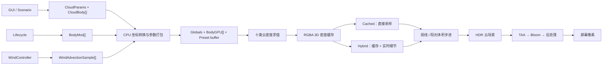
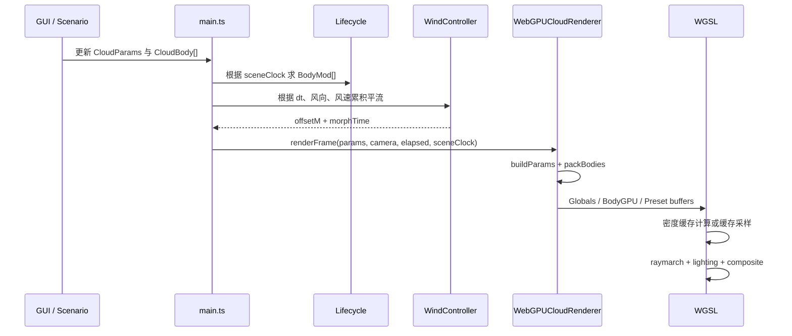
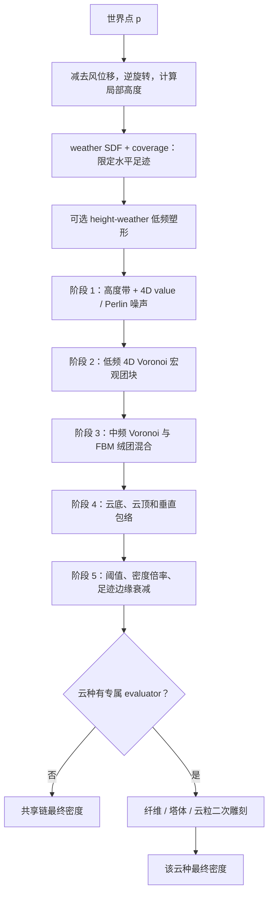
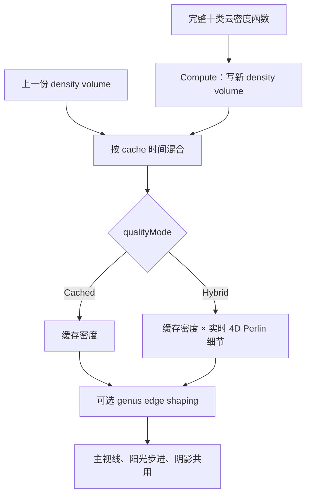
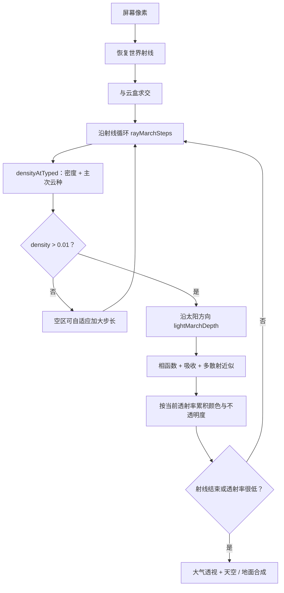

# 云体密度生成与渲染架构

本文按当前源码解释一帧云是怎样从参数变成像素的，重点覆盖 Cached 与 Hybrid 两种质量模式。Realtime 只作为对照出现。

源码快照：2026-07-10。

## 1. 先建立一个直观模型

程序并不是先造出一张“云的网格”，再给网格贴材质。它反复回答两个问题：

1. 世界空间中的点 `p` 在时刻 `t` 有多少云，得到密度 `d(p, t)`。
2. 一条相机射线穿过这些密度时，每一小段吸收、散射多少光，最后累积成屏幕颜色。

可以把整套程序想象成四层：

- **云体边界**决定“哪里允许有云”。每个 `CloudBody` 是一个可平移、旋转、有羽化边缘的水平圆角矩形，加上垂直高度区间。
- **密度雕刻器**决定边界内部“云肉长成什么样”。十种云先经过同一条五阶段密度链，少数云再叠加自己的纤维、塔状或颗粒数学。
- **密度缓存**把昂贵的三维密度采样烘进体纹理。Cached 直接使用；Hybrid 再实时补一层便宜的细节。
- **体积光线步进**沿视线累积吸收和散射。云种编号随密度一起进入缓存，所以同一个密度场仍能按云种使用不同光照参数。



## 2. 参数从哪里来

### 2.1 四类参数源

| 参数源 | 主要类型 | 控制内容 | 最终去向 |
| --- | --- | --- | --- |
| 全局设置 | `CloudParams` | 步数、缓存分辨率、全局细节、太阳、大气、相函数、后处理 | `Globals` uniform |
| 单个云体 | `CloudBody` | 云种、水平范围、底高、厚度、覆盖率、密度倍率、旋转、风速 | `BodyGPU[]` |
| 生命周期 | `BodyMod` | 覆盖率倍率、密度倍率、形态变化量 | 与 `CloudBody` 合并后写入 `BodyGPU.intensity` |
| 风平流 | `WindAdvectionSample` | 累积水平位移、形态时间 | 写入 `BodyGPU.wind` |

场景系统和手动 GUI 最后进入同一条通道。场景只是在时间轴上插值 `CloudBody`、全局风和太阳等参数，并没有另一套密度算法。

### 2.2 一帧中的参数传递



### 2.3 米制参数怎样进入渲染空间

作者侧的高度、厚度、风位移和云体范围都以米表达；着色器使用渲染世界单位：

```text
worldY  = metersY  / verticalMetersPerWorldUnit
worldXZ = metersXZ / horizontalMetersPerWorldUnit
```

当前默认两个换算率都是 `1000 m / world unit`。例如底高 `7000 m` 会变成世界空间 `y = 7`。水平和垂直换算分开保留，是为了以后可以改变视觉上的垂直夸张，而不破坏真实米制参数。

每个云体在打包时形成以下 GPU 数据：

| `BodyGPU` 字段 | 内容 |
| --- | --- |
| `geom.x/y` | `baseY`、`topY = base + thickness`，均已换成渲染空间 |
| `geom.z` | 云种在 preset 数组中的编号 `0..9` |
| `geom.w` | 是否启用 |
| `wind.xy` | 累积 XZ 平流位移，已换成渲染空间 |
| `wind.z` | 随风累积的形态时间 `morphTime` |
| `intensity.x` | `body.coverage × lifecycle.coverageMul` |
| `intensity.y` | `body.densityScale × lifecycle.densityScale` |
| `intensity.z` | 生命周期形态量 `morph` |
| `intensity.w` | 羽化宽度，已换成渲染空间 |
| `footprint.xyz` | 水平中心、最大半尺寸 |
| `footprint.w` | 对应 weather 纹理数组层号 |
| `rot.xyz` | 云体欧拉旋转 |

`Globals` 占前 `60` 个 `f32`，随后最多有 `12` 个、每个 `20 f32` 的 `BodyGPU`。因此当前参数 uniform 一共是 `300 f32 = 1200 bytes`。

### 2.4 每种云的 preset 怎样打包

十种云各有一个 `CloudPreset`。CPU 将其压成连续的八个 `vec4<f32>`：

| 向量 | 字段 | 作用域 |
| --- | --- | --- |
| `p0` | `density, coverage, altitude, scale` | 基础密度与宏观形状 |
| `p1` | `detail, cloudHeight, coverageThreshold, edgeSharpness` | 细节、阈值和缓存锐化 |
| `p2` | `baseRoundness, worleyBlend, detailStrength, altBase` | 云底、Worley/FBM 混合、中尺度细节、内部高度下界 |
| `p3` | `altTop, absorptionCoeff, phaseForward, phaseBack` | 内部高度上界和主要光照 |
| `p4` | `silverLining, baseDarkening, sssStrength, reserved` | 银边、云底压暗、次表面散射感 |
| `p5` | `edgeHardness, anvilStrength, topCutoffSharpness, edgeErosionStrength` | 边缘与积雨云砧形 |
| `p6` | `cirrusFiberStrength, cirrusFiberCurl, convectiveTowerStrength, convectiveCellScale` | 卷云纤维与积雨云塔体 |
| `p7` | `sunDiscVisible, haloEffect, internalLightning, tileScale` | 特殊光效与块状尺度 |

这份 preset buffer 与逐帧 uniform 分开。修改 preset 时只重传 preset buffer；修改云体位置、风或生命周期，则更新 `BodyGPU` 和必要的 weather 形状。

## 3. 云体边界：先确定哪里允许长云

### 3.1 水平 weather 形状

CPU 为每个云体绘制一层 `r8unorm` weather 纹理。形状是一个经过旋转的圆角矩形有符号距离场：

```text
d > 0：点在云体水平边界内
d = 0：边界
d < 0：边界外

alpha = clamp(0.5 + 0.5 × d / feather, 0, 1)
```

因此：

- 边界线上 `alpha = 0.5`；
- 向内超过一个 `feather` 后为 `1`；
- 向外超过一个 `feather` 后为 `0`。

着色器对 alpha 再做覆盖率曲线：

```text
cov = pow(
    smoothstep(0.5 - weatherCurve, 0.5, alpha),
    edgeCurveShaper
)

localCoverage = cov × bodyCoverage
```

`bodyCoverage` 已经包含生命周期倍率。它既决定云体边缘从哪里开始出现，也决定内部密度链能得到多少“原料”。

### 3.2 平流不是重画纹理，而是移动采样点

weather 纹理记录的是云体的静态作者形状。GPU 求密度时先做：

```text
advectedPoint.xz = worldPoint.xz - accumulatedWindOffset.xz
```

也就是让采样点逆风移动，从视觉上得到云体随风向前漂移。之后再执行云体逆旋转，把点放进云体局部坐标。

### 3.3 垂直边界

云体的物理垂直范围来自：

```text
bodyLocalY = (worldY - baseY) / (topY - baseY)
```

随后还会用 preset 的 `altBase`、`altTop` 将它映射到内部形态带 `profileLocal`。物理底高和厚度负责“这片云放在哪、占多高”；`altBase/altTop` 负责“共享密度公式在这段高度内怎样展开”。两者不是同一个概念。

## 4. 共享密度雕刻链

十种云都会先调用 `evalCompatibilityGenus`。这条链是项目的核心：云种之间大多数外观差异，不是十套完全不同的生成器，而是同一套数学函数使用不同 preset。



### 4.1 准备局部坐标

`prepareGenusEvalContext` 依次完成：

1. 减去累积风位移；
2. 对点施加云体的逆旋转；
3. 计算 `bodyLocalY`；
4. 取出当前云种的 shape、morphology preset；
5. 用 `altBase/altTop` 得到内部高度 `profileLocal`。

后面所有噪声都基于这个局部空间，因此旋转会连同卷云长轴、积雨云胞状结构一起旋转，而不只是旋转外框。

### 4.2 积雨云砧形预扩张

在采 weather 纹理前，积雨云可根据上部高度扩大局部 XZ 足迹。`anvilStrength` 越大，上部水平采样尺度越宽，形成“窄塔身、宽砧顶”。

这一步只改变共享链如何读取原始足迹，仍不会让密度无约束地越过整个云体区域。

### 4.3 可选 height-weather 塑形

`densityShapeModel` 选择兼容形态或高度感知形态。高度感知分支先用低频 4D FBM 生成随时间变化的大块覆盖，再按高度改变侵蚀强度：

- 低频 FBM 决定大的空洞和云团分布；
- 粗、细两层 FBM 侵蚀边缘；
- 高度函数使云底、云中和云顶受到不同程度的侵蚀；
- 结果成为后续五阶段链的宏观倍率，而不是取代后续链。

`weatherMorph` 与生命周期 `morph` 会改变采样时间和细节强度，让云形连续生长、衰减，而不是逐帧跳变。

### 4.4 阶段 1：高度带与 4D 连续噪声

这一阶段把内部高度 ramp 与 4D value/Perlin 类噪声相乘。第四维是时间，所以形状可以平滑变化。

它负责：

- 建立云在垂直方向上的基本存在区；
- 产生比 Voronoi 更柔和、连续的初级密度；
- 避免整块 footprint 变成均匀实心体。

`altitude` 在这里参与内部高度的渐变和截断。它不是云体在世界中的米制海拔；真正海拔由 `CloudBody.base` 和 `thickness` 决定。

### 4.5 阶段 2：低频 4D Voronoi 宏观团块

完整 4D Voronoi 会检查四维邻域中的候选特征点，形成大尺度胞状距离场。低频版本负责把连续噪声切成可识别的云团、云柱或大片层状结构。

`scale` 是这一阶段最直观的尺度旋钮。总体上，值越大，结构越大、频率越低；值越小，单位范围内会出现更多小结构。

### 4.6 阶段 3：中频 Voronoi 与 FBM 绒团

中尺度层同时准备两种材料：

- **Worley/Voronoi 路径**：边界更像胞状、蜂窝、翻卷的团块；
- **FBM puff 路径**：更柔软、连续，像棉絮或薄层。

`worleyBlend` 在两者间混合：

- 接近 `0`：更柔、更连贯；
- 接近 `1`：更胞状、更容易看到云粒边界。

`detail` 控制噪声细节层级，`detailStrength` 控制中尺度雕刻的幅度。生命周期形态量为正时会增强细节；为负时会偏向侵蚀，让消散期的云更碎。

### 4.7 阶段 4：云底、云顶与垂直包络

这一阶段把水平噪声重新装进一个有底、有顶的云层：

- `baseRoundness` 控制云底过渡宽度和幂次。较大时，底部过渡更圆、更蓬松；较小时更像平直层底。
- `topCutoffSharpness` 在旧的柔和顶底和更硬的垂直截止之间混合。
- 全局 `verticalEnvelope` 再控制整片云层的垂直占用。
- `altBase/altTop` 界定内部有效高度带。

积雨云常用较强 top cutoff，配合砧形扩张得到明显的塔顶；层云类通常保持平缓包络。

### 4.8 阶段 5：阈值和最终密度

最后阶段可概括为：

```text
finalDensity = falloff(
    shapedNoise - coverageThreshold
) × presetDensity × 5 × bodyDensityScale × footprintEdgeFade
```

各参数的直观效果：

| 参数 | 增大时的主要结果 |
| --- | --- |
| `density` | 同一形状变得更实、更不透明 |
| `body.densityScale` | 只放大当前云体，不改该云种的全局 preset |
| `coverageThreshold` | 从噪声中减去更多，云更薄、孔洞更多 |
| `coverage` | 更大范围超过阈值，云块更连、更满 |
| `edgeSharpness` | 共享链阶段 2/3 的非线性 sharpen 更强，并被烘入密度缓存 |
| `scale` | 主要结构尺度变大 |
| `detailStrength` | 中尺度侵蚀/云粒更明显 |

## 5. 十类云到底用了哪些数学形态

### 5.1 总表

| 云种 | 密度路径 | 形态来源 | 视觉含义 |
| --- | --- | --- | --- |
| Cumulus 积云 | 共享链 | 中等 Worley、圆云底、较强密度 | 分立、棉团状、边缘较清楚 |
| Stratus 层云 | 共享链 | 大尺度、低细节、低 Worley、平底 | 连续、柔软、低矮薄层 |
| Stratocumulus 层积云 | 共享链 | 大尺度与中等胞状细节折中 | 连成片但仍能看见块状云团 |
| Cumulonimbus 积雨云 | 共享链 + 砧形 + 对流塔胞 | 高密度、硬顶、上部扩张、胞状塔体 | 高耸、花椰菜塔身、砧状顶部 |
| Altocumulus 高积云 | 共享链 + 低频小云粒 | 较强 Worley + 3D 云粒切分 | 成排或成群的中层云块 |
| Altostratus 高层云 | 共享链 | 大尺度、极低 Worley、较低吸收 | 连续中层薄幕，能透出太阳 |
| Nimbostratus 雨层云 | 共享链 | 大尺度、高覆盖、高密度、高吸收 | 厚重、暗、连续的降水云层 |
| Cirrus 卷云 | 共享链 + curl 纤维 | 各向异性波纹、卷曲域变形 | 细长丝缕、羽毛状纹理 |
| Cirrostratus 卷层云 | 共享链 | 极低 Worley、大尺度、低吸收 | 高空均匀薄纱和日晕背景 |
| Cirrocumulus 卷积云 | 共享链 + 高频云粒 | 高频 3D Worley + ripple | 细小鱼鳞状、颗粒比高积云更密 |

六类云的 evaluator 直接返回共享链密度：积云、层云、层积云、高层云、雨层云、卷层云。它们并非“没有类型差异”，而是通过 preset、物理高度和云体范围驱动同一数学骨架。

另外四类在共享结果大于零后继续雕刻。它们都不会凭空在基础 footprint 外造云。

### 5.2 积雨云：对流塔和砧顶

积雨云有两处特化：

1. **砧顶**：共享链开始前，`anvilStrength` 随上部高度放大 XZ 足迹。
2. **对流塔胞**：共享密度出来后，在大约局部高度 `0.26..0.94` 的区间加入纵向拉伸的正弦/余弦胞状结构。

`convectiveCellScale` 把塔胞频率从较大的团块调到较密的花椰菜颗粒；`convectiveTowerStrength` 决定这些胞状塔体对共享密度的乘法增强和软并集强度。

因此积雨云的“高”首先来自 `CloudBody.thickness`，塔身纹理由 `convective*` 控制，砧顶宽度由 `anvilStrength` 控制，顶部硬度由 `topCutoffSharpness` 控制。这四者分别负责不同层次。

### 5.3 卷云：各向异性纤维

卷云先计算解析 curl，用它扭曲局部采样坐标，再在各向异性坐标上组合多组正弦 carrier/ridge：

- `cirrusFiberCurl`：域扭曲幅度，越大越弯曲、翻卷；
- `cirrusFiberStrength`：纤维 mask 对共享密度的切割强度；
- 云体旋转：决定纤维整体长轴方向；
- `scale/detail`：仍决定纤维下面的基础连续云幕尺度与破碎程度。

这不是简单画几条线，而是用纤维 mask 乘到已有体密度，因此仍有厚度和体积光照。

### 5.4 高积云：较大的云粒阵列

高积云使用较便宜的 3D Worley F1 距离，把共享密度切成互相分离或半连接的小云块。`tileScale` 同时调节这层雕刻的频率与强度：增大后云粒更明显、更密集。

其频率范围低于卷积云，所以单位空间内的块更大，符合中层“羊群云”的尺度感。

### 5.5 卷积云：更细的鱼鳞颗粒

卷积云同样使用 3D Worley，但采样频率更高，并叠加 ripple。`tileScale` 增大时会产生更细密、规则感更强的高空颗粒。

高积云和卷积云并不是只靠摆放高度区分：两者专属 evaluator 的频率区间也不同，卷积云会在相同世界范围里生成更小、更密的单元。

### 5.6 当前 preset 的形态倾向

下表保留对辨认形态最有用的当前值，不代替 `src/params.ts` 中的完整数据：

| 云种 | density | 初始 coverage | scale | Worley | detail strength | threshold | 专属形态值 |
| --- | ---: | ---: | ---: | ---: | ---: | ---: | --- |
| Cumulus | 1.0 | 0.55 | 3.75 | 0.50 | 1.00 | 0.00 | baseRoundness 0.35 |
| Stratus | 1.2 | 0.90 | 6.00 | 0.10 | 0.40 | 0.00 | baseRoundness 0.00 |
| Stratocumulus | 1.1 | 0.70 | 4.50 | 0.40 | 0.80 | 0.00 | baseRoundness 0.20 |
| Cumulonimbus | 2.2 | 0.50 | 5.00 | 0.65 | 1.10 | 0.10 | anvil 0.85, tower 0.82, cell 0.55 |
| Altocumulus | 0.9 | 0.55 | 2.50 | 0.70 | 0.70 | 0.05 | tileScale 0.55 |
| Altostratus | 1.0 | 0.85 | 6.00 | 0.05 | 0.30 | 0.00 | 大尺度连续薄层 |
| Nimbostratus | 1.8 | 0.95 | 6.50 | 0.10 | 0.40 | 0.00 | 高覆盖、高吸收 |
| Cirrus | 0.6 | 0.35 | 2.20 | 0.15 | 1.30 | 0.15 | fiber 0.78, curl 0.55 |
| Cirrostratus | 0.5 | 0.70 | 5.00 | 0.00 | 0.30 | 0.00 | 均匀高空薄幕 |
| Cirrocumulus | 0.6 | 0.40 | 1.50 | 0.80 | 0.90 | 0.10 | tileScale 0.82 |

## 6. 多云体怎样合成，以及缓存里到底存了什么

### 6.1 多个云体不是简单无限相加

`cloudDensityTyped` 遍历最多十二个云体。每个云体得到一个密度 `dd` 后，程序记录：

- 最大密度及其云种 `bestType`；
- 第二大密度及其云种 `secondType`；
- 所有密度之和。

最终密度采用“主密度精确保留，其余密度软饱和”的方式：

```text
rest    = totalDensity - bestDensity
restCap = max(bestDensity, 0.25)
dSoft   = bestDensity + restCap × (1 - exp(-rest / restCap))
```

这样交叠处会增厚，但不会因为多个云体重叠而线性爆亮、爆密度。

第二云种的混合权重是：

```text
w2 = secondDensity / (bestDensity + secondDensity)
```

### 6.2 RGBA 体纹理协议

密度 compute pass 写入 `rgba16float` 三维纹理：

| 通道 | 内容 |
| --- | --- |
| R | 软饱和后的总密度 |
| G | 主导云种编号 |
| B | 第二云种编号 |
| A | 第二云种光照混合权重 `w2` |

这是整个架构很关键的一点：缓存没有只存一张“灰色浓度图”，而是把主要云种元数据一起带到渲染阶段。因此积雨云和卷层云交叠时，密度可以合并，吸收、相函数、银边和特殊光效仍可按贡献混合。

## 7. Cached 与 Hybrid 模式

### 7.1 缓存生成和时间插值

渲染器维护两个三维密度纹理，形成 ping-pong 缓存。满足更新条件时，compute shader 在体素中心调用完整的 `cloudDensityTyped`，把新结果写到当前纹理。

缓存 compute 由以下条件触发：

- 到达 `cacheUpdateRate` 指定的帧间隔；
- 风平流位移超过一个体素量级；

密度参数或云体结构变化会通过最新 uniform/weather 进入**下一次**缓存 compute；当前代码没有为每一种参数变化单独强制插入一次即时更新。

采样时对两份缓存做三线性和时间混合。密度与 `w2` 可连续插值；云种编号不能插值成小数，所以从时间上更“实”的那一份缓存用 `textureLoad` 取离散编号。



### 7.2 Cached

Cached 的主视线和阳光射线都只查询缓存密度，不重新执行完整 4D Voronoi 和十类 evaluator。

它的特征是：

- 单帧成本较稳定；
- 缓存分辨率决定可保留的最小三维结构；
- `cacheUpdateRate` 越大，完整密度更新越少，但快速变化更可能显得滞后；
- ping-pong 时间混合减轻缓存更新跳变。

### 7.3 Hybrid

Hybrid 先取 Cached 结果；当基础密度大于约 `0.01` 且全局 `detailStrength > 0` 时，再计算一次随风平流的 4D Perlin 细节并调制密度。

因此它不是“每个射线点重跑全部云种算法”，而是：

```text
昂贵的宏观与中观密度 = 3D 缓存
便宜的高频运动细节   = 每个采样点实时补充
```

这让轮廓和近景内部纹理比 Cached 更活，但成本显著低于 Realtime。

### 7.4 边缘塑形为什么不写入缓存

`applyEdgeShaping` 在缓存采样之后执行，并利用缓存中的主、次云种编号混合各自的 edge preset：

- `edgeHardness` 用窄 `smoothstep` 把边缘压得更硬；
- `edgeErosionStrength` 只在密度阈值附近，用解析 curl 和便宜的 3D Worley 侵蚀轮廓；
- 全局 `edgeSharpening` 是总开关。

它不写回体纹理，所以主视线、阳光步进和阴影在调用 `densityAtTyped` 时都能得到同样的最终边缘，同时又能实时响应边缘参数。

### 7.5 Cached/Hybrid 的静态运算量

不运行程序也可以从循环结构得到成本模型：

```text
缓存更新成本
≈ cacheResolution³ × activeBodies × 单体完整密度函数

主渲染成本
≈ screenPixels × rayMarchSteps
  × (缓存查询 + 命中云后的 lightMarchSteps × 缓存查询)
```

真实成本会低于最坏值，因为 weather、水平边界、高度和密度阈值都有 early return；阳光步进也只在主射线命中有效云密度时执行。但四维 Voronoi/FBM 仍是缓存更新中的重操作。

缓存分辨率是立方增长，而不是线性增长：

| 分辨率 | 体素数 | 相对 `96³` | 两张 `RGBA16F` 密度纹理的原始容量 |
| ---: | ---: | ---: | ---: |
| 96³ | 884,736 | 1.00× | 约 13.5 MiB |
| 128³ | 2,097,152 | 2.37× | 约 32 MiB |
| 192³ | 7,077,888 | 8.00× | 约 108 MiB |
| 256³ | 16,777,216 | 18.96× | 约 256 MiB |

因此对 Cached/Hybrid 来说：

- `cacheResolution` 是最容易让更新成本和显存突然放大的参数；
- `cacheUpdateRate` 增大可近似按比例摊薄平均 compute 成本，但风位移越过体素时仍会提前更新；
- 活跃云体数近似线性影响缓存 compute，不过 footprint 和高度 early return 会让小云体便宜很多；
- `rayMarchSteps` 近似线性影响所有像素；`lightMarchSteps` 主要影响真正命中云的样本；
- Hybrid 只在缓存密度大于 `0.01` 且全局 `detailStrength > 0` 时增加一次 4D Perlin。当前默认 `detailStrength = 0`，所以默认 Hybrid 的这条附加分支实际上关闭；
- `edgeSharpening` 当前默认关闭。打开后主要在密度阈值附近增加 curl 和 3D Worley，不会重跑完整云种生成器；
- TAA 默认开启、Bloom 默认关闭，它们属于屏幕空间成本，不进入三维密度 compute。

静态结论是：**Cached/Hybrid 的算法分层本身合理，不会像 Realtime 那样在每个相机和阳光采样点重跑十类完整密度函数；但高缓存分辨率、过密的缓存更新和高屏幕步数叠加后仍可能很重。** 当前默认 `96³`、隔帧更新的思路是在三维细节与成本之间做折中。是否达到具体显卡的帧率目标仍需单独测量，本文不以未运行的结果冒充性能数据。

## 8. 从密度到画面：体积光线步进

### 8.1 主射线

片元着色器先从相机逆投影矩阵恢复世界射线，与全局云盒求交，然后在盒内分段前进：



主射线步数由 `rayMarchSteps` 控制。连续空采样后，程序可把步长逐渐扩大到约四倍；一旦遇到密度又恢复正常步长。帧间 jitter 和 TAA 共同减轻低步数的层纹。

### 8.2 阳光射线

每个有云的主射线采样点，还会沿太阳方向走 `lightMarchSteps` 次，累计太阳到该点之间的密度。它调用的也是 `densityAtTyped`，所以在 Cached/Hybrid 下与相机射线严格使用同一种缓存/细节/边缘语义。

光透射的基本形式是 Beer-Lambert：

```text
T = exp(-density × extinction × stepLength)
```

`msModel` 可选择较传统的单/多重 Beer 近似；`energyConservingScatter` 决定每一步使用解析积分式还是旧的密度乘法式累积散射。

### 8.3 每一步如何累积

当前采样段先算步进后的透射率 `stepTrans`，再用：

```text
weight = accumulatedTransmittance × (1 - stepTrans)
color += weight × litCloudColor
accumulatedTransmittance *= stepTrans
```

这使前面的浓云自然遮挡后面的云；当累计透射率已经很低时可以提前结束。

## 9. 云种怎样影响渲染，而不只是影响密度

缓存中的主、次云种编号会交给 `blendedLighting`。它按 `w2` 混合两个 preset 的：

- `absorptionCoeff`
- `phaseForward` / `phaseBack`
- `silverLining`
- `baseDarkening`
- `sssStrength`
- `sunDiscVisible`
- `haloEffect`
- `internalLightning`

`typeLightingBlend` 决定最终有多少采用云种专属光照，多少退回全局统一光照。设为 `0` 时，各种云仍有不同密度形态，但光照更统一；接近 `1` 时，类型差异更强。

### 9.1 主要光照参数的视觉含义

| 参数 | 控制内容 | 增大后的直观效果 |
| --- | --- | --- |
| `absorptionCoeff` | 云内消光 | 同样密度更厚、更暗，太阳更难穿透 |
| `phaseForward` | 前向散射形状 | 朝太阳方向看时更亮、更集中 |
| `phaseBack` | 后向散射形状 | 背太阳方向的亮度分布改变 |
| `silverLining` | 逆光边缘增强 | 太阳附近薄边更亮 |
| `baseDarkening` | 密集低部压暗 | 云底更有重量、层次更深 |
| `sssStrength` | 太阳侧内部软亮 | 透光和内部柔和发亮更明显 |
| `sunDiscVisible` | 薄云后的太阳盘 | 主要用于高层云透日 |
| `haloEffect` | 太阳周围日晕 | 主要用于卷层云 |
| `internalLightning` | 云内闪电权重 | 主要用于积雨云内部发光 |

全局 `silverIntensity`、`sunIntensity`、`powderStrength`、高度环境光模型、阴影染色和时段调色还会统一调节所有云。

### 9.2 当前十类云的光照倾向

| 云种 | 吸收 | 前向相位 | 银边 | 云底压暗 | SSS | 特殊效果 |
| --- | ---: | ---: | ---: | ---: | ---: | --- |
| Cumulus | 0.045 | 0.60 | 0.40 | 0.35 | 0.30 | 明亮棉团与中等银边 |
| Stratus | 0.060 | 0.30 | 0.10 | 0.15 | 0.15 | 柔暗、少银边 |
| Stratocumulus | 0.050 | 0.40 | 0.25 | 0.25 | 0.25 | 层状与块状折中 |
| Cumulonimbus | 0.100 | 0.70 | 0.60 | 0.60 | 0.20 | internalLightning 0.65 |
| Altocumulus | 0.035 | 0.40 | 0.30 | 0.20 | 0.35 | 中层云粒较通透 |
| Altostratus | 0.020 | 0.50 | 0.10 | 0.10 | 0.50 | sunDiscVisible 0.85 |
| Nimbostratus | 0.090 | 0.20 | 0.05 | 0.50 | 0.10 | 厚暗、弱方向性 |
| Cirrus | 0.008 | 0.80 | 0.50 | 0.05 | 0.70 | 很薄、强前向散射 |
| Cirrostratus | 0.005 | 0.85 | 0.20 | 0.00 | 0.80 | haloEffect 0.75 |
| Cirrocumulus | 0.010 | 0.70 | 0.30 | 0.10 | 0.60 | 薄而细碎 |

### 9.3 相函数与高度环境光

程序同时有全局和云种专属的前后向相函数参数。全局路径把后向 Henyey-Greenstein 与前向 Cornette-Shanks 结果按 `hgBlend` 混合；类型路径使用各 preset 的 `phaseBack/phaseForward` 做同类计算；最后再用 `typeLightingBlend` 混合两条路径。

此外，采样点的世界高度还影响环境光颜色和多散射近似。`heightAmbientModel`、`shadowTintStrength` 和时段调色控制云底阴影是否偏蓝灰、日出日落是否偏暖。这部分改变的是“密度怎样被看见”，不会反过来改变密度。

## 10. 后处理链

云 raymarch 先写入 HDR `rgba16float` 目标，其中 alpha 还携带代表性云深度。后续顺序为：

```text
HDR 云场景
  → TAA：世界位置重投影 + YCoCg 方差裁剪
  → 可选五级 Bloom
  → 曝光 / God rays / 色调映射 / Gamma
  → 最终画面
```

- **TAA** 使用上一帧和当前相机矩阵重投影，主要消除 raymarch jitter 和低步数噪点。
- **Bloom** 对亮区做五级降采样与合成，默认关闭。
- **God rays** 在后处理阶段围绕太阳屏幕位置做径向采样。
- **Tone mapping** 可在 Reinhard、ACES、AgX 等路径间选择。

它们都不改变下一帧的云密度缓存，只处理当前已经积累好的 HDR 图像。

## 11. 哪些参数最值得按层调节

如果目标是稳定地塑造某类云，建议按从大到小的顺序调：

1. **放置层**：`base`、`thickness`、`bounds`、旋转。
2. **占用层**：body `coverage`、`coverageThreshold`、weather feather。
3. **宏观形状层**：`scale`、`altitude`、`altBase/altTop`、`baseRoundness`、`topCutoffSharpness`。
4. **中小尺度层**：`worleyBlend`、`detail`、`detailStrength`。
5. **类型特化层**：卷云 fiber/curl，积雨云 anvil/tower/cell，高积云/卷积云 tileScale。
6. **厚薄与照明层**：`density`、body `densityScale`、`absorptionCoeff`。
7. **渲染风格层**：phase、silver、base darkening、SSS、环境光和时段调色。

把 `density` 当成“形状大小”调，或把 `coverage` 当成“光照明暗”调，都会导致参数互相补偿，后续很难稳定复现。

## 12. 当前实现边界与容易误读的字段

### 12.1 `preset.coverage`

它会在创建默认 `CloudBody` 时作为初始 coverage 使用，但共享密度链运行时读取的是 `body.intensity.x`。因此在 preset 编辑器里实时修改 `preset.coverage`，不会自动改写已经存在的云体 coverage。

### 12.2 `preset.cloudHeight`

该字段已被打包进 preset，但当前密度着色器没有读取它。实际云高由每个 `CloudBody` 的 `base + thickness` 决定。

### 12.3 `altBase/altTop`

GUI 将它们标成 reserved，但当前 `prepareGenusEvalContext` 实际会读取它们并重映射内部高度。它们不是完全未使用字段。

### 12.4 只有四种云有专属二次 evaluator

不要把十个 evaluator 文件理解成十套独立算法。当前真正增加额外形态数学的是：

- Cumulonimbus
- Cirrus
- Altocumulus
- Cirrocumulus

另外六个文件目前是显式的 pass-through，类型差异来自共享链的 preset 和各自的物理摆放。

### 12.5 Realtime 不是本文建议的基线

Realtime 在每个相机/光照采样点直接运行完整 `cloudDensityTyped`，会重复执行多云体遍历、4D FBM/Voronoi 和云种特化。本文描述和调参建议以 Cached/Hybrid 为基线，因为它们把完整密度计算摊到三维缓存更新上。

## 13. 源码导航

| 主题 | 文件 |
| --- | --- |
| 帧循环、场景与 renderer 调用 | `src/main.ts` |
| 全局参数、preset、uniform 打包 | `src/params.ts` |
| 云体模型与默认十类云 | `src/body.ts` |
| 十类云默认高度与范围 | `src/genusProfile.ts` |
| 生命周期倍率 | `src/lifecycle.ts` |
| 风位移与形态时间 | `src/wind.ts` |
| 米制到渲染空间换算 | `src/space.ts` |
| CPU weather SDF 纹理 | `src/weather.ts` |
| WebGPU 资源、缓存调度、渲染 pass | `src/renderer.ts` |
| 共享结构、缓存、密度合成、raymarch、lighting | `shaders/cloud.wgsl` |
| 4D Perlin/FBM/Voronoi、3D Worley、curl | `shaders/noise.wgsl` |
| 共享五阶段密度链 | `shaders/genus/common.wgsl` |
| 云种编号分发 | `shaders/genus/dispatch.wgsl` |
| 四类专属形态 | `shaders/genus/cumulonimbus.wgsl`, `cirrus.wgsl`, `altocumulus.wgsl`, `cirrocumulus.wgsl` |

## 14. 一句话总结

这套程序的本质是：**用云体 footprint 和高度区间限定空间，用共享的 4D 连续噪声 + Voronoi/Worley + 垂直包络雕刻基础密度，用四种专属函数补出塔体、纤维和云粒，再把“密度 + 主次云种”缓存起来，最后由体积 raymarch 按云种混合吸收、相函数和特殊光效。** Cached 保存这份雕刻结果，Hybrid 则在它上面实时补一层随风运动的细节。
