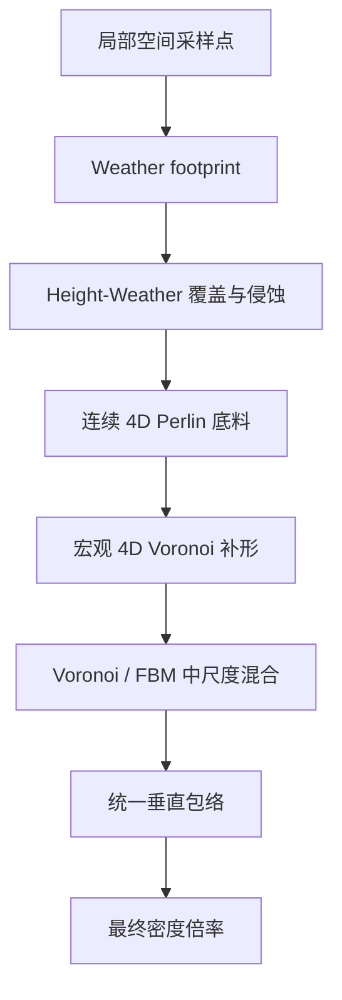
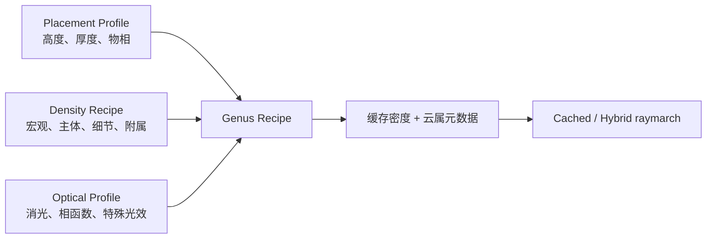
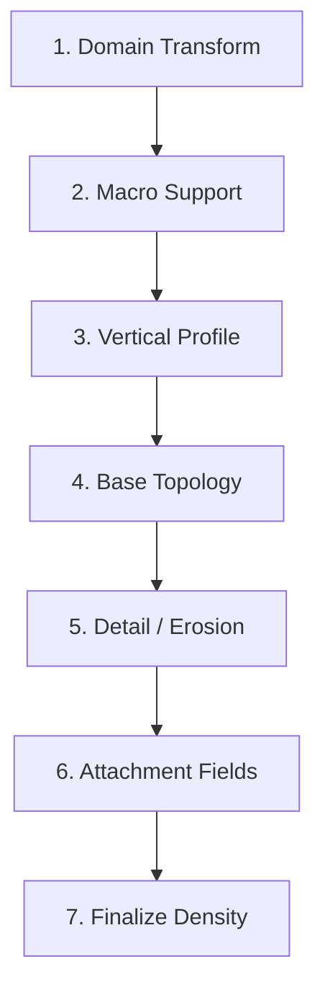

# 十类云形态与组合式密度建模讨论

本文综合当前源码与 `docs/云属分类与数学建模技术手册 - Table 1.csv`，讨论十类云是否适合共享现有密度链，以及更灵活的密度与形态架构。

> 文档性质：架构讨论，不是 OpenSpec 规范，不表示建议已经实现或获得批准。
>
> 当前代码的数据流与渲染事实参见 `docs/cloud-density-rendering-architecture.md`。

讨论基线：2026-07-11。

## 1. 更新后的结论

原先提出的 Convective、Stratiform、Cellular Layer、Fibrous 四云族仍然有价值，但更适合作为**形态模板**，不适合作为四选一、互斥的最终 dispatcher。

CSV 带来的关键修正是：同一个云属内部就可能出现荚状、堡状、絮状、成层状、滚轴状、碎片状、纤维状等不同云种或变种。反过来，相同形态又会跨越不同云属重复出现。

例如：

- 层积云、高积云、卷积云都有荚状、堡状、絮状或成层状变体；
- 层积云和高积云都有滚轴状变体；
- 卷云内部既有毛状/钩状纤维，也有堡状和絮状变体；
- 积雨云同时具有对流塔、砧状水平层、纤维顶部和乳状附属特征。

因此，“一个云属对应一个固定密度家族”的关系仍然过于僵硬。更好的总体结构是：

```text
气象放置约束
  + 多尺度密度 Recipe
  + 云种/变种 Modifier
  + 独立光学 Profile
```

密度 Recipe 由可复用算子组合而成：

```text
Domain Transform
→ Macro Support
→ Vertical Profile
→ Base Topology
→ Detail / Erosion
→ Attachment Fields
→ Finalize Density
```

最终建议不是“一条万能链”、也不是“十条完全独立链”，而是：

> 十个云属共享空间、边界、时间、缓存和组合规则；每个云属通过一份静态 Recipe 选择并组合形态算子；云种、变种和附属特征只修改必要的算子或参数。

## 2. 如何理解 CSV 中的信息

CSV 的十一列实际提供了四个相互独立的建模维度：

| 维度 | CSV 信息 | 架构职责 |
| --- | --- | --- |
| 气象放置 | 云族、高度范围、coverage、precipitation | 决定云出现在哪、覆盖多大、是否跨层发展 |
| 宏观分布 | Coverage Map、Weather Map、Height Gradient、Anvil Mask | 生成空间 Support，不决定最终细节 |
| 中尺度主体 | Perlin、Perlin-Worley、Worley、各向异性噪声、正弦波 | 决定云的主要密度拓扑 |
| 微观与光学 | 高频侵蚀、curl、Beer、phase、halo、powder | 应进一步拆成密度细节与渲染光学两部分 |

### 2.1 高、中、低、直展云族不是密度算法分类

CSV 使用高云族、中云族、低云族和直展云族描述气象高度与发展方向。它适合约束：

- body base 和 thickness；
- altitude support；
- 水滴、冰晶或混合物的 optical profile；
- 垂直发展上限。

它不直接决定使用 Perlin、Worley、纤维或层状密度。例如卷层云和卷云同属高云族，但一个是薄幕，一个是纤维，两者不能共享最终密度拓扑。

### 2.2 `128³`、`32³` 应理解为频带，而非资源命令

CSV 中积云、层积云等条目使用 `128³` 基础噪声与 `32³` 高频 Worley 描述宏观和细节层级。当前项目使用程序化 WGSL 4D 噪声，并另有可配置的三维密度缓存。

因此不应机械地新增固定 `128³` 和 `32³` 噪声纹理。更稳妥的解释是：

```text
低频/中频层：主体膨胀、连续块和云粒排列
高频层：边缘侵蚀、碎裂和局部卷曲
```

具体由程序化噪声、缓存 LOD 或预计算纹理实现，可以在正式性能设计中再决定。

### 2.3 CSV 的光学符号不能直接映射当前参数

CSV 使用 `σa`、`σs` 和 phase `g` 表达物理吸收、散射与方向性；当前 shader 的 `absorptionCoeff` 则作为艺术化消光倍率参与 `density × absorption × 22`，并没有独立的物理吸收、散射系数和单次散射反照率。

因此 CSV 中“吸收极高/极低”应先理解为视觉和介质倾向，不能直接把数值写进当前 preset。若以后需要更物理的模型，应引入或明确：

```text
extinction
singleScatteringAlbedo
phaseForward
phaseBack
```

本文重点讨论密度和形态，光学信息只用于划分职责。

### 2.4 CSV 是建模手册，不是已验证的运行规范

CSV 单元格中的 `1-4` 引用标记没有在该文件内附带完整参考文献表；高度、coverage 和噪声分辨率也多为典型范围或建模建议。因此本文把它用作形态分类和算子设计依据，不把其中每个数值直接升级为代码要求或验收标准。

## 3. 当前实现事实

### 3.1 当前调用结构

当前每个普通云体都会先执行同一条兼容密度链：

```text
evalBody
  → prepareGenusEvalContext
  → evalCompatibilityGenus
  → evalGenusDensity
```

`evalCompatibilityGenus` 在源码中被描述为重构前五阶段 Blender 匹配链的机械迁移桥。它首先生成 `compatibilityDensity`，云属 dispatcher 随后才执行。

### 3.2 当前链偏向团块型云



这条链自然产生：

- 三维、各向相对均匀的团块；
- 多尺度胞状结构；
- 从柔软 FBM 到明显 Worley 云粒的连续变化；
- 一套通用云底、云顶和垂直 falloff。

它最适合积云和一部分层积云，不是中性的通用形态函数。

### 3.3 当前十类云路径

六类云直接返回共享密度：

- Cumulus；
- Stratus；
- Stratocumulus；
- Altostratus；
- Nimbostratus；
- Cirrostratus。

四类云在共享密度上增加二次雕刻：

- Cumulonimbus：砧形预扩张和对流塔胞；
- Cirrus：curl 域扭曲与纤维 mask；
- Altocumulus：较低频 3D Worley 云粒；
- Cirrocumulus：较高频 3D Worley 和 ripple。

专属 evaluator 基本都依赖非零 `compatibilityDensity`。这使专属函数只能改造已有团块，不能自由建立新的主体拓扑。

## 4. 当前共享链的适配性

| 云属 | CSV 强调的中尺度主体 | 当前实现 | 适配度 | 核心问题 |
| --- | --- | --- | --- | --- |
| Cirrus 卷云 | 各向异性低频 Perlin 长丝 | 团块链 × 纤维 mask | 很低 | 长纤维被共享团块和空洞截断 |
| Cirrocumulus 卷积云 | 极高频小尺度 Worley | 团块链 × 高频云粒 | 中 | 云粒尺度方向正确，但受无关宏观团块干扰 |
| Cirrostratus 卷层云 | 极低幅、极低频 Perlin 薄幕 | 完全共享团块链 | 低 | 不需要明显胞状膨胀和侵蚀 |
| Altocumulus 高积云 | Perlin-Worley，荚状可叠加正弦波 | 团块链 × 云粒 mask | 中 | 无法自然表达荚状、滚轴、堡状等变体 |
| Altostratus 高层云 | 强水平拉伸、低幅低频 3D 噪声 | 完全共享团块链 | 低 | 应是缓慢厚度变化的连续幕层 |
| Nimbostratus 雨层云 | 高密度低频 Perlin，底部 fBm 碎云 | 完全共享团块链 | 中 | 主体可近似，但胞状成本多余，缺少底部附属场 |
| Stratocumulus 层积云 | 大尺度 Perlin-Worley 连片云块 | 完全共享团块链 | 中高 | 大方向合适，但没有独立 connectivity、roll 或 lenticular 控制 |
| Stratus 层云 | 纯低幅 Perlin，碎层云使用 fBm 挖空 | 完全共享团块链 | 低 | 多层 Voronoi 与平坦均匀主体冲突 |
| Cumulus 积云 | Perlin-Worley billow，高频侵蚀 | 完全共享团块链 | 高 | 最接近当前基线，但缺少高度相关胞状尺度 |
| Cumulonimbus 积雨云 | 大尺度 Worley、垂直流动、砧顶 | 团块链 + 塔胞/砧形 | 中 | 缺少真正垂直连贯的流动域和复合顶部 |

## 5. 更好的整体架构：组合式 Density Recipe

### 5.1 三条正交轴

每个云属不再只选择一个 `densityFamily`，而是由三条正交轴共同定义：



#### Placement Profile

负责：

- 典型高度范围；
- 默认 base/thickness；
- 高、中、低或直展约束；
- 水滴、冰晶或混合物标记；
- 默认 coverage 和 precipitation 信号。

#### Density Recipe

负责：

- 哪些空间允许生成密度；
- 云的主体拓扑；
- 垂直形态；
- 中高频侵蚀；
- 附属结构。

#### Optical Profile

负责：

- extinction/absorption；
- scattering albedo；
- phase；
- silver/powder；
- halo、sun disc、lightning。

这样 Altostratus 与 Cirrostratus 可以共享薄层拓扑，却保留不同的高度、物相和光学特征。

### 5.2 Density Recipe 的七个步骤



#### 1. Domain Transform

公共坐标准备和可选形态域变换：

```text
风平流
云体逆旋转
水平/垂直缩放
各向异性拉伸
垂直流动偏移
curl domain warp
```

各向异性拉伸适合卷云和高层云；垂直流动适合积雨云；普通层云不必支付这些成本。

#### 2. Macro Support

Macro Support 只回答“这里是否属于该云体的气象区域”：

```text
S = footprintMask
  × altitudeBand
  × weatherCoverage
  × lifecycleMask
```

可选附加 mask：

- precipitation system；
- anvil footprint；
- terrain/wave influence；
- patch or roll band。

Support 不应预先生成团块密度。

#### 3. Vertical Profile

不再让所有云共享同一套对称包络，而是选择或混合：

| Profile | 适用形态 |
| --- | --- |
| Thin Sheet | Stratus、Cirrostratus |
| Soft Layer | Altostratus、Nimbostratus |
| Flat-base Dome | Cumulus |
| Cellular Layer | Stratocumulus、Altocumulus、Cirrocumulus |
| Tower | Cumulonimbus、castellanus 变体 |
| Anvil | Cumulonimbus incus |
| Roll/Lens | volutus、lenticularis 变体 |

#### 4. Base Topology

主体由一到多个拓扑算子组合：

| 算子 | 数学材料 | 主要用途 |
| --- | --- | --- |
| Stratiform Field | 低幅低频 2D/3D Perlin | 连续云幕和厚度变化 |
| Billow Field | Perlin-Worley | 积云、层积云和对流团块 |
| Cellular Field | Worley/Voronoi | 高积云、卷积云、云粒排列 |
| Fiber Field | 各向异性 Perlin + ridge/carrier | 卷云、积雨云纤维顶部 |
| Wave/Lens Field | sine/ridge + anisotropic envelope | 荚状云、滚轴云、波状排列 |
| Convective Column | 高度相关 2D cells + vertical flow | 积云浓积阶段、积雨云塔 |

四云族仍可作为这些算子的默认模板，但一个 Recipe 可以组合多个算子。例如积雨云可以组合 Convective Column、Billow、Anvil 和 Fiber，而不是被迫只属于 Convective。

#### 5. Detail / Erosion

细节算子只修改主体边缘或局部结构：

| 算子 | 作用 |
| --- | --- |
| High-frequency Worley | 花椰菜突起、云粒边缘碎裂 |
| fBm Cutout | 碎层云、碎积云和底部破洞 |
| Curl Warp | 卷曲、钩状、湍流边缘 |
| Ripple | 鱼鳞或波状排列 |
| Height-dependent Erosion | 云底、云中、云顶使用不同侵蚀强度 |

CSV 所说的“侵蚀权重极高/极低”应落在这一层，而不是通过同一个 `detail` 同时改变宏观 Voronoi octave 和微观成本。

#### 6. Attachment Fields

附属结构应通过加法或 smooth union 接入，而不是强迫主密度链承担：

| Attachment | 适用对象 |
| --- | --- |
| Fractus | Stratus fra、Cumulus fra、Nimbostratus 底部碎云 |
| Anvil | Cumulonimbus incus |
| Mammatus | Cumulonimbus mamma |
| Virga/Precipitation Curtain | Nimbostratus、Cumulonimbus |
| Castellanus Turrets | Cirrus/Altocumulus/Stratocumulus 的 cas 变体 |
| Fiber Cap | Cumulonimbus capillatus |

这能解决“专属函数只能在共享密度非零区域内工作”的限制。

#### 7. Finalize Density

公共尾部负责：

```text
阈值与 remap
body densityScale
lifecycle densityScale
footprint edge fade
非负限制
密度标定
```

### 5.3 组合语义必须明确

Recipe 不应简单把所有噪声相乘。不同算子需要不同组合语义：

```text
Mask：乘法，限定允许区域
Base topology：remap 后形成主体
第二主体：smooth union / soft max
Erosion：从主体中减去
Domain warp：改变后续采样坐标
Attachment：加法或 smooth union
Final profile：乘法或高度相关 remap
```

可以概括为：

```text
support = footprint × altitude × weather × lifecycle

base = composeTopologyFields(domain, recipe)
body = support × verticalProfile × remap(base)

eroded = max(body - detailErosion, 0)
combined = smoothUnion(eroded, attachments)

density = finalize(combined, densityScale, edgeFade)
```

## 6. 十类云的推荐 Recipe

### 6.1 汇总表

| 云属 | Macro Support | Vertical Profile | Base Topology | Detail / Attachment | 光学职责 |
| --- | --- | --- | --- | --- | --- |
| Cirrus | 高空低覆盖 2D mask | 极薄、可倾斜 | Fiber Field | 大 curl、hook、branching；cas/flo 可加 turret/floccus | 极低消光、强前向散射 |
| Cirrocumulus | 严格高空带、中低 coverage | 极薄 Cellular Layer | 高频 Cellular | 极弱侵蚀、ripple；len 可加 Wave/Lens | 高反射、弱阴影 |
| Cirrostratus | 高空近全覆盖 mask | Ultra-thin Sheet | 极低幅 Stratiform | 无或极弱侵蚀 | halo、极低消光 |
| Altocumulus | 中层连续 coverage | Cellular Layer | Perlin-Worley + Cellular | 中等侵蚀；len/vol 加 Wave/Lens/Roll；cas 加 turret | 底部阴影、适中透射 |
| Altostratus | 广域近全覆盖 | Soft Layer | 水平拉伸 Stratiform | 低幅厚度变化 | 太阳盘透见、强散射感 |
| Nimbostratus | 降水系统 Weather Map | Thick Soft Layer | 高密度低频 Stratiform | 底部 fBm、Fractus、可选 precipitation curtain | 强消光、暗底 |
| Stratocumulus | 低空高覆盖 | 厚 Cellular Layer | Billow + 大尺度 Cellular | 极弱侵蚀；vol/len 可加 Roll/Lens | 圆润块状、柔和阴影 |
| Stratus | 贴地近全覆盖 | Thin Sheet | 低幅 Stratiform | fra 使用 fBm Cutout/Fractus | 低对比度、雾状散射 |
| Cumulus | 离散 Weather Map | Flat-base Dome | Billow + 弱 Convective Column | 高频 Worley、curl；hum/med/con 控制垂直发展，fra 加 cutout | powder、银边、暗底 |
| Cumulonimbus | 强降水系统 + anvil mask | Tower + Anvil | Convective Column + Billow | 最大 curl、Fiber Cap、Mammatus、降水核心 | 强消光、雷电、多重光步进 |

### 6.2 卷云及其变体

主体应由 Fiber Field 直接产生，而不是 `legacyPuffy × fiberMask`。

| 变体 | Recipe 修改 |
| --- | --- |
| fibratus 毛卷云 | 提高 fiber length，降低 curl 和主体厚度 |
| uncinus 钩卷云 | 增大末端 curl/hook，保持长主纤维 |
| spissatus 密卷云 | 增加 fiber density、厚度和 smooth union |
| castellanus 堡状卷云 | 在薄纤维支撑上增加局部 vertical turrets |
| floccus 絮状卷云 | 增加离散小绒团与短尾迹 |

这说明卷云不是单一 Fibrous 枚举即可完全表达，但 Fiber 是其主要主体算子。

### 6.3 卷积云、高积云、层积云

三者共享 Cellular Field，但通过尺度、连通率和垂直厚度区分：

```text
Stratocumulus：cell 大、connectivity 高、profile 厚
Altocumulus：cell 中等、connectivity 中等
Cirrocumulus：cell 极小、profile 极薄、ripple 较强
```

同属内变体由 Modifier 表达：

| 变体 | Modifier |
| --- | --- |
| lenticularis 荚状 | Wave/Lens Field，强各向异性、平滑边缘 |
| castellanus 堡状 | 局部 Convective Column/Turret |
| floccus 絮状 | 低 connectivity、独立紧凑云粒和尾迹 |
| stratiformis 成层状 | 提高 support coverage 和 connectivity |
| volutus 滚轴状 | 沿一轴拉伸的 Roll profile 与周期波场 |

因此 family 是默认模板，variant modifier 才决定最终拓扑组合。

### 6.4 层云、高层云、卷层云、雨层云

四者共享 Stratiform Field，但不应共享完全相同的高度和细节：

```text
Stratus：贴地、薄、低幅；fra 才增加明显挖空
Altostratus：中层、较厚、水平拉伸、缓慢厚度变化
Cirrostratus：高空、极薄、近均匀、几乎不侵蚀
Nimbostratus：跨低中层、厚、高密度、底部附属碎云
```

它们之间很多视觉差异属于 optical profile，而不是额外密度噪声。

### 6.5 积云与积雨云

积云可把当前兼容链拆成可复用的 Billow、Flat-base Dome 和 Erosion 算子。云种主要控制垂直发展：

```text
humilis 淡积云：低 tower height，宽而扁
mediocris 中积云：中等 tower coherence
congestus 浓积云：高 tower coherence，顶部小胞增强
fractus 碎积云：降低 support 连通率，增加 fBm cutout
```

积雨云需要复合 Recipe：

```text
下部：高密度 Billow base
中部：随高度流动的 Convective Column
上部：更小尺度的 cauliflower cells
顶部：Anvil support + Fiber Cap
附属：Mammatus / precipitation core
```

这比在一条均匀团块链后追加塔胞更能表达垂直结构。

## 7. Recipe 的数据模型建议

概念上可以使用：

```text
GenusProfile
  placement
  densityRecipe
  opticalProfile

DensityRecipe
  domainTransform
  supportOperators[]
  verticalProfile
  topologyOperators[]
  detailOperators[]
  attachmentOperators[]
  finalize

VariantModifier
  parameterOverrides
  addOperators[]
  disableOperators[]
```

但不建议在 WGSL 中实现任意动态表达式解释器。更稳妥的实现是：

- 概念和 TypeScript preset 使用 Recipe 描述；
- WGSL 保持静态 genus dispatcher；
- 每个 genus evaluator 调用共享算子函数；
- variant 只启用少量预编译 modifier 分支；
- 昂贵算子之前完成 genus/variant 分发。

示意：

```text
evalAltocumulus(ctx, recipe)
  support = evalCommonSupport(ctx)
  domain = applyAnisotropyAndWave(ctx, recipe)
  base = evalCellularField(domain, recipe.cell)
  if lenticular: base = combine(base, evalLensField(domain))
  if castellanus: base = smoothUnion(base, evalTurrets(domain))
  return finalizeDensity(base, support, recipe)
```

这既保留组合思路，又避免 GPU 上的通用解释器开销。

## 8. Cached 与 Hybrid 的新边界

### 8.1 Cached 保存宏观和中尺度主体

建议缓存：

- Macro Support；
- Vertical Profile；
- Base Topology；
- 影响轮廓的中尺度 attachment；
- 主、次云属编号及混合权重。

缓存格式仍可保持：

```text
R：密度
G：主云属
B：次云属
A：次云属混合权重
```

### 8.2 Hybrid 只补充可丢失的微观细节

不同 Recipe 可以声明细节策略：

```text
CachedOnly
CachedAndHybrid
HybridOnlyDetail
```

建议：

| 形态 | Hybrid 细节 |
| --- | --- |
| Billow/Convective | 高频 Worley 和 curl 边缘翻卷 |
| Stratiform | 很弱的 thickness noise，或不增加 |
| Cellular | 小尺度粒边破碎和 ripple |
| Fiber | 高频分叉、断续和轻微摆动 |
| Attachments | 大型 attachment 缓存，小型扰动实时 |

当前统一 4D Perlin 可保留为 Legacy fallback，但不应继续是所有云属唯一的 Hybrid detail。

## 9. 性能上的改进机会

组合式架构并不意味着每个云体执行所有算子。Recipe 的价值恰恰是只选择需要的路径：

- Stratus、Altostratus、Cirrostratus 跳过分形 4D Voronoi；
- Cirrus 跳过团块链，直接使用各向异性纤维；
- Cellular 类主要使用适合的 2D/3D Worley；
- Cumulus/Cumulonimbus 才执行较重的 Billow 和对流细节；
- 变体 modifier 未启用时不产生额外成本。

缓存成本仍近似：

```text
cacheResolution³
× 活跃云体数
× 当前 Recipe 实际启用的算子成本
```

为防止组合失控，Recipe 应携带静态预算信息：

```text
macroCostClass
detailCostClass
maxOctaves
hybridDetailEnabled
```

并坚持：

- 分发发生在昂贵噪声之前；
- detail 不同时控制宏观 octave 和微观侵蚀；
- 大尺度 attachment 缓存，小尺度 detail 才实时；
- 不因 CSV 写了 `128³/32³` 就重复分配固定噪声体纹理。

## 10. 对原四云族方案的修正

| 原方案 | 保留内容 | 修正内容 |
| --- | --- | --- |
| Convective | 仍是积云/积雨云默认模板 | 拆成 Billow、Column、Tower、Anvil 等可组合算子 |
| Stratiform | 仍覆盖主要层状云 | 作为低频主体模板，可与 Fractus、Cellular 或 precipitation attachments 组合 |
| Cellular Layer | 仍覆盖 Sc/Ac/Cc 主体 | 增加 Wave/Lens、Roll、Turret 等跨云属 modifier |
| Fibrous | 仍是卷云主要主体 | 也可作为积雨云纤维顶部等 attachment，而非 Cirrus 专属代码 |

换句话说，四云族从“互斥类型”降级为“常用 Recipe 模板”，底层使用更小粒度的算子库。

## 11. 建议的演进顺序

以下只是讨论建议，不是实施任务：

1. 将当前 `evalCompatibilityGenus` 明确定位为 `LegacyPuffy`，保持视觉回退；
2. 抽取公共 Density Context、Macro Support 和 Finalize；
3. 将 `scale` 拆成 horizontal macro、cell、vertical、fiber 等独立尺度；
4. 将 `detail` 拆成 topology octaves、erosion strength 和 Hybrid detail budget；
5. 先实现 Stratiform Field，迁移 St/As/Cs/Ns；
6. 实现 Fiber Field，使 Ci 独立生成主体密度；
7. 实现 Cellular + Wave/Lens，迁移 Sc/Ac/Cc 及其主要变体；
8. 从 LegacyPuffy 提取 Billow，再实现 Convective Column 和高度分区；
9. 将 Cb 组合为 Billow + Column + Anvil + Fiber Cap + attachments；
10. 最后引入 VariantModifier，而不是一开始覆盖 CSV 中所有云种缩写。

整个过程可以保持多云体合成、RGBA 密度缓存、Cached/Hybrid 时间混合和 raymarch 协议不变。

## 12. 开放问题

形成正式 OpenSpec 提案前仍需决定：

1. 第一阶段需要支持到云属，还是同时支持云种/变种？
2. VariantModifier 是用户可编辑字段，还是只作为内部 preset？
3. Recipe 是否允许两个主体 topology smooth union，还是每个云属限制一个主体加若干 attachment？
4. 积雨云的 precipitation、mammatus 和 lightning 是否属于同一阶段能力？
5. 当前 `absorptionCoeff` 是否改名为 artistic extinction，或进一步拆成物理 optical profile？
6. Macro Support 是否继续完全来自 CPU weather texture，还是允许 GPU weather/system mask？
7. Hybrid family detail 如何在主、次云属交叠处稳定混合？
8. 目标 GPU、缓存分辨率和每个 Recipe 的噪声预算是多少？
9. CSV 中的高度范围用于校验、默认值还是硬限制？
10. 哪些 CSV 变体是第一阶段必须可辨认的验收对象？

## 13. 最终判断

CSV 支持了原讨论中“完整共享密度链不适合十类云”的判断，但也进一步说明：仅用四个互斥密度家族仍不够灵活，因为云种和变种会跨家族复用形态。

更好的长期边界是：

> 云属不是一个固定密度函数，而是一份由放置约束、宏观 Support、垂直 Profile、主体 Topology、细节侵蚀、附属结构和光学 Profile 组成的静态 Recipe。

当前团块链可以作为 LegacyPuffy/Billow 的重要实现保留；它不再是所有云不可绕过的前置密度。四云族作为常用模板保留，真正的复用单位下沉到 Stratiform、Billow、Cellular、Fiber、Wave、Column、Erosion 和 Attachment 等算子。

这种结构能同时满足：

- 十类云属的主体差异；
- CSV 中同属多变体、跨属同形态的事实；
- Cached/Hybrid 的性能边界；
- 现有缓存和渲染协议的兼容性；
- 后续逐步迁移而非一次重写。

## 14. 证据与相关源码

| 主题 | 文件 |
| --- | --- |
| 云属、变体、云族、高度和三尺度建模来源 | `docs/云属分类与数学建模技术手册 - Table 1.csv` |
| 当前参数和渲染数据流 | `docs/cloud-density-rendering-architecture.md` |
| 云体求值入口 | `shaders/cloud.wgsl` 中的 `evalBody` |
| 公共 Context 与兼容密度链 | `shaders/genus/common.wgsl` |
| 云属 dispatcher | `shaders/genus/dispatch.wgsl` |
| 当前积雨云修饰 | `shaders/genus/cumulonimbus.wgsl` |
| 当前卷云修饰 | `shaders/genus/cirrus.wgsl` |
| 当前高积云修饰 | `shaders/genus/altocumulus.wgsl` |
| 当前卷积云修饰 | `shaders/genus/cirrocumulus.wgsl` |
| 十类 preset 与打包 | `src/params.ts` |
| 默认云体与物理摆放 | `src/body.ts`, `src/genusProfile.ts` |
| 缓存调度与渲染 pass | `src/renderer.ts` |
