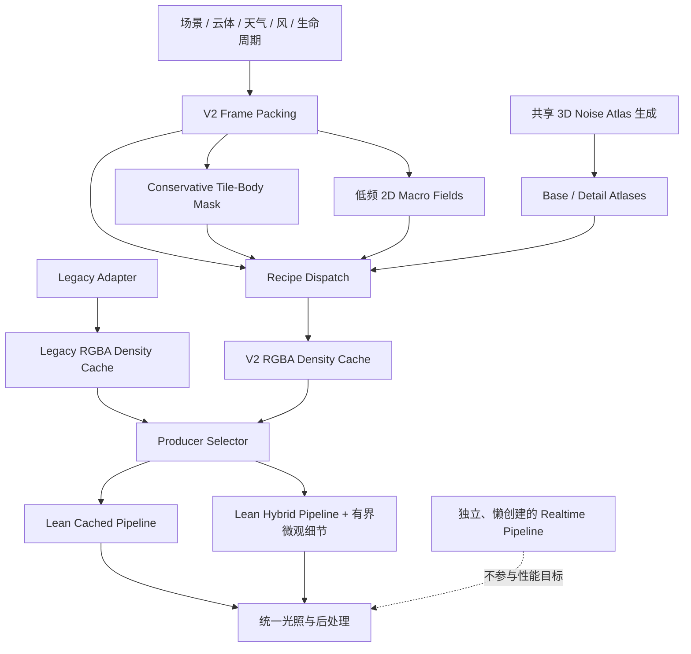
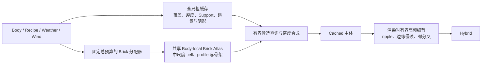

# Roadmap Refactor — 并行重写 Density Engine V2

本文给出云密度与形态系统的实施路线，但**不是 OpenSpec 提案，也不是实施授权**。旧提案 `refactor-cloud-density-recipes` 已废弃；每个 Wave 的实际范围、任务与批准状态仍以对应 OpenSpec change 为准。

> 状态：roadmap 评审稿；W0 工具已落地并由项目所有者人工签核（timing/截图非阻塞，提交 `1c62d25`）；W1 已于 2026-07-11 归档；W2 已完成视觉验收并归档（提交 `3e5fd15`）；W3 已完成空密度验收并于 2026-07-12 归档（提交 `338b61a`）；W4 已完成验收并于 2026-07-12 归档（提交 `a6940f6`，验收修复 `43b3cca`）；W5 已完成共享场验收并于 2026-07-12 归档（实现 `b3595e2`，归档 `cf1e98a`）；W6 已在 benchmark 修正 `9a8d33a` 后由项目所有者验收并归档（归档 `5615a71`，精确性能阈值记为 `owner-waived`）；W7 已于 2026-07-14 由项目所有者归档（`openspec/changes/archive/2026-07-14-add-density-v2-stratiform-family/`，任务 35/47，视觉/性能 Gate 按 owner 决策归档）；W8 已完成代码与自动检查，并采集 64/64 case、128/128 张截图，但独立 Gate 因 Ac/Cc 形态、尺度顺序与 ripple 连续性失败而为 **Stop**，当前仍处于 W8 修复阶段；W9提案已起草但在W8 Continue/归档前不得批准实施；W10–W13尚未建立提案。
>
> 主目标：Cached 与 Hybrid。Realtime 只保持可选兼容，不承担本路线的性能目标。
>
> 核心决策：不重写整个应用，也不在旧共享链内部原地大拆；在同一仓库中并行重写一个输出兼容的 Density Engine V2。

## 1. 为什么改成“子系统并行重写”

当前真正需要重新设计的是密度求值热区，而不是整个程序。以下能力已经形成可复用资产，应继续保留：

- WebGPU 设备、资源生命周期与帧循环；
- 场景、云体、天气、风和生命周期；
- Cached/Hybrid 缓存调度与时间混合；
- raymarch、light march、地面云影、TAA、Bloom 与 HDR；
- GUI、参数上传、预设、调试视图与 GPU timing。

旧方案先把 `evalCompatibilityGenus()` 拆成多个共享步骤，再逐属替换。这会让旧参数、新 Recipe 和昂贵 4D 噪声长期缠绕，导致每一步都可能影响十属。新路线改为：

```text
现有应用与 renderer
        │
        ▼
DensityCacheProducer Seam
        ├── LegacyDensityAdapter  ── 当前密度实现，冻结并用于回退/A-B
        └── RecipeDensityV2Adapter ── 新数据、新算子、新 compute pipeline
```

两个 Adapter 输出同一缓存契约，形成真实 Seam。renderer 不知道内部使用旧共享链还是 V2 Recipe。这样可以获得：

- **Leverage**：renderer、阴影和调试视图只学习一个 Interface；
- **Locality**：V2 的 Recipe、图集、剔除和性能策略集中在一个 Module 内；
- 每个 Wave 可独立切回 Legacy；
- 同场景、同相机、同缓存分辨率下可以直接 A/B；
- V2 失败时不需要回滚整个应用架构。

## 2. 目标架构

### 2.1 外部 Seam

概念 Interface 如下，具体类型名由后续提案确定：

```ts
interface DensityCacheProducer {
  prepareFrame(input: DensityFrameInput): void;
  encode(commandEncoder: GPUCommandEncoder): void;
  getOutput(): DensityCacheOutput;
  getStats(): DensityProducerStats;
}
```

Interface 必须同时约束：

- 输入：云体、Recipe、天气、风、生命周期、时间和缓存配置；
- 输出：当前 renderer 可消费的密度、主云属、次云属和混合权重；
- 调用顺序：`prepareFrame → encode → getOutput`；
- 回退：Adapter 创建失败或 V2 feature 不可用时切回 Legacy；
- 性能统计：cache pass、预计算 pass、活跃云体数、被剔除 tile 数；
- 资源生命周期：resize、device loss 和销毁责任由 Adapter 内部承担。

W0–W8 保持现有 RGBA16F ping-pong 缓存，避免在形态族迁移初期同时修改密度算法和 renderer 契约。W9 若经独立 OpenSpec 批准，可把输出演进为“全局粗缓存 + 共享 body-local brick”的版本化复合契约，但必须保留 global-only V2 与 Legacy 回退。

### 2.2 V2 内部数据流



### 2.3 Recipe 内部顺序

十属共享控制框架，不共享同一套昂贵数学链：

```text
Tile / Body Reject
→ Domain Transform
→ Macro Support
→ Vertical Profile
→ Base Topology
→ Bounded Detail / Erosion
→ Bounded Attachments
→ Finalize Density
```

每个阶段都允许在确定密度为零时立即退出。昂贵图集采样或程序噪声必须位于包围盒、高度和覆盖率拒绝之后。

### 2.4 W9 之后的分层密度扩展

当前 `96³` RGBA 缓存覆盖整个 V2 世界体积，并不是给每个云体各分配 `96³`。这适合宏观覆盖、合成和远景，但小型云体横向可能只占少数全局体素；W8 已证明，仅调整高频 cell/ripple 参数无法稳定跨过这一采样上限。后续采用三层互补结构，而不是在“局部 brick”与“渲染时细节”之间二选一：



三层职责固定如下：

- **全局粗缓存**：保守宏观覆盖、厚度/Support、空域跳过、远景 LOD、地面云影、global-only 回退，以及过渡期的主/次云属 metadata；
- **共享 Body-local Brick Atlas**：从一张共享 3D atlas 中按云体分配可变分辨率 brick，保存 body-local 的中尺度形态；`24³–64³` 只是 W9 Spike 的候选档位，最终档位必须由预算与实测决定；
- **渲染时有界细节**：只在命中主体后执行，只能侵蚀或微调已有密度，不能在 Support 外或空缓存区域创造新云体质量。

“共享”是关键约束：不得为每个云体创建独立纹理，也不得让每个云体固定占用一个高分辨率 volume。所有 brick 必须受同一个总 voxel/显存预算、候选采样上限和回收策略约束。

W5 的共享 **noise atlas** 是所有 Recipe 读取的程序噪声基底；W9 的共享 **density brick atlas** 保存已经在 body-local 空间求值后的云体密度。两者不是同一个资源，也不能用前者已经存在来推断 W9 没有接口与显存成本。

| 方案 | 结论 | 原因 |
| --- | --- | --- |
| 只保留全局 `96³` | 保留为 coarse/fallback，不作为完整终局 | 成本稳定，但小云体中尺度形态会被全局采样低通 |
| 每云体独立 `96³` texture | 拒绝 | 显存、更新和绑定成本随云体数线性放大 |
| 全局网格 + 仅渲染时高频细节 | 不足以单独解决 | 改动较小，但无法恢复已经在缓存阶段丢失的 cell 骨架和 profile |
| 全局 coarse + 共享 body-local bricks | 进入 W9 Spike | 在固定总预算内把分辨率给真正需要的云体，但需验证 atlas 生命周期和采样成本 |
| 三层合并：coarse + bricks + bounded detail | 推荐终局 | 宏观覆盖、中尺度拓扑与可丢失微观细节各由最合适的尺度负责 |

## 3. GPU 成本模型与硬约束

### 3.1 当前成本锚点

默认 `96³` 缓存包含 884,736 个体素。当前实现每个体素最多遍历 `MAX_BODIES = 12`；十个活动云体时，一次更新约有 885 万次有效云体尝试。完整 4D Voronoi 每 octave 搜索 `3⁴ = 81` 个候选单元，再乘以多 octave 和多云体，是首要成本来源。

因此 V2 必须遵守以下规则：

1. V2 主路径不得调用完整 4D Voronoi 或无界 4D fBm；
2. 不允许运行时任意 operator graph/interpreter；
3. octave、atlas sample、attachment 和循环次数必须有编译期或固定 record 上限；
4. 先做 tile/body、高度、Support 和天气拒绝，再执行形态噪声；
5. 共享噪声与密度资源，不为每个云体创建独立 3D texture/atlas；W9 只允许从一张共享 atlas 中分配 body-local brick；
6. 全局缓存保存宏观保守场，body-local brick 保存中尺度形态，Hybrid 只补可丢失的微观细节；
7. 不以默认提高全局缓存分辨率掩盖算法问题，也不把固定高分辨率成本乘到每个云体；
8. renderer 每个采样点只能查询有界数量的候选 brick，不得重新退化为逐步遍历全部 `MAX_BODIES`；
9. brick 与渲染时细节都必须受原云体 Support 约束，禁止双重合成或 Support 外增密。

### 3.2 各形态族的初始预算

这些预算是 roadmap 的设计护栏，最终数值在新 OpenSpec 中根据 Spike 数据固化。

| 形态族 | 主体实现 | 每次有效体素求值的初始预算 | 禁止事项 |
| --- | --- | --- | --- |
| Stratiform | 2D macro + 低频 3D atlas | 1–2 次 macro/atlas 采样 | 完整 4D Voronoi |
| Billow | 共享 Perlin-Worley atlas | 2–4 次 atlas 采样，最多 1 次低频 warp | `detail × 5` octave 链 |
| Cellular | Worley atlas 或受限 3D cell | 2–3 次采样/有界邻域 | 4D 81 邻域循环 |
| Fiber | 解析方向脊线 + warp | 解析 ALU + 最多 2 次 atlas 采样 | 先生成团块再裁出纤维 |
| Wave/Lens | 正弦、椭球/透镜 SDF | 解析 ALU，零强度早退 | 为零强度执行噪声 |
| Convective | 高度门控 cell + 柱/砧解析场 | 4–6 次主体采样，附件数固定 | 无界塔体/附件循环 |
| Body-local brick | 共享 atlas 中的可变档位 brick | 固定总 voxel/显存预算；每 body 一个有效 allocation 或明确降级 | 每云体固定 `96³`、无界扩容 |
| Hybrid detail | 按主/次云属选择细节 | 每种 Recipe 最多 2 次额外采样 | 空缓存区域生成新主体 |

### 3.3 WebGPU 使用原则

- workgroup 尺寸必须同时校验 X/Y/Z 和乘积，并读取 `device.limits`；
- 不假设最大 invocation 数最快，至少比较 64、128、256 三档候选；
- 继续以 `timestamp-query` 作为主要 GPU 计时证据；
- `shader-f16` 仅作为可选 Adapter 内部优化，必须有 f32 fallback；
- 初期不依赖 `subgroups`，避免把可选 feature 变成基础契约；
- 大型 compute/render pipeline 使用异步创建，并缓存编译结果；
- workgroup storage 只用于测量证明存在重复读取的值；
- 不在早期引入 occupied-tile compaction 或 indirect dispatch，先验证保守 mask 的收益。

### 3.4 与其他 active changes 的关系

| Active change | 本路线中的处理 |
| --- | --- |
| `add-height-weather-shaping` | 作为 Legacy 视觉与行为基线；V2 可以吸收其高度/天气语义，但不得继续依赖旧昂贵噪声链，也不复制一份同名参数链 |
| `add-height-ambient-tint` | 属于 Optical/Lighting，不并入 Density V2；W0 冻结基线后独立演进 |
| `add-stratocumulus-cumulus-breakup` | 不与 V2 并行制造第三套 breakup；其目标由 W8 Cellular 和后续 Variant Modifier 决策吸收，提案状态应在新 OpenSpec 前单独处理 |

本路线细化并取代 `roadmap-v2` 阶段 13.1 的密度模型重建路线，并吸收阶段 14 中与形态算子有关的部分；不取代阶段 13.2 光照或 13.3 大气。

## 4. Wave 总览

```mermaid
flowchart LR
    W0["W0 基线与预算"] --> W1["W1 Producer Seam"]
    W1 --> W2["W2 Pipeline 隔离"]
    W2 --> W3["W3 V2 空壳与数据"]
    W3 --> W4["W4 Tile 剔除"]
    W4 --> W5["W5 共享场与图集"]
    W5 --> W6["W6 双属 Spike"]
    W6 --> Gate{"继续 V2?"}
    Gate -->|是| W7["W7 Stratiform"]
    Gate -->|否| Stop["保留 Legacy / 重审架构"]
    W7 --> W8["W8 Cellular / Wave"]
    W8 --> W8Gate{"W8 形态 Gate?"}
    W8Gate -->|未通过| W8Fix["留在 W8 修复"]
    W8Gate -->|通过| W9["W9 分层缓存 Spike"]
    W9 --> BrickGate{"分层架构值得继续?"}
    BrickGate -->|否| GlobalOnly["保留 global-only V2 / 重审后续 Wave"]
    BrickGate -->|是| W10["W10 Fiber"]
    W10 --> W11["W11 Convective"]
    W11 --> W12["W12 Hybrid 与调优"]
    W12 --> W13["W13 默认切换与收尾"]
```



| Wave | 可交付结果 | 视觉变化 | 主要风险 |
| --- | --- | --- | --- |
| W0 | 冻结 Legacy Cached/Hybrid 基线和预算 | 否 | 缺少可重复证据 |
| W1 | 一个 Seam、两个 Adapter 槽位，Legacy 仍唯一工作实现 | 否 | Interface 泄漏 renderer 细节 |
| W2 | Cached/Hybrid/Realtime shader 与 pipeline 生命周期隔离 | 否 | shader 组装改变资源布局 |
| W3 | V2 独立资源、参数布局和空密度 compute 闭环 | 否 | CPU/WGSL layout 错位 |
| W4 | active-body 上限、早退和保守 tile-body mask | 否或仅性能变化 | 包围盒过小造成缺云 |
| W5 | 共享 3D atlas 与低频 2D macro fields | 否，尚不接管云属 | atlas 周期或精度产生伪影 |
| W6 | Stratus + Cumulus V2 Spike 和继续/停止门 | 是，仅两个测试属 | 核心假设不成立 |
| W7 | St/Cs/As/Ns 完整 Stratiform 迁移 | 是，仅四属 | 薄层缓存丢失 |
| W8 | Sc/Ac/Cc Cellular/Wave 迁移 | 是，仅三属 | cell 过度规则 |
| W9 | 全局粗缓存 + 共享 body-local brick 的 Proof-of-Architecture | 是，仅固定 Spike 场景 | atlas 碎片、双重增密或采样成本失控 |
| W10 | Cirrus Fiber 迁移 | 是，仅 Ci | 纤维被缓存低通截断 |
| W11 | Cu/Cb Convective 正式迁移 | 是，仅两属 | Cb 组合成本失控 |
| W12 | Recipe-aware Hybrid、render-time detail、workgroup 和格式决策 | 是，微观 | 主次属交界闪变 |
| W13 | V2 默认启用、最终证据和后续提案清单 | 否 | 过早删除 Legacy |

## 5. W0 — Legacy 基线与性能预算

OpenSpec change：`openspec/changes/establish-density-v2-baseline/`。该 change 只负责基线、观测与证据，不授权 W1 Seam 或 V2 实现。

### 工作

- 固定 camera、scene time、body placement、天气、风和生命周期状态；
- 使用固定 `96³`、固定 update rate，分别记录 Cached 与 Hybrid；
- 提供十属固定场景与五类代表性 timing/截图入口；项目所有者可接受人工视觉签核而不严格采集；
- 记录 cache pass、cloud pass、活跃云体数和 shader/pipeline 首次创建时间；
- 建立两类压力场景：十属同场景、单个大体积 Cb；
- 记录设备 feature/limits，但不据单台设备硬编码通用参数。

### 退出条件

- 十属有可重复 manifest；实际采集时可按同一输入恢复；
- 若声明性能证据完整，记录须区分预热、稳态、正常视图和 debug 视图；当前未作该声明；
- 所有后续 Wave 都使用同一套输入进行 A/B；
- Realtime 只记录是否可创建和正确显示，不纳入预算。

## 6. W1 — 建立 DensityCacheProducer Seam

### 工作

- 定义最小 `DensityCacheProducer` Interface；
- 用 `LegacyDensityAdapter` 包住当前 compute/cache 行为，不拆旧 shader 内部函数；
- 建立 `RecipeDensityV2Adapter` 槽位，但本 Wave 不实现新密度；
- renderer、地面云影和 debug 视图只消费 `DensityCacheOutput`；
- 明确 resize、device loss、销毁、统计与失败回退语义；
- 增加运行时 Legacy/V2 选择，但 V2 未就绪时必须安全回退。

### 退出条件

- Legacy Adapter 与当前画面、缓存更新节奏和性能处于测量噪声范围；
- renderer 不直接访问 Adapter 内部 buffer/pipeline；
- 删除 Interface 后复杂度会重新散落到多个调用方，证明该 Module 具有 Depth；
- V2 创建失败不会破坏 Legacy。

## 7. W2 — 隔离 Cached、Hybrid 与 Realtime Pipeline

### 工作

- Cached 渲染模块只包含缓存采样和其必需函数；
- Hybrid 渲染模块只增加有界微观细节入口；
- Realtime 的完整密度调用图移到独立模块和独立 pipeline；
- Realtime 只有在用户选择时才异步创建；
- V2 compute shader 不拼接 Legacy 的完整 genus/noise 调用图；
- 为 pipeline 创建时间和失败原因增加统计。

### 退出条件

- Cached/Hybrid 不再静态携带完整 Realtime 密度实现；
- 三种质量模式资源布局明确，切换无悬空引用；
- Cached/Hybrid 视觉与 W0 基线等价；
- Realtime 仍能按需创建，但没有性能承诺。

## 8. W3 — V2 Compute 空壳与数据布局

### 工作

- 建立 V2 自有 WGSL 模块、compute pipeline、bind group 和资源生命周期；
- 定义固定布局的 `DensityRecipeGPU`，不复用旧 `detail` 字段承载多种语义；
- 将 Placement、Density Recipe、Optical Profile 保持为三条正交数据轴；
- 十属 Recipe 表先只包含静态模式和有界参数，不引入 operator interpreter；
- 让 V2 写出与 Legacy 相同的 RGBA 缓存协议；
- 在无云输入、单体输入和无效 genus 下验证有限值与零密度语义。

### 退出条件

- V2 可独立创建、dispatch、resize 和销毁；
- CPU/WGSL record 顺序和对齐有机器可读检查计划；
- V2 shader 不引用 Legacy 4D Voronoi/4D fBm；
- 切换 Adapter 不要求 renderer 重建无关后处理资源。

## 9. W4 — 空间剔除与廉价早退

### 工作

1. 循环上限使用真实 `activeBodyCount`；
2. 在天气和噪声前增加保守 body AABB、高度与 profile 拒绝；
3. 按实际 workgroup 网格生成保守 tile-body bit mask；
4. mask 纳入旋转、风位移、Cb 砧顶和附件的最大扩展；
5. 统计空 tile、每 tile 候选 body 数和实际 evaluator 调用数；
6. workgroup 改变、缓存 resize 或 body bounds 改变时正确重建 mask。

默认 `96³`、`8×8×4` 下约有 3,456 个 tile。CPU 每次更新做约 `3,456 × 12` 次保守相交判断，预期远低于 GPU 对每体素尝试所有云体的成本。

### 退出条件

- mask 关闭时与开启时的密度结果在约定容差内一致；
- 快速移动、旋转和 Cb 砧顶场景不缺块；
- 有指标能证明 evaluator 调用量下降，而不是只观察 FPS；
- 暂不引入 GPU compaction、原子累积或 indirect dispatch。

## 10. W5 — 共享 GPU 场与噪声图集

### 工作

- 用 compute 一次或低频生成共享 Base Atlas 和 Detail Atlas；
- 比较 `rgba8unorm`、`r16float/rgba16float` 等候选格式的质量、带宽和兼容性；
- 使用硬件三线性采样、坐标平流和低频 warp 取代主路径 4D 动画噪声；
- 不为每个云体创建独立 3D texture；
- 为仅依赖 XZ 的天气覆盖、层厚、波相位和 cell 布局建立低频 2D macro fields；
- macro、density cache、Hybrid detail 使用不同更新频率；
- 增加 atlas 切片/debug 视图，用于检查周期、接缝和量化。

### 退出条件

- atlas 生成不进入每帧热路径；
- 风平流和时间演化连续，不出现明显方块或固定纹理锁定；
- 共享资源内存有明确上限；
- 尚未迁移的 Legacy 云属不受新资源影响。

## 11. W6 — 双属 Proof-of-Architecture Spike

选择两个相反的代表属：

- **Stratus**：验证 Stratiform、2D macro 和廉价层状路径；
- **Cumulus**：验证 Billow、共享 Perlin-Worley atlas 和中等复杂度主体。

### 工作

- 分别实现最小 V2 Recipe，不追求全部变种；
- Stratus：Thin Sheet + 低幅 macro + 最多两次主体采样；
- Cumulus：Flat-base Dome + Billow atlas + 有界高度变化；
- 保留属级 Legacy/V2 切换；
- 对比正常视图、density debug、Cached、Hybrid、单体和多体场景；
- 记录 V2 预计算 pass、cache pass、总 cloud pass、pipeline 创建时间和资源占用。

### 继续/停止 Gate

只有满足以下条件才进入 W7：

- Stratus 明显减少 cache pass 成本，且层体连续；
- Cumulus 在等价分辨率下不比 Legacy 稳态中位数显著变慢；
- 两属均无 Support 外密度、NaN、tile 缺块和明显 atlas 周期伪影；
- V2 shader/pipeline 的编译与资源复杂度可维护；
- 视觉问题能够通过 Recipe 参数或有限算子修正，而不需要恢复完整 4D Voronoi 链。

若 Gate 失败：停止迁移，保留 W1 Seam 与 Legacy，针对失败原因重审 atlas、Recipe 或缓存策略；不得以“已投入较多”为理由继续八属迁移。

## 12. W7 — Stratiform 家族迁移

迁移顺序：

1. Stratus：沿用 Spike 结果；
2. Cirrostratus：极薄、近均匀，高空薄幕；halo 留在 Optical；
3. Altostratus：中层、水平拉伸、磨砂层；sun disc 留在 Optical；
4. Nimbostratus：厚层与暗底，预留降水 Attachment，但不实现降水输运。

### 退出条件

- 四属不调用 Legacy 完整团块噪声链；
- 四种厚度、破碎度和垂直位置肉眼可分；
- 薄层在 Cached 下连续，不依靠默认提高 cache resolution；
- 每属保留 Legacy 回退和独立 timing。

当前 W7 实现与形态修复的固定验证步骤、case ID、raw-density 判据及 Gate 记录模板见 [`w7-stratiform-fix-validation.md`](w7-stratiform-fix-validation.md)。W7 已归档；证据与未完成 Gate 项保留在 archive/tasks 与 docs/evidence/w7-stratiform-form*。

## 13. W8 — Cellular 与 Wave 家族迁移

迁移顺序：

1. Stratocumulus：大 cell、高连接率、较厚；
2. Altocumulus：中 cell、中连接率；
3. Cirrocumulus：小 cell、薄 profile、较强 ripple。

### 工作

- Cellular 使用共享 atlas 或受限 3D cell，不使用完整 4D 邻域；
- cell scale、connectivity、thickness 和 ripple 分开控制；
- Wave/Lens/Roll 作为静态可选 hook，零强度必须在噪声前早退；
- 不在本 Wave 扩展 scenario schema 或一次实现所有云种/变种。

### 当前 Gate 与修复边界

独立 WebGPU 验收已经完成 64/64 case 和 128/128 张截图，运行时与自动检查通过，但结论为 **Stop**：Ac/Cc 主体、`Sc > Ac > Cc` 尺度顺序和 ripple 连续性未通过，Support/metadata 与 Cc 成对性能证据仍 unresolved。详见 [`evidence/w8-cellular-wave/report.md`](evidence/w8-cellular-wave/report.md)。

W8 只修复当前全局 `96³` 契约内能够成立的行为：

- 把 cell/ripple 的有效频率校准到当前缓存可分辨的频带，并用 world/body-stable 相位避免相机锁纹；
- 让 benchmark 中 Sc/Ac/Cc 的物理尺寸、镜头与预期体素跨度可解释，避免用亚体素差异证明属间尺度；
- 补齐 finite metadata、Support containment、evaluator call count 与 Cc Legacy/V2 timing 证据；
- 保留当前 RGBA 输出与 renderer 采样路径，不在 W8 新增 brick atlas、每云体资源或复合缓存接口。

### 退出条件

- Sc/Ac/Cc 的 cell 尺寸、层厚和连接度可辨；
- 不出现明显棋盘重复或随相机锁定；
- 空的 `add-stratocumulus-cumulus-breakup` 目标由新架构吸收，但不复制其旧设计；
- 三属在相同场景中可独立切回 Legacy；
- 独立 Gate 从 Stop 变为 Continue，且项目所有者批准后才可归档；2026-07-16 已批准 W9 作为该 Stop 的架构修复例外先行实施，但不能据此改写或归档 W8。

## 14. W9 — 分层密度缓存与 Body-local Brick Spike

W9 是独立架构 Gate，不是继续给 W8 追加参数。change ID 为 `add-hierarchical-body-local-density-bricks`；Proposal、Design、delta specs 和 Tasks 已获准作为 W8 Stop 的受控架构修复推进，最终仍须独立 W9 Gate。

### 工作

- 保留现有全局 RGBA 缓存作为 coarse envelope、Support/occupancy、远景、地面云影、global-only 回退和过渡期 metadata 来源；
- 建立一张共享 body-local density atlas，优先评估单通道 `R16F` brick；每个活动 Recipe V2 云体只持有 allocation record，不持有独立纹理；
- 在固定总 voxel/显存预算内评估 `24³`、`32³`、`48³`、`64³` 候选档位，并根据投影尺寸、形态频带和重要度分配或降级；
- Spike 默认先验证“每 body 至多一个 brick”；对 Ci/Cb 等高纵横比云体记录拉伸采样和空间浪费。若数据证明需要 aspect-aware brick 或每 body 多 brick，Proposal 必须给出固定上限，不得无界拆分；
- 定义 world/body-local/atlas 坐标变换、1–2 voxel gutter、allocation generation、回收、resize、device loss 和 atlas 重建行为；
- 为 LOD 变更加入 hysteresis/cross-fade，并让噪声与风相位在 world/body 空间稳定；
- renderer 通过已有 tile/body 信息或等价加速结构取得有界候选，只采样少量相关 brick；精确上限由 Spike 数据固化，不得在每个 ray step 扫描全部 12 个云体；
- 在 overlap 中明确 coarse 与 brick 的合成所有权，避免同一质量被全局缓存和局部 brick 重复相加；
- 对 global-only V2、hierarchical V2 与 Legacy 做同场景 A/B，且所有新路径均可关闭。

W9 只证明存储、采样、合成和生命周期架构。它可以复用 W8 的小尺度 Sc/Ac/Cc，再增加一个细长 Fiber 代理场景验证低通问题，但不在本 Wave 正式迁移 Cirrus 或 Convective。

### 继续/停止 Gate

只有同时满足以下条件，后续 Wave 才可把 brick 当成可用基础设施：

- 在明确且固定的总显存预算下，小型 Cellular 和细长代理主体比同预算 global-only 缓存保留更多可辨中尺度形态；
- 正常视图、density debug、相机运动、风平流和 LOD 切换中没有 atlas 接缝、跳变、屏幕锁纹或 allocation 泄漏；
- overlap 密度与 metadata 合成在规范容差内，无双重增密、NaN、越界和 Support 外质量；
- brick 候选数、atlas 更新、cache pass 与 cloud pass timing 均满足 Proposal 中的硬预算，且没有退化为全 body 扫描；
- resize、device loss、云体增删、allocation 回收和预算不足降级都有自动检查与运行时证据；
- global-only V2 与 Legacy 回退仍可独立工作，`DensityCacheOutput` 的版本/兼容规则不会泄漏未启用资源。

任一核心条件不成立则停止 W9，保留 global-only V2 并重审 W10–W13；不得用无界显存、默认提高全局分辨率或删除回退来换取 Continue。

## 15. W10 — Fiber 家族迁移

### 工作

- Cirrus 直接以解析方向脊线和低频 warp 生成主体；
- fiber length、width、curl、breakup、vertical thinness 分离；
- body rotation 控制主方向，风平流移动完整纤维结构；
- W9 Continue 时，body-local brick 保存长丝中尺度骨架，global coarse 只保留保守覆盖；细分叉和断续留给 W12 Hybrid；
- W9 Stop 时，W10 Proposal 必须先写明 global-only 替代方案与质量上限，不得假定 brick 已存在；
- 不先生成 Billow 团块再裁切成纤维。

### 退出条件

- 纤维连续、具有方向性且不被团块空洞随机截断；
- footprint 和高度范围外严格为零；
- Cached 不因低通变成粗条，Hybrid 不在空区生成新纤维；
- atlas/warp 采样保持在预算内。

## 16. W11 — Convective 家族迁移

### Cumulus

- 固化 W6 的 Billow + Flat-base Dome；
- 加入高度相关 cell scale 和有界 Convective Column；
- 宏观 cell 与微观侵蚀使用不同参数，不再由单一 `detail` 同时控制。
- W9 Continue 时，根据屏幕重要度与形态频带为 Cu 选择 brick 档位，预算不足时显式降级到 global-only；

### Cumulonimbus

```text
下部：高密度 Billow base
中部：Convective Column
中上部：更小的 cauliflower cells
顶部：Anvil Support + Fiber Cap
可选 Attachment：Mammatus / precipitation core，默认关闭且数量固定
```

### 退出条件

- Cu 平底圆顶与 Cb 塔、砧、纤维顶可以分别辨认；
- 每项附件可关闭，关闭后在昂贵采样前早退；
- 所有结构受保守 Support 与 tile mask 包含；
- Cb 不破坏 internal lightning 等 Optical 行为；
- 单个复杂 Cb 与十属同场景均不突破新提案届时确定的预算。

## 17. W12 — Recipe-aware Hybrid、渲染时细节与 GPU 调优

### Hybrid 策略

| 主体 | Hybrid 微观细节 |
| --- | --- |
| Stratiform | 无或极弱 thickness noise |
| Billow/Convective | 最多两次高频 Worley/curl atlas 采样 |
| Cellular | 粒边 breakup/ripple |
| Fiber | 高频分叉和断续 |

主、次云属交叠处沿缓存权重平滑混合。渲染时细节是分层架构的第三层：只有 coarse/brick 合成已经命中主体后才能执行，只能侵蚀或微调已有密度，不能在空区域或 Support 外凭空造云。每个 ray sample 的细节算子与 atlas 采样次数必须有固定上限。

### GPU 调优

- 在真实设备上比较 `4×4×4`、`8×4×4`、`8×8×2`、`8×8×4` 等合法候选；
- GUI 输入同时校验各维限制和 invocation 乘积；
- 可按 adapter/device 指纹缓存最快候选，不把单机结果写成全局常量；
- 评估 `shader-f16` 的临时值与 atlas 路径，保留 f32 fallback；
- 评估 brick 档位、atlas 格式、gutter 与更新批次的质量/显存/timing 曲线；
- 只有 timing 证明收益时，才考虑进一步拆分 global density/metadata、occupied tile compaction 或 subgroup 优化。

### 退出条件

- 十属 Cached 主体稳定，Hybrid 差异符合各自拓扑；
- 主/次云属边界无硬切和时间闪变；
- global coarse、body-local brick 与 render-time detail 的职责不重叠，LOD 切换没有可见 popping；
- workgroup 设置不可能超过设备 limits；
- 每项可选优化都有独立关闭路径和前后 timing；
- 不为了单台高端 GPU 的收益破坏基础兼容路径。

## 18. W13 — 默认切换、证据矩阵与收尾

### 工作

- 完成十属 Legacy/global-only V2/hierarchical V2（若 W9 Continue）、Cached/Hybrid、正常/debug 截图矩阵；
- 完成单体、十属同场景、复杂 Cb 的 GPU timing、显存与 brick residency 矩阵；
- V2 达标后将默认 Producer 切为 V2，Legacy 仍保留可见回退；
- 更新源码导读、参数传递、数学算子和渲染数据流文档；
- 清理只属于未落地设计的命名，不删除仍被旧场景使用的字段；
- 列出后续独立提案：Legacy cleanup、Variant Modifier、降水场、atlas compaction/扩展和不再属于本路线的缓存格式优化。

### Legacy 删除 Gate

本 roadmap 不直接删除 Legacy。只有同时满足以下条件，才能另建 OpenSpec change：

- 十属 V2 全部默认启用；
- 十属均有 Cached/Hybrid 视觉与性能证据；
- 至少一个稳定版本周期内未依赖属级 Legacy 回退；
- 旧 scenario/preset 字段有明确迁移或保留策略；
- V2 在目标设备矩阵上没有依靠 Legacy 才能达标的云属；
- 删除后 renderer 仍只依赖版本化 `DensityCacheProducer` 契约，不直接依赖具体 Adapter。

## 19. 每个 Wave 的提交与验证规则

### 提交规则

- 一个提交只完成一种职责：Seam、Adapter、资源布局、一个算子、一个云属、一次校准或一项检查；
- 不在云属迁移提交中顺手改 renderer 光照；
- 不在性能提交中同时改变视觉参数；
- 每个 Wave 结束时 Legacy 回退必须可用；
- 未经新 OpenSpec 批准，不开始任何实施提交。

### 自动检查计划

- TypeScript typecheck 与 production build；
- CPU/WGSL record 布局、genus/recipe 顺序和固定上限；
- workgroup limits 与 invocation 乘积；
- Adapter 路由、创建失败回退和资源销毁；
- W9 之后检查 atlas allocation 不重叠/不越界、gutter、坐标变换、generation、回收和固定总预算；
- 复合输出版本、global-only 降级与缺失/失效 brick 不得泄漏未初始化资源；
- 零强度、空 tile、无效索引和非有限值保护；
- Cached/Hybrid shader 不静态引用 Realtime 完整密度链。

### 视觉与性能证据

每个迁移云属至少保留：

- Legacy 与 V2 正常视图；
- Legacy 与 V2 density debug；
- Cached 与 Hybrid；
- 固定 camera/time/weather/body placement；
- cache pass、cloud pass、预计算 pass 和总 GPU 中位数；
- 被剔除 tile、平均候选 body 数和实际 evaluator 调用量；
- W9 之后增加 global-only/hierarchical A/B、总分配 voxel/显存、brick residency/降级/回收次数和每采样点候选 brick 数。

性能判断看稳态 GPU timing，不只看 FPS；正常视图与 density debug 分开记录。Realtime 只要求可选创建、无 NaN/越界和基础语义正确。

## 20. 明确不在本路线内

- 重写整个应用或另建独立项目；
- 在 V2 内继续复刻旧完整 4D Voronoi/fBm 链；
- 任意 shader graph、用户自定义 WGSL 或运行时 operator interpreter；
- 十属所有云种、变种一次实现；
- 每云体独立 3D texture、每云体固定 `96³` volume 或无固定总预算的动态 atlas；W9 允许的仅是一张共享、可降级、固定总预算的 body-local brick atlas；
- precipitation curtain、virga、真实降水输运；
- 台风涡旋、风切变和流体模拟；
- 物理大气 LUT 和光照模型重写；
- Realtime 60 fps；
- 未经迁移提案删除旧 preset/scenario 兼容；
- 未测量就引入 subgroup、indirect dispatch、原子累积或复杂 GPU compaction。

## 21. 分 Wave OpenSpec 入口

各 Wave 的 OpenSpec 入口如下；W0 baseline change 仍 active，W1–W7 已归档，W8 为当前 active migration：

- Proposal：`openspec/changes/establish-density-v2-baseline/proposal.md`
- Design：`openspec/changes/establish-density-v2-baseline/design.md`
- Tasks：`openspec/changes/establish-density-v2-baseline/tasks.md`
- Spec delta：`cloud-density-benchmarking`

W1（已归档）：`openspec/changes/archive/2026-07-11-add-density-cache-producer-seam/`

- Proposal：`proposal.md`
- Design：`design.md`
- Tasks：`tasks.md`
- Spec deltas：`density-cache-production`、`cloud-rendering`、`cloud-params`

W2（已归档）：`openspec/changes/archive/2026-07-11-isolate-density-quality-pipelines/`

- Proposal：`proposal.md`
- Design：`design.md`
- Tasks：`tasks.md`
- Spec deltas：`cloud-rendering`、`density-cache-production`

W3（已归档）：`openspec/changes/archive/2026-07-12-establish-density-recipe-v2-shell/`

- Proposal：`proposal.md`
- Design：`design.md`
- Tasks：`tasks.md`
- Spec deltas：`density-recipe-schema`、`density-cache-production`

W4（已归档）：`openspec/changes/archive/2026-07-12-add-density-v2-tile-culling/`

- Proposal：`proposal.md`
- Design：`design.md`
- Tasks：`tasks.md`
- Spec deltas：`density-recipe-schema`、`density-cache-production`

W5（已归档）：`openspec/changes/archive/2026-07-12-add-density-v2-shared-fields/`

- Proposal：`proposal.md`
- Design：`design.md`
- Tasks：`tasks.md`
- Spec deltas：`density-shared-fields`、`density-cache-production`

W6（已归档）：`openspec/changes/archive/2026-07-12-add-density-v2-stratus-cumulus-spike/`

- Proposal：`proposal.md`
- Design：`design.md`
- Tasks：`tasks.md`
- Spec deltas：`density-v2-evaluators`、`density-recipe-schema`、`density-shared-fields`、`density-cache-production`

W7（已归档）：`openspec/changes/archive/2026-07-14-add-density-v2-stratiform-family/`

- Proposal：`proposal.md`
- Design：`design.md`
- Tasks：`tasks.md`
- Spec deltas：`density-v2-evaluators`、`density-recipe-schema`、`density-cache-production`

W8（实现完成，独立视觉 Gate 为 Stop，修复中）：`openspec/changes/add-density-v2-cellular-wave-family/`

- Proposal：`proposal.md`
- Design：`design.md`
- Tasks：`tasks.md`
- Spec deltas：`density-v2-evaluators`、`density-recipe-schema`、`density-shared-fields`、`density-cache-production`
- 自动化视觉验收：[`docs/w8-cellular-wave-validation.md`](w8-cellular-wave-validation.md)
- 本轮报告：[`docs/evidence/w8-cellular-wave/report.md`](evidence/w8-cellular-wave/report.md)

W9（2026-07-16 已批准实施，代码与自动验证完成，完整 WebGPU/视觉/性能 Gate 待执行）：`openspec/changes/add-hierarchical-body-local-density-bricks/`

- Proposal：`proposal.md`
- Design：`design.md`
- Tasks：`tasks.md`
- Spec deltas：新增`density-body-local-bricks`；修改`density-cache-production`、`cloud-rendering`、`cloud-params`
- `density-recipe-schema`、`density-shared-fields`与`density-v2-evaluators`保持不变；allocation使用独立record
- 完整 WebGPU/视觉验收与外部 AI 提示词：[`docs/w9-body-local-bricks-validation.md`](w9-body-local-bricks-validation.md)
- W9 作为 W8 Stop 的架构修复例外先行实施；W8 旧报告仍保持 Stop，必须用同 revision global-only/hierarchical A/B 联合复验，不能自动改写旧证据。

W1–W7 已完成实施、项目所有者签核与归档；W8 已批准并完成实现与自动检查，但当前独立 Gate 为 Stop，在修复、复验和项目所有者批准前不得归档；W9 已作为受控修复例外获准实施但尚未通过独立 Gate；W10–W13 仍必须逐 Wave 建立并批准。后续提案仍需分别把以下决定写成规范性要求：

- V2 禁止完整 4D Voronoi 主路径和固定算子预算；
- tile-body mask 的保守性要求；
- 共享 atlas、2D macro fields 与多频率更新；
- 全局 coarse、共享 body-local brick 与 render-time detail 的三层职责和 Support 不变量；
- 固定总 brick voxel/显存预算、候选采样上限、LOD、gutter、回收和 global-only 降级；
- W6 双属 Spike 的继续/停止 Gate；
- W9 分层缓存 Spike 的继续/停止 Gate；
- 十属分 Wave 迁移及属级回退；
- 性能证据格式、workgroup limits 和可选 feature fallback；
- Legacy 删除必须由独立 change 批准。

相关依据：

- `docs/cloud-morphology-and-density-family-discussion.md`
- `docs/云属分类与数学建模技术手册 - Table 1.csv`
- `docs/roadmap-v2.md` 阶段 13.1 与阶段 14
- `openspec/specs/cloud-morphology/spec.md`
- `openspec/specs/cloud-rendering/spec.md`
- `openspec/specs/cloud-params/spec.md`

新 OpenSpec 的 tasks 才是未来实施进度的事实来源；本 roadmap 负责说明架构选择、Wave 依赖、性能护栏和停止条件。
