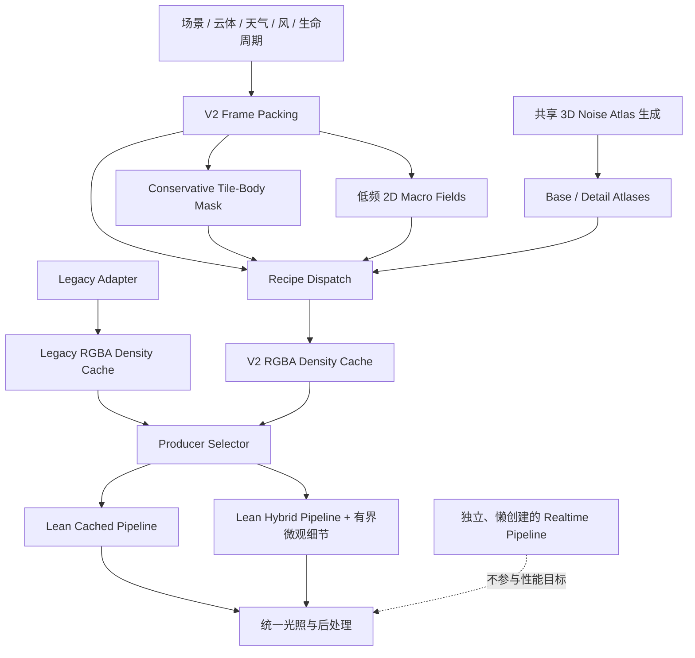
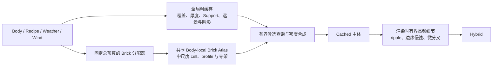
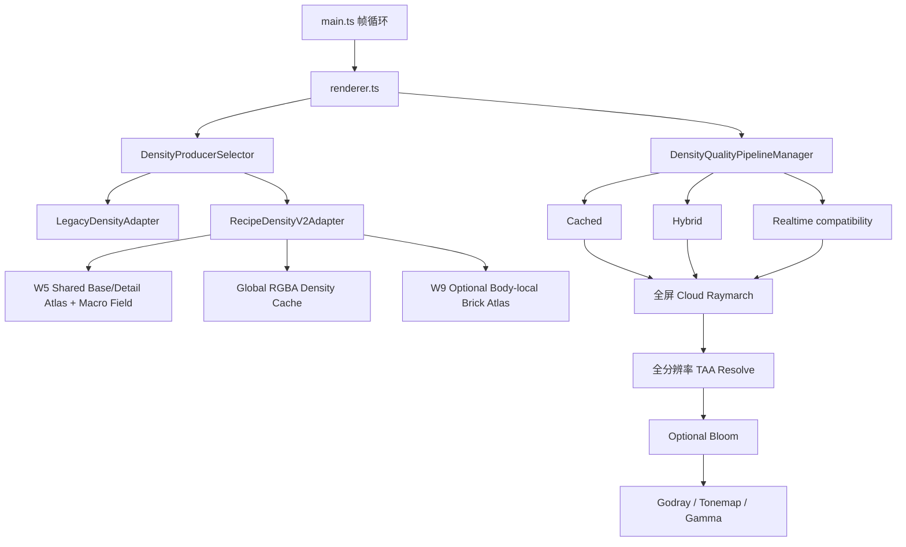

# Roadmap Refactor — 并行重写 Density Engine V2

本文给出云密度与形态系统的实施路线，但**不是 OpenSpec 提案，也不是实施授权**。旧提案 `refactor-cloud-density-recipes` 已废弃；每个 Wave 的实际范围、任务与批准状态仍以对应 OpenSpec change 为准。

> 状态（2026-07-27）：roadmap 评审稿；W0 工具已落地并由项目所有者人工签核（timing/截图非阻塞，提交 `1c62d25`），但 `establish-density-v2-baseline` change 仍以 26/28 active 保留最终基线/证据责任；W1 已于 2026-07-11 归档；W2 已完成视觉验收并归档（提交 `3e5fd15`）；W3 已完成空密度验收并于 2026-07-12 归档（提交 `338b61a`）；W4 已完成验收并于 2026-07-12 归档（提交 `a6940f6`，验收修复 `43b3cca`）；W5 已完成共享场验收并于 2026-07-12 归档（实现 `b3595e2`，归档 `cf1e98a`）；W6 已在 benchmark 修正 `9a8d33a` 后由项目所有者验收并归档（归档 `5615a71`，精确性能阈值记为 `owner-waived`）；W7 已于 2026-07-14 由项目所有者归档（`openspec/changes/archive/2026-07-14-add-density-v2-stratiform-family/`，任务 35/47，视觉/性能 Gate 按 owner 决策归档）；W8 已完成代码与自动检查，但独立 report verdict 因 Ac/Cc 形态、尺度顺序与 ripple 连续性失败而为 **Stop**，仍处于修复阶段；W9 已于 2026-07-16 获准作为 W8 Stop 的受控架构修复例外实施，当前 44/57 tasks 已完成，runtime/protocol 自动检查通过，但现存 Gate report 的 verdict 仍为 **Stop**（visual=`review`、performance=`fail`、owner approval=`pending`），最终 disposition 仍为 `pending`。该 Gate 证据基于旧 revision `1257786`，当前 HEAD 已包含后续 W9 validation/performance 修正，必须重新采集，不能把代码完成等同于 W9 final Continue；W10A/W10B **代码已在** `c0de3a5`/`bd266eb` 落地，并已于 2026-07-27 由项目所有者决策归档：`openspec/changes/archive/2026-07-27-refactor-cloud-frame-output/`（tasks 13/13）与 `openspec/changes/archive/2026-07-27-add-world-scale-cloud-raymarch/`（tasks 15/15）；Gate 报告 `docs/evidence/w10-visual-qa/gate-w10a.md` / `gate-w10b.md` 已更新为 `Decision: CONTINUE (owner-approved 2026-07-27)`、`Formal Continue: YES (owner decision; visual/performance evidence owner-waived)`——这是 **owner 决策 Continue，不是实测等价通过**；共享矩阵仍为 78 PASS / 0 FAIL / 13 UNABLE / 9 OBSERVATION，`visualGate=UNABLE`、`performanceGate=UNABLE`，PNG diff 仍为 OBSERVATION 而非视觉等价 PASS；owner-waived 项：W10A 的 owner visual approval、steady-state GPU median/p90 作为性能 Gate、resize/camera-cut/device-loss 与 depth/velocity 的像素级证明；W10B 的 owner visual approval（miss/banding/screen-lock）、steady-state GPU median/p90 与 counter series、stratus/cirrostratus toggle+motion 完整套件；W9 final disposition 仍为 `pending`，owner 明确豁免「W10A 开始前必须先正式记录 W9 final disposition」这一前置条件，不得把 W9 写成已 Continue；delta specs 已同步进主 specs（新建 `cloud-frame-output`、`cloud-stochastic-sampling`；修改 `cloud-rendering`、`cloud-params`、`cloud-physical-units`、`cloud-lighting`），`npx openspec validate --specs --strict` 为 22 passed / 0 failed，`test:w10a-cloud-frame`、`test:w10b-world-raymarch`、`test:w10b-raymarch` 均通过；W11 change `add-temporal-cloud-upscaling` 已进入提案阶段（proposal/design/tasks/spec deltas 已创建，尚未实施，Gate 未开始）；W12–W18 尚未建立提案。
>
> 主目标：Cached 与 Hybrid。Realtime 只保持可选兼容，不承担本路线的性能目标。
>
> 核心决策：不重写整个应用，也不在旧共享链内部原地大拆；在同一仓库中并行重写一个输出兼容的 Density Engine V2。

## 1. 为什么改成“子系统并行重写”

当前真正需要重新设计的是密度求值热区，而不是整个程序。以下能力已经形成可复用资产，应继续保留：

- WebGPU 设备、资源生命周期与帧循环；
- 场景、云体、天气、风和生命周期；
- Cached/Hybrid 缓存调度与时间混合；
- raymarch、light march、地面云影、TAA、Bloom 与 HDR；
- GUI、参数上传、预设、调试视图与 GPU timing。

旧方案先把 `evalCompatibilityGenus()` 拆成多个共享步骤，再逐属替换。这会让旧参数、新 Recipe 和昂贵 4D 噪声长期缠绕，导致每一步都可能影响十属。新路线改为：

```text
现有应用与 renderer
        │
        ▼
DensityCacheProducer Seam
        ├── LegacyDensityAdapter  ── 当前密度实现，冻结并用于回退/A-B
        └── RecipeDensityV2Adapter ── 新数据、新算子、新 compute pipeline
```

两个 Adapter 输出同一缓存契约，形成真实 Seam。renderer 不知道内部使用旧共享链还是 V2 Recipe。这样可以获得：

- **Leverage**：renderer、阴影和调试视图只学习一个 Interface；
- **Locality**：V2 的 Recipe、图集、剔除和性能策略集中在一个 Module 内；
- 每个 Wave 可独立切回 Legacy；
- 同场景、同相机、同缓存分辨率下可以直接 A/B；
- V2 失败时不需要回滚整个应用架构。

## 2. 目标架构

### 2.1 外部 Seam

概念 Interface 如下，具体类型名由后续提案确定：

```ts
interface DensityCacheProducer {
  prepareFrame(input: DensityFrameInput): void;
  encode(commandEncoder: GPUCommandEncoder): void;
  getOutput(): DensityCacheOutput;
  getStats(): DensityProducerStats;
}
```

Interface 必须同时约束：

- 输入：云体、Recipe、天气、风、生命周期、时间和缓存配置；
- 输出：当前 renderer 可消费的密度、主云属、次云属和混合权重；
- 调用顺序：`prepareFrame → encode → getOutput`；
- 回退：Adapter 创建失败或 V2 feature 不可用时切回 Legacy；
- 性能统计：cache pass、预计算 pass、活跃云体数、被剔除 tile 数；
- 资源生命周期：resize、device loss 和销毁责任由 Adapter 内部承担。

W0–W8 保持现有 RGBA16F ping-pong 缓存，避免在形态族迁移初期同时修改密度算法和 renderer 契约。W9 已按获准的独立 OpenSpec change 把输出演进为“全局粗缓存 + 共享 body-local brick”的版本化复合契约，并保留 global-only V2 与 Legacy 回退；但 W9 Gate 尚未 Continue，因此从 W10A 起只能把 brick 作为可选能力，不能把它当成强制前提。

### 2.2 V2 内部数据流



### 2.3 Recipe 内部顺序

十属共享控制框架，不共享同一套昂贵数学链：

```text
Tile / Body Reject
→ Domain Transform
→ Macro Support
→ Vertical Profile
→ Base Topology
→ Bounded Detail / Erosion
→ Bounded Attachments
→ Finalize Density
```

每个阶段都允许在确定密度为零时立即退出。昂贵图集采样或程序噪声必须位于包围盒、高度和覆盖率拒绝之后。

### 2.4 W9 之后的分层密度扩展

当前 `96³` RGBA 缓存覆盖整个 V2 世界体积，并不是给每个云体各分配 `96³`。这适合宏观覆盖、合成和远景，但小型云体横向可能只占少数全局体素；W8 已证明，仅调整高频 cell/ripple 参数无法稳定跨过这一采样上限。后续采用三层互补结构，而不是在“局部 brick”与“渲染时细节”之间二选一：



三层职责固定如下：

- **全局粗缓存**：保守宏观覆盖、厚度/Support、空域跳过、远景 LOD、地面云影、global-only 回退，以及过渡期的主/次云属 metadata；
- **共享 Body-local Brick Atlas**：从一张共享 3D atlas 中按云体分配可变分辨率 brick，保存 body-local 的中尺度形态；`24³–64³` 只是 W9 Spike 的候选档位，最终档位必须由预算与实测决定；
- **渲染时有界细节**：只在命中主体后执行，只能侵蚀或微调已有密度，不能在 Support 外或空缓存区域创造新云体质量。

“共享”是关键约束：不得为每个云体创建独立纹理，也不得让每个云体固定占用一个高分辨率 volume。所有 brick 必须受同一个总 voxel/显存预算、候选采样上限和回收策略约束。

W5 的共享 **noise atlas** 是所有 Recipe 读取的程序噪声基底；W9 的共享 **density brick atlas** 保存已经在 body-local 空间求值后的云体密度。两者不是同一个资源，也不能用前者已经存在来推断 W9 没有接口与显存成本。

| 方案 | 结论 | 原因 |
| --- | --- | --- |
| 只保留全局 `96³` | 保留为 coarse/fallback，不作为完整终局 | 成本稳定，但小云体中尺度形态会被全局采样低通 |
| 每云体独立 `96³` texture | 拒绝 | 显存、更新和绑定成本随云体数线性放大 |
| 全局网格 + 仅渲染时高频细节 | 不足以单独解决 | 改动较小，但无法恢复已经在缓存阶段丢失的 cell 骨架和 profile |
| 全局 coarse + 共享 body-local bricks | 进入 W9 Spike | 在固定总预算内把分辨率给真正需要的云体，但需验证 atlas 生命周期和采样成本 |
| 三层合并：coarse + bricks + bounded detail | 推荐终局 | 宏观覆盖、中尺度拓扑与可丢失微观细节各由最合适的尺度负责 |

### 2.5 当前渲染模块地图与 W9 后的真实起点

W9 之后不能只看 density evaluator；视觉结果由下面整条调用链共同决定：



以下实现快照以 2026-07-18 的 repository HEAD `08f4c76` 和当日 `openspec list` 为核对基线；建立任何后续 proposal 时必须重新核对，不能把这份快照当作永久现状。当前边界如下：

- W5 已有两张 `64³ rgba8unorm` Base/Detail Atlas 和一张 `256²` Macro Field，生成后只读、repeat + linear sample；它们已足以承载第一版 Perlin/Worley 多尺度细节，不应再平行创建一套重复 shape texture；
- W9 已实现 versioned output、固定预算 brick profiles、one-brick-per-Body、K=4 candidate grid、hierarchical Cached/Hybrid bundle、global-only 原子回退和 generation/lifecycle；尚未通过的是视觉、性能与最终 owner Gate，不是协议空壳；
- 默认仍是 Legacy producer、global-only storage、Hybrid quality、`96³` cache、64 次主步进和 8 次太阳步进；cache 后 Hybrid detail 默认 `0`，edge sharpening、adaptive march、Bloom 和 Godray 默认关闭；
- 主 raymarch 仍用 `(tExit-tEntry)/rayMarchSteps`，同一 64 步在垂直 12 km 与横向 64 km 视线上分别约为 188 m 与 1 km，世界空间采样误差会随视角变化；
- 当前 Hybrid 只做 `base *= 1 + detailStrength * noise`。它不能在零密度外产生轮廓，也不能像受控 erosion 那样切开等值面；默认 `detailStrength=0` 时该分支完全不工作；
- 当前 cloud pass 已把云、天空和地面合成到同一 `rgba16float`，alpha 只保存 `cloudDepth`；TAA 用该深度重投影整张场景，但没有 cloud-only radiance/transmittance、显式 velocity、reactive/disocclusion mask 或 shadow length；
- 当前 TAA 是全分辨率历史平滑，不是 TAAU；它能降噪，却没有把省下来的像素预算重新投入更多体积步进；
- 当前 `lightMarchDepth()` 在每个有效主采样点执行指数增长的局部太阳步进；已有 ground-shadow map 只描述地面接收阴影，不能替代云体自阴影的 Beer Shadow Map；
- 当前 `todColors()`、height ambient、Triple-Beer、Cornette-Shanks、energy-conserving step integral、解析 aerial 和 tonemap 都应保留为可回退资产；后续不重复实现同名公式，而是补齐长程光学厚度、真实的 sun/sky irradiance 输入和更正确的合成位置。

### 2.6 `three-geospatial` 借鉴矩阵

参考实现位于相邻仓库 `three-geospatial/packages/clouds/`，其 clouds package 为 MIT。借鉴时优先移植算法与资源契约到 WebGPU/WGSL；若直接改写具体 shader 片段，必须保留原始 MIT/上游 TileableVolumeNoise 等许可与来源注释。不得把 Three.js/R3F 生命周期或地球坐标假设直接搬进本项目。

| 参考能力 | 本项目当前情况 | 借鉴方式 | 明确不照搬 |
| --- | --- | --- | --- |
| 2D weather + 3D base/detail + turbulence 分层密度 | 已有 Body SDF weather、W5 Base/Detail/Macro、W9 bricks，但 render-time detail 未消费 W5 资源 | 复用 W5 资源，建立 coarse/bricks → edge-band erosion → bounded turbulence 的固定顺序 | 不新增重复的每云体 shape texture，不采用四层 `vec4` 云层上限 |
| 世界尺度主步进、weather/interval 空区早退 | 当前固定总步数导致视角相关步长，adaptive heuristic 默认关闭且不保守 | W10B 引入 min/max world step、max distance、perspective growth、Support/有效 candidate hard reject、受保守 step envelope 限制的 coarse hint 和命中回退 | 不搬 ECEF ray-sphere/cloud-shell 求交，继续使用本项目 AABB/Body Support；不让单点粗密度单独证明空区或放大步长 |
| STBN stochastic sampling | 当前是 IGN + Halton/temporal dither | W10B 增加 3D/2D-array STBN 资源、frame slice 和确定性 fallback | 不让缺少 STBN 变成初始化失败 |
| 4×4 Bayer、1/16 像素 raymarch、velocity + variance-clipped TAAU | 当前为全分辨率 TAA，只有合成色+cloudDepth | W10A 先拆 cloud-only 输出，W11 再增加宽高各 1/4 的 current pass 与全分辨率 resolve/history | 不在 cloud/ground/sky 未拆分时直接缩小现有整场景 pass |
| Sun-view cascaded Beer Shadow Map + temporal resolve | 当前只有逐点 local light march 和 ground shadow | 增加独立 BSM producer；长程 BSM + 2–3 次局部太阳步进组合 | 不把 ground-shadow texture 冒充 BSM，不双重累计同一光学厚度 |
| 每采样点 sun/sky irradiance、ground bounce、多重散射、解析积分 | 已有解析积分、相函数和多散射近似，但 irradiance 来自手工 TOD 色 | 建立 AtmosphereLightingProvider，先包住现有解析路径，再增加受限 LUT/provider | 不重复堆第二套 Triple-Beer/phase 参数，不在 Density Recipe 中放光学字段 |
| 透射率加权代表深度与 aerial composition | 已有 `cloudDepth`，但云与背景过早合成 | 保留加权深度，改为 cloud overlay resolve 后再做 aerial/composite | 不采用地球半径、cube-sphere UV 或全球天气接缝逻辑 |
| shadow length / haze / light shafts | 当前 Godray 是屏幕空间径向后效 | BSM 稳定后输出可选 shadow length，供 haze/shaft 合成；原 Godray 保留 fallback | 不在 BSM 之前扩大昂贵的 shaft raymarch |
| quality presets | 当前参数可调但缺少跨 pass 的一致 preset | 建立 low/medium/high/ultra 的资源、步数、detail、BSM、irradiance 联动 schema | 不把某一台 GPU 的最快常量写成全局事实 |

## 3. GPU 成本模型与硬约束

### 3.1 当前成本锚点

默认 `96³` 缓存包含 884,736 个体素。当前实现每个体素最多遍历 `MAX_BODIES = 12`；十个活动云体时，一次更新约有 885 万次有效云体尝试。完整 4D Voronoi 每 octave 搜索 `3⁴ = 81` 个候选单元，再乘以多 octave 和多云体，是首要成本来源。

因此 V2 必须遵守以下规则：

1. V2 主路径不得调用完整 4D Voronoi 或无界 4D fBm；
2. 不允许运行时任意 operator graph/interpreter；
3. octave、atlas sample、attachment 和循环次数必须有编译期或固定 record 上限；
4. 先做 tile/body、高度、Support 和天气拒绝，再执行形态噪声；
5. 共享噪声与密度资源，不为每个云体创建独立 3D texture/atlas；W9 只允许从一张共享 atlas 中分配 body-local brick；
6. 全局缓存保存宏观保守场，body-local brick 保存中尺度形态，Hybrid 只补可丢失的微观细节；
7. 不以默认提高全局缓存分辨率掩盖算法问题，也不把固定高分辨率成本乘到每个云体；
8. renderer 每个采样点只能查询有界数量的候选 brick，不得重新退化为逐步遍历全部 `MAX_BODIES`；
9. brick 与渲染时细节都必须受原云体 Support 约束，禁止双重合成或 Support 外增密。

### 3.2 各形态族的初始预算

这些预算是 roadmap 的设计护栏，最终数值在新 OpenSpec 中根据 Spike 数据固化。

| 形态族 | 主体实现 | 每次有效体素求值的初始预算 | 禁止事项 |
| --- | --- | --- | --- |
| Stratiform | 2D macro + 低频 3D atlas | 1–2 次 macro/atlas 采样 | 完整 4D Voronoi |
| Billow | 共享 Perlin-Worley atlas | 2–4 次 atlas 采样，最多 1 次低频 warp | `detail × 5` octave 链 |
| Cellular | Worley atlas 或受限 3D cell | 2–3 次采样/有界邻域 | 4D 81 邻域循环 |
| Fiber | 解析方向脊线 + warp | 解析 ALU + 最多 2 次 atlas 采样 | 先生成团块再裁出纤维 |
| Wave/Lens | 正弦、椭球/透镜 SDF | 解析 ALU，零强度早退 | 为零强度执行噪声 |
| Convective | 高度门控 cell + 柱/砧解析场 | 4–6 次主体采样，附件数固定 | 无界塔体/附件循环 |
| Body-local brick | 共享 atlas 中的可变档位 brick | 固定总 voxel/显存预算；每 body 一个有效 allocation 或明确降级 | 每云体固定 `96³`、无界扩容 |
| Hybrid detail | 按主/次云属选择细节 | 每种 Recipe 最多 2 次额外采样 | 空缓存区域生成新主体 |

### 3.3 WebGPU 使用原则

- workgroup 尺寸必须同时校验 X/Y/Z 和乘积，并读取 `device.limits`；
- 不假设最大 invocation 数最快，至少比较 64、128、256 三档候选；
- 继续以 `timestamp-query` 作为主要 GPU 计时证据；
- `shader-f16` 仅作为可选 Adapter 内部优化，必须有 f32 fallback；
- 初期不依赖 `subgroups`，避免把可选 feature 变成基础契约；
- 大型 compute/render pipeline 使用异步创建，并缓存编译结果；
- workgroup storage 只用于测量证明存在重复读取的值；
- 不在早期引入 occupied-tile compaction 或 indirect dispatch，先验证保守 mask 的收益。

### 3.4 与其他 active changes 的关系

| Active change | 本路线中的处理 |
| --- | --- |
| `establish-density-v2-baseline` | 只保留未完成的最终基线/证据责任；不得继续用旧 baseline manifest 覆盖 W9 后新增的 cloud-only、TAAU、BSM pass 指标 |
| `add-height-weather-shaping` | 作为 Legacy 视觉与行为基线；V2 可以吸收其高度/天气语义，但不得继续依赖旧昂贵噪声链，也不复制一份同名参数链 |
| `add-height-ambient-tint` | 属于 Optical/Lighting，不并入 Density V2；W0 冻结基线后独立演进 |
| `add-density-v2-cellular-wave-family` | W8 实现完成但 Gate verdict=Stop；继续保存 global-only/hierarchical 联合复验入口。W10A、W10B 与 W11–W14 不得暗中修改 W8 Recipe 以“顺便修好”形态，W15 前必须形成 Continue→归档，或 Stop→withdraw/supersede/带失败证据归档之一的终态记录 |
| `add-hierarchical-body-local-density-bricks` | W9 代码与自动协议已落地，当前 report verdict=Stop、final disposition=pending；先在包含现有修正且明确记录的新 commit 重采 evidence。final Continue 时作为 W12/W15/W16 中尺度来源；final Stop 时保持实验关闭并由 global-only + bounded render detail 路线继续 |
| `raymarch-occupancy` | 不再作为平行的旧 HDDA 设计直接实施；其目标并入 W10B 的世界尺度步进与保守 skip 子 Gate，先复用公开 Body Support 与有效 candidate coverage，coarse probe 只作 step hint；再由 timing 决定是否在 W17 建立 min-max mip/HDDA |

进入任何新 Wave 前，重叠 active change 必须先归档、撤销或在新 proposal 中写明串行修改边界；不得同时让两个 active change 修改 `renderer.ts`、`cloud.wgsl` 或同一完整 MODIFIED requirement。

本路线继续取代 `roadmap-v2` 阶段 13.1 的密度模型重建路线，并吸收阶段 14 中与形态算子有关的部分；本次重排进一步把旧阶段 11 的时域升采样、阶段 13.2 的光照耦合和阶段 13.3 的大气输入纳入 W10A、W10B 与 W11–W18。`roadmap-v2` 对这些项目只保留历史背景，不再作为独立执行顺序。

## 4. Wave 总览

```mermaid
flowchart LR
    W0["W0 基线与预算"] --> W1["W1 Producer Seam"]
    W1 --> W2["W2 Pipeline 隔离"]
    W2 --> W3["W3 V2 空壳与数据"]
    W3 --> W4["W4 Tile 剔除"]
    W4 --> W5["W5 共享场与图集"]
    W5 --> W6["W6 双属 Spike"]
    W6 --> Gate{"继续 V2?"}
    Gate -->|是| W7["W7 Stratiform"]
    Gate -->|否| Stop["保留 Legacy / 重审架构"]
    W7 --> W8["W8 Cellular / Wave"]
    W8 --> W8Gate{"W8 形态 Gate?"}
    W8Gate -->|未通过但 owner 批准架构例外| W9["W9 分层缓存 Spike"]
    W8Gate -->|继续修复| W8Fix["W8 global-only 修复"]
    W9 --> BrickGate{"记录 W9 final disposition"}
    BrickGate -->|Continue| Hierarchical["Hierarchical 可用"]
    BrickGate -->|Stop| GlobalOnly["Global-only + Render Detail"]
    Hierarchical --> W10A["W10A Cloud-only 输出与合成"]
    GlobalOnly --> W10A
    W10A --> W10B["W10B 世界尺度 Raymarch / STBN"]
    W10B --> W11["W11 Temporal Upscaling"]
    W11 --> W12["W12 多尺度有界细节"]
    W12 --> W13["W13 Beer Shadow Maps"]
    W13 --> W14["W14 大气与辐照度耦合"]
    W14 --> GenusGate{"W8 已处置且存储路线明确?"}
    GenusGate -->|是| W15["W15 Fiber"]
    GenusGate -->|否| Hold["只完成渲染基础设施，不开始新云属"]
    W15 --> W16["W16 Convective"]
    W16 --> W17["W17 Quality / GPU 调优"]
    W17 --> W18["W18 默认切换与收尾"]
```



| Wave | 可交付结果 | 视觉变化 | 主要风险 |
| --- | --- | --- | --- |
| W0 | 冻结 Legacy Cached/Hybrid 基线和预算 | 否 | 缺少可重复证据 |
| W1 | 一个 Seam、两个 Adapter 槽位，Legacy 仍唯一工作实现 | 否 | Interface 泄漏 renderer 细节 |
| W2 | Cached/Hybrid/Realtime shader 与 pipeline 生命周期隔离 | 否 | shader 组装改变资源布局 |
| W3 | V2 独立资源、参数布局和空密度 compute 闭环 | 否 | CPU/WGSL layout 错位 |
| W4 | active-body 上限、早退和保守 tile-body mask | 否或仅性能变化 | 包围盒过小造成缺云 |
| W5 | 共享 3D atlas 与低频 2D macro fields | 否，尚不接管云属 | atlas 周期或精度产生伪影 |
| W6 | Stratus + Cumulus V2 Spike 和继续/停止门 | 是，仅两个测试属 | 核心假设不成立 |
| W7 | St/Cs/As/Ns 完整 Stratiform 迁移 | 是，仅四属 | 薄层缓存丢失 |
| W8 | Sc/Ac/Cc Cellular/Wave 迁移 | 是，仅三属 | cell 过度规则 |
| W9 | 全局粗缓存 + 共享 body-local brick 的 Proof-of-Architecture | 是，仅固定 Spike 场景 | atlas 碎片、双重增密或采样成本失控 |
| W10A | cloud-only HDR 输出、代表深度/速度、full-res cloud-only feature fallback 与 legacy combined emergency fallback | 否，固定采样下应与旧路径等价 | MRT/clear value/合成所有权或 fallback 路由回归 |
| W10B | 世界尺度 raymarch、保守 skip、STBN sampling/deterministic fallback | 是，减少视角相关欠采样与远景 banding | 薄云漏采、步进成本或 STBN screen-lock |
| W11 | 4×4 Bayer temporal cloud upscaling 与全分辨率 fallback | 主要是稳定性/细节预算 | ghosting、disocclusion、history 污染 |
| W12 | 复用 W5 atlas 的 Recipe-aware edge erosion、detail/turbulence | 是，轮廓与微结构 | 高频 alias、Support leak、主次属闪变 |
| W13 | 级联 Beer Shadow Map、独立时域 resolve、local correction | 是，内部体积与长程自阴影 | 光学厚度双算、shadow swimming |
| W14 | AtmosphereLightingProvider、sun/sky irradiance、aerial/shaft 合成 | 是，云与天空/地面统一 | LUT 成本、色调重校准、过度物理化 |
| W15 | Cirrus Fiber 正式迁移 | 是，仅 Ci | 纤维被存储/时域低通截断 |
| W16 | Cu/Cb Convective 正式迁移 | 是，仅两属 | Cb 组合和自阴影成本失控 |
| W17 | 统一 quality presets、workgroup/格式/LOD 调优 | 是，质量档稳定 | 组合爆炸、单机过拟合 |
| W18 | V2 默认启用、最终证据和后续提案清单 | 默认运行行为会改变，但不引入新算法 | 过早删除 Legacy 或实验路径 |

## 5. W0 — Legacy 基线与性能预算

OpenSpec change：`openspec/changes/establish-density-v2-baseline/`。该 change 只负责基线、观测与证据，不授权 W1 Seam 或 V2 实现。

### 工作

- 固定 camera、scene time、body placement、天气、风和生命周期状态；
- 使用固定 `96³`、固定 update rate，分别记录 Cached 与 Hybrid；
- 提供十属固定场景与五类代表性 timing/截图入口；项目所有者可接受人工视觉签核而不严格采集；
- 记录 cache pass、cloud pass、活跃云体数和 shader/pipeline 首次创建时间；
- 建立两类压力场景：十属同场景、单个大体积 Cb；
- 记录设备 feature/limits，但不据单台设备硬编码通用参数。

### 退出条件

- 十属有可重复 manifest；实际采集时可按同一输入恢复；
- 若声明性能证据完整，记录须区分预热、稳态、正常视图和 debug 视图；当前未作该声明；
- 所有后续 Wave 都使用同一套输入进行 A/B；
- Realtime 只记录是否可创建和正确显示，不纳入预算。

## 6. W1 — 建立 DensityCacheProducer Seam

### 工作

- 定义最小 `DensityCacheProducer` Interface；
- 用 `LegacyDensityAdapter` 包住当前 compute/cache 行为，不拆旧 shader 内部函数；
- 建立 `RecipeDensityV2Adapter` 槽位，但本 Wave 不实现新密度；
- renderer、地面云影和 debug 视图只消费 `DensityCacheOutput`；
- 明确 resize、device loss、销毁、统计与失败回退语义；
- 增加运行时 Legacy/V2 选择，但 V2 未就绪时必须安全回退。

### 退出条件

- Legacy Adapter 与当前画面、缓存更新节奏和性能处于测量噪声范围；
- renderer 不直接访问 Adapter 内部 buffer/pipeline；
- 删除 Interface 后复杂度会重新散落到多个调用方，证明该 Module 具有 Depth；
- V2 创建失败不会破坏 Legacy。

## 7. W2 — 隔离 Cached、Hybrid 与 Realtime Pipeline

### 工作

- Cached 渲染模块只包含缓存采样和其必需函数；
- Hybrid 渲染模块只增加有界微观细节入口；
- Realtime 的完整密度调用图移到独立模块和独立 pipeline；
- Realtime 只有在用户选择时才异步创建；
- V2 compute shader 不拼接 Legacy 的完整 genus/noise 调用图；
- 为 pipeline 创建时间和失败原因增加统计。

### 退出条件

- Cached/Hybrid 不再静态携带完整 Realtime 密度实现；
- 三种质量模式资源布局明确，切换无悬空引用；
- Cached/Hybrid 视觉与 W0 基线等价；
- Realtime 仍能按需创建，但没有性能承诺。

## 8. W3 — V2 Compute 空壳与数据布局

### 工作

- 建立 V2 自有 WGSL 模块、compute pipeline、bind group 和资源生命周期；
- 定义固定布局的 `DensityRecipeGPU`，不复用旧 `detail` 字段承载多种语义；
- 将 Placement、Density Recipe、Optical Profile 保持为三条正交数据轴；
- 十属 Recipe 表先只包含静态模式和有界参数，不引入 operator interpreter；
- 让 V2 写出与 Legacy 相同的 RGBA 缓存协议；
- 在无云输入、单体输入和无效 genus 下验证有限值与零密度语义。

### 退出条件

- V2 可独立创建、dispatch、resize 和销毁；
- CPU/WGSL record 顺序和对齐有机器可读检查计划；
- V2 shader 不引用 Legacy 4D Voronoi/4D fBm；
- 切换 Adapter 不要求 renderer 重建无关后处理资源。

## 9. W4 — 空间剔除与廉价早退

### 工作

1. 循环上限使用真实 `activeBodyCount`；
2. 在天气和噪声前增加保守 body AABB、高度与 profile 拒绝；
3. 按实际 workgroup 网格生成保守 tile-body bit mask；
4. mask 纳入旋转、风位移、Cb 砧顶和附件的最大扩展；
5. 统计空 tile、每 tile 候选 body 数和实际 evaluator 调用数；
6. workgroup 改变、缓存 resize 或 body bounds 改变时正确重建 mask。

默认 `96³`、`8×8×4` 下约有 3,456 个 tile。CPU 每次更新做约 `3,456 × 12` 次保守相交判断，预期远低于 GPU 对每体素尝试所有云体的成本。

### 退出条件

- mask 关闭时与开启时的密度结果在约定容差内一致；
- 快速移动、旋转和 Cb 砧顶场景不缺块；
- 有指标能证明 evaluator 调用量下降，而不是只观察 FPS；
- 暂不引入 GPU compaction、原子累积或 indirect dispatch。

## 10. W5 — 共享 GPU 场与噪声图集

### 工作

- 用 compute 一次或低频生成共享 Base Atlas 和 Detail Atlas；
- 比较 `rgba8unorm`、`r16float/rgba16float` 等候选格式的质量、带宽和兼容性；
- 使用硬件三线性采样、坐标平流和低频 warp 取代主路径 4D 动画噪声；
- 不为每个云体创建独立 3D texture；
- 为仅依赖 XZ 的天气覆盖、层厚、波相位和 cell 布局建立低频 2D macro fields；
- macro、density cache、Hybrid detail 使用不同更新频率；
- 增加 atlas 切片/debug 视图，用于检查周期、接缝和量化。

### 退出条件

- atlas 生成不进入每帧热路径；
- 风平流和时间演化连续，不出现明显方块或固定纹理锁定；
- 共享资源内存有明确上限；
- 尚未迁移的 Legacy 云属不受新资源影响。

## 11. W6 — 双属 Proof-of-Architecture Spike

选择两个相反的代表属：

- **Stratus**：验证 Stratiform、2D macro 和廉价层状路径；
- **Cumulus**：验证 Billow、共享 Perlin-Worley atlas 和中等复杂度主体。

### 工作

- 分别实现最小 V2 Recipe，不追求全部变种；
- Stratus：Thin Sheet + 低幅 macro + 最多两次主体采样；
- Cumulus：Flat-base Dome + Billow atlas + 有界高度变化；
- 保留属级 Legacy/V2 切换；
- 对比正常视图、density debug、Cached、Hybrid、单体和多体场景；
- 记录 V2 预计算 pass、cache pass、总 cloud pass、pipeline 创建时间和资源占用。

### 继续/停止 Gate

只有满足以下条件才进入 W7：

- Stratus 明显减少 cache pass 成本，且层体连续；
- Cumulus 在等价分辨率下不比 Legacy 稳态中位数显著变慢；
- 两属均无 Support 外密度、NaN、tile 缺块和明显 atlas 周期伪影；
- V2 shader/pipeline 的编译与资源复杂度可维护；
- 视觉问题能够通过 Recipe 参数或有限算子修正，而不需要恢复完整 4D Voronoi 链。

若 Gate 失败：停止迁移，保留 W1 Seam 与 Legacy，针对失败原因重审 atlas、Recipe 或缓存策略；不得以“已投入较多”为理由继续八属迁移。

## 12. W7 — Stratiform 家族迁移

迁移顺序：

1. Stratus：沿用 Spike 结果；
2. Cirrostratus：极薄、近均匀，高空薄幕；halo 留在 Optical；
3. Altostratus：中层、水平拉伸、磨砂层；sun disc 留在 Optical；
4. Nimbostratus：厚层与暗底，预留降水 Attachment，但不实现降水输运。

### 退出条件

- 四属不调用 Legacy 完整团块噪声链；
- 四种厚度、破碎度和垂直位置肉眼可分；
- 薄层在 Cached 下连续，不依靠默认提高 cache resolution；
- 每属保留 Legacy 回退和独立 timing。

当前 W7 实现与形态修复的固定验证步骤、case ID、raw-density 判据及 Gate 记录模板见 [`w7-stratiform-fix-validation.md`](w7-stratiform-fix-validation.md)。W7 已按 owner 决策归档，但不等于 47 项 tasks 全部完成；未完成项和 waiver 保留在 archive/tasks，运行证据见 [`w7-stratiform-fix/report.md`](evidence/w7-stratiform-fix/report.md) 与 [`w7-stratiform-fix-round2/report.md`](evidence/w7-stratiform-fix-round2/report.md)。

## 13. W8 — Cellular 与 Wave 家族迁移

迁移顺序：

1. Stratocumulus：大 cell、高连接率、较厚；
2. Altocumulus：中 cell、中连接率；
3. Cirrocumulus：小 cell、薄 profile、较强 ripple。

### 工作

- Cellular 使用共享 atlas 或受限 3D cell，不使用完整 4D 邻域；
- cell scale、connectivity、thickness 和 ripple 分开控制；
- Wave/Lens/Roll 作为静态可选 hook，零强度必须在噪声前早退；
- 不在本 Wave 扩展 scenario schema 或一次实现所有云种/变种。

### 当前 Gate 与修复边界

独立 WebGPU 验收已经完成 64/64 case 和 128/128 张截图，运行时与自动检查通过，但结论为 **Stop**：Ac/Cc 主体、`Sc > Ac > Cc` 尺度顺序和 ripple 连续性未通过，Support/metadata 与 Cc 成对性能证据仍 unresolved。详见 [`evidence/w8-cellular-wave/report.md`](evidence/w8-cellular-wave/report.md)。

W8 只修复当前全局 `96³` 契约内能够成立的行为：

- 把 cell/ripple 的有效频率校准到当前缓存可分辨的频带，并用 world/body-stable 相位避免相机锁纹；
- 让 benchmark 中 Sc/Ac/Cc 的物理尺寸、镜头与预期体素跨度可解释，避免用亚体素差异证明属间尺度；
- 补齐 finite metadata、Support containment、evaluator call count 与 Cc Legacy/V2 timing 证据；
- 保留当前 RGBA 输出与 renderer 采样路径，不在 W8 新增 brick atlas、每云体资源或复合缓存接口。

### 退出条件

- Sc/Ac/Cc 的 cell 尺寸、层厚和连接度可辨；
- 不出现明显棋盘重复或随相机锁定；
- 空的 `add-stratocumulus-cumulus-breakup` 目标由新架构吸收，但不复制其旧设计；
- 三属在相同场景中可独立切回 Legacy；
- 独立 Gate 从 Stop 变为 Continue，且项目所有者批准后才可归档；2026-07-16 已批准 W9 作为该 Stop 的架构修复例外先行实施，但不能据此改写或归档 W8。

这里的 Gate verdict 与 change 终态分开记录：Continue 后可按流程归档；若最终仍为 Stop，则必须明确选择 withdraw、由后续 change supersede，或带失败证据归档，不能长期以“修复中”冒充可依赖的已完成基础设施。

## 14. W9 — 分层密度缓存与 Body-local Brick Spike

W9 是独立架构 Gate，不是继续给 W8 追加参数。change ID 为 `add-hierarchical-body-local-density-bricks`；Proposal、Design、delta specs 和 Tasks 已获准作为 W8 Stop 的受控架构修复推进，最终仍须独立 W9 Gate。

### 当前状态（2026-07-18）

- tasks 为 44/57；versioned output、固定预算 brick atlas、one-brick-per-Body、K=4 candidate、Cached/Hybrid bundle、global-only 原子回退和 lifecycle 路径已经进入当前代码；
- runtime 与 protocol 自动检查通过，但现存 [`docs/evidence/w9-body-local-bricks/report.md`](evidence/w9-body-local-bricks/report.md) 的 report verdict 仍是 **Stop**：visual=`review`、performance=`fail`、owner approval=`pending`；W9 final disposition 因而仍是 `pending`，二者不得混称；
- 该报告基于 revision `1257786`，而当前 HEAD 已包含后续 validation/performance 修正。必须选择并记录一个包含这些修正的新 commit，让 global-only 与 hierarchical 两组 A/B 在该**同一个新 revision**、同场景、同参数下重采；不是回到 `1257786` 重跑。旧报告不能删除，也不能被“代码已完成”自动改写；
- 现有性能失败集中在部分 cloud median 超出 `1.25×`、部分 ground-shadow median 超出 `1.35×` 的硬线。重采前先确认 timing query/样本数/预热一致，再判断是实现回归、证据过期还是预算本身需要经 owner 显式 waiver；
- W10A、W10B 与 W11–W14 是 renderer 基础设施，可在 W9 **Continue 或 Stop 被正式记录后**按各自 OpenSpec 串行推进，并始终保留 global-only 路线；W15/W16 不得在 W8 尚未处置、W9 存储路线未明确时开始正式云属迁移。

### 工作

- 保留现有全局 RGBA 缓存作为 coarse envelope、Support/occupancy、远景、地面云影、global-only 回退和过渡期 metadata 来源；
- 建立一张共享 body-local density atlas，优先评估单通道 `R16F` brick；每个活动 Recipe V2 云体只持有 allocation record，不持有独立纹理；
- 在固定总 voxel/显存预算内评估 `24³`、`32³`、`48³`、`64³` 候选档位，并根据投影尺寸、形态频带和重要度分配或降级；
- Spike 默认先验证“每 body 至多一个 brick”；对 Ci/Cb 等高纵横比云体记录拉伸采样和空间浪费。若数据证明需要 aspect-aware brick 或每 body 多 brick，Proposal 必须给出固定上限，不得无界拆分；
- 定义 world/body-local/atlas 坐标变换、1–2 voxel gutter、allocation generation、回收、resize、device loss 和 atlas 重建行为；
- 为 LOD 变更加入 hysteresis/cross-fade，并让噪声与风相位在 world/body 空间稳定；
- renderer 通过已有 tile/body 信息或等价加速结构取得有界候选，只采样少量相关 brick；精确上限由 Spike 数据固化，不得在每个 ray step 扫描全部 12 个云体；
- 在 overlap 中明确 coarse 与 brick 的合成所有权，避免同一质量被全局缓存和局部 brick 重复相加；
- 对 global-only V2、hierarchical V2 与 Legacy 做同场景 A/B，且所有新路径均可关闭。

W9 只证明存储、采样、合成和生命周期架构。它可以复用 W8 的小尺度 Sc/Ac/Cc，再增加一个细长 Fiber 代理场景验证低通问题，但不在本 Wave 正式迁移 Cirrus 或 Convective。

### 继续/停止 Gate

只有同时满足以下条件，后续 Wave 才可把 brick 当成可用基础设施：

- 在明确且固定的总显存预算下，小型 Cellular 和细长代理主体比同预算 global-only 缓存保留更多可辨中尺度形态；
- 正常视图、density debug、相机运动、风平流和 LOD 切换中没有 atlas 接缝、跳变、屏幕锁纹或 allocation 泄漏；
- overlap 密度与 metadata 合成在规范容差内，无双重增密、NaN、越界和 Support 外质量；
- brick 候选数、atlas 更新、cache pass 与 cloud pass timing 均满足 Proposal 中的硬预算，且没有退化为全 body 扫描；
- resize、device loss、云体增删、allocation 回收和预算不足降级都有自动检查与运行时证据；
- global-only V2 与 Legacy 回退仍可独立工作，`DensityCacheOutput` 的版本/兼容规则不会泄漏未启用资源。

任一核心条件不成立则停止 W9，保留 global-only V2；W10A、W10B 与 W11–W14 改以 global-only + bounded render detail 为基线，W15/W16 重新选择中尺度存储。不得用无界显存、默认提高全局分辨率或删除回退来换取 Continue。

## 15. W10 — 拆为两个串行 Changes

W10 保留为路线图中的调度容器，但不再对应一个同时修改输出 ABI 与采样算法的 OpenSpec change。实施顺序固定为：

```text
W9 final disposition → W10A Gate/归档 → W10B Gate/归档 → W11
```

W10A 与 W10B 必须分别建立 proposal/design/tasks/spec deltas、分别验证、分别批准和回退。W10A Continue 并归档后才实施 W10B；W10A Continue 后即使 W10B Stop，W10A 也可以独立保留。W10B Continue 并归档后才实施 W11，且不得借机重新定义 W10A 的 attachment、composite 或失效语义。

### 15.1 W9 后重排与共同前置

本次调整不删除旧 W10–W13 的目标，而是把它们放到能产生收益的位置：

| 旧路线项目 | 新位置 | 调整原因 |
| --- | --- | --- |
| 旧 W10 Fiber | 新 W15 | 先解决固定步数、粗缓存、时域预算和 render-time detail；否则 Fiber 仍会变成粗条 |
| 旧 W11 Convective | 新 W16 | Cb 的内部体积主要依赖自阴影和多尺度细节，必须在 BSM/irradiance 后验收 |
| 旧 W12 的 Hybrid detail 子项 | 新 W12 | 从“十属迁完再补”前移为基础设施；它直接决定现有八属轮廓能否超过 `96³`/brick 带宽 |
| 旧 W12 的 GPU tuning 子项 | 新 W17 | 先让 pass/资源契约稳定，再做组合调优，避免对过渡架构过拟合 |
| 旧 W13 默认切换 | 新 W18 | 默认切换必须包含 TAAU、BSM、atmosphere 和新 quality preset 的最终证据 |
| `roadmap-v2` 阶段 11 TAAU | 新 W11 | 从可选性能项提升为高采样质量的核心资金来源 |
| `roadmap-v2` 阶段 12 occupancy/HDDA | W10B 子 Gate + W17 可选优化 | 先做世界尺度步进与保守 Support skip；只有 timing 仍失败才做完整 mip/HDDA |
| `roadmap-v2` 阶段 13.2/13.3 | 新 W13/W14 | 把自阴影、irradiance 和 aerial 从“后续 Track”纳入商业观感主路径 |

开始 W10A 前必须正式记录 W9 final disposition=Continue 或 Stop，而不只是引用旧 report verdict；同时冻结命名 revision 下的旧 combined cloud/TAA/composite attachment、pass 顺序、fixed-step/IGN-Halton 和 GPU 基线。所有触及同一 spec、渲染 shader/source assembly 或完整 requirement 的 active changes 必须先归档、撤销或写明串行边界；W10A 至少要解决 W9 的 `cloud-rendering` 重叠，W10B 还要解决现存 `cloud-params`/`cloud-lighting` 重叠。W9 final Stop 时 hierarchical bundle 保持实验关闭；两个 change 都只依赖公开的 `densityAtTyped()`/Body Support 契约，不能为 hierarchical 私建分支。

### 15.2 W10A — Cloud-only Frame Output 与 Full-resolution Composite

建议 change ID：`refactor-cloud-frame-output`。

当前 `fs()` 过早返回 `color + transmittance * background`，导致 cloud history 同时包含天空、地面和调试线。W10A 只建立独立、版本化的 cloud-only 概念输出及其 full-resolution composite；以下是 proposal 的起草约束，不是已冻结的 TypeScript ABI：

```ts
interface CloudFrameOutput {
  contractVersion: 1;
  radianceTransmittance: GPUTextureView; // RGB=云散射辐亮度，A=透射率 T
  depthVelocity: GPUTextureView;         // representative depth + screen velocity + validity
  sampleMeta?: GPUTextureView;           // 可选 reactive/debug；不进入 v1 必需契约
  width: number;
  height: number;
  resourceGeneration: number;
  contentRevision: number;
  discontinuityGeneration: number;
}
```

具体通道在 W10A proposal 中固化，但必须满足：

- cloud raymarch 只积分云介质，不在同一 history 颜色中烘焙天空、地面、Bloom 或 tonemap；
- `radianceTransmittance` 使用 HDR 浮点格式，保持能量守恒积分的线性空间结果；A 通道固定为透射率 `T`，空像素 clear value 为 `(0,0,0,1)`，禁止 consumer 猜测 A 是 opacity；
- `depthVelocity` 使用透射率加权代表深度；有云像素由代表世界点计算 velocity，无云像素显式标记 invalid，而不是用 `1e4` 假深度伪装有效云；
- 天空/地面先由现有解析函数生成，再在 full-resolution composite 中唯一地按 `cloudRadiance + T * background` 合成；
- gizmo/axis/debug line 在 cloud temporal resolve 之后叠加，不能污染 cloud depth/history；
- `resourceGeneration`、连续内容 revision 和结构性 discontinuity 必须是三个不同概念。W10A 只发布失效信号，不接管 W11 的 history owner；
- `CloudFrameOutput` 可用时，full-resolution cloud-only current + 现有 full-resolution temporal resolve 是 W11 feature-off 的真值/设备 fallback；
- MRT 不可用、pipeline 创建失败或 device capability 不满足时，旧 full-resolution combined pass 只作为 legacy emergency fallback。它不得伪装成 `CloudFrameOutput`，启用时必须禁用 W11/TAAU，而不能成为 W11 的隐式输入。

W10A 的非目标是：不改变主 ray 步进分布、skip、STBN、Bayer/TAAU、history 算法、Density Recipe、render-time detail、光照、BSM 或 atmosphere；不改变 W9 `DensityCacheOutput`/hierarchical ABI。

#### W10A Gate

W10A Continue 必须满足：

- 在完全相同的 fixed-step/IGN-Halton、相机、时间和后处理设置下，新 full-resolution cloud-only + composite 与旧 combined 路径视觉等价；
- attachment 数量、格式、clear value、`T`/validity、尺寸、generation 和销毁行为有自动 fixture；
- representative depth/velocity 对静止、相机平移/旋转、云体风移和无云像素均有限、方向正确；
- 天空、地面、gizmo/debug 不再污染 cloud history，且 TAA、Bloom、tonemap、ground shadow 无回归；
- resize、camera cut、producer/storage/quality 切换、pipeline failure 与 device loss 不留下陈旧 view/history；W11 feature-off 使用 full-res cloud-only 路径，legacy combined emergency fallback 则明确禁用 W11；
- 分别报告 cloud-only current、现有 full-resolution temporal resolve、composite 的 pass 数、纹理字节和 GPU median/p90。

任一核心条件失败则 W10A Stop，保留旧 combined 路径，不开始 W10B 或 W11。

### 15.3 W10B — 世界尺度 Raymarch、保守 Skip 与 STBN

建议 change ID：`add-world-scale-cloud-raymarch`。只有 W10A Continue 并归档、`CloudFrameOutput`/composite/discontinuity 契约被冻结后才能实施；W10B 不得修改 W10A 的 attachment 格式、透射率语义、composite owner 或 history invalidation 语义。

#### 世界尺度步进契约

新增候选参数，最终范围由 W10B proposal 与 Gate 固化：

- `maxPrimaryIterations`：只作为安全循环上限，不再决定整段均分步长；
- `minPrimaryStepMeters` / `maxPrimaryStepMeters`：集中换算为沿当前 ray 的 render-space `Δt`，禁止 CPU/WGSL 混用米与 world unit，也不得假定水平和垂直缩放相同；
- `maxPrimaryRayDistanceMeters`：限制远景成本；
- `perspectiveStepScale`：随距离缓慢增长，不能替代 mip/occupancy；
- `minDensity` / `minExtinction` / `minTransmittance`：分别控制昂贵采样、光照与早停，不复用一个阈值；
- 旧 `rayMarchSteps` 在迁移期映射为 `maxPrimaryIterations`，GUI 标记 deprecated；W18 前决定删除或仅保留 scenario 兼容读取。

主循环顺序固定为：

```text
ray/AABB intersection
→ 公开 Body Support interval 的保守 hard reject
→ valid/complete hierarchical candidate coverage 的可选保守 hard reject
→ 由最小特征厚度或保守 majorant 固化当前 step envelope
→ coarse density probe（只能在 envelope 内给 step hint，不能判空或单独放大上限）
→ 首次可能命中前按 envelope 推进
→ 首次可能命中时回退/二分细化到 min step
→ densityAtTyped（global-only 或 valid hierarchical）
→ 现有 lighting/integration
→ transmittance early termination
```

W10B 只为 W12 的 bounded detail 预留明确插入点，不提前定义或实现 `finalDensity`/`roughDensity`。现有“连续四次空样本后 ×2”的 heuristic 只能作为对照 fallback。默认启用任何大步前必须证明不会跨过：薄 Stratiform、Cc ripple、W9 thin-ridge proxy、旋转 Body、风平流 Support 与 brick complete/incomplete 边界。

W4 tile-body mask 当前属于 producer-private 资源，W10B 不得绕过公开契约直接读取或把它暗中加入 `DensityCacheOutput`。只有公开 Body Support interval，以及被规范证明 complete/valid 的 W9 candidate coverage 可以执行 hard reject；global coarse 点采样不是占用率上界，既不能把区间判空，也不能单独把步长放大到超出由最小特征厚度或保守 majorant 证明的 step envelope。没有这种 envelope 证明时，coarse hint 必须关闭并使用不含 hint 的基础 world-step；整个 W10B feature-off 时才精确回到 W10A fixed-step。W9 final Stop、global-only、Legacy 或 candidate invalid 时不得触碰 candidate buffer，必须仅靠 Body Support 约束范围并在 Support 内按已批准 envelope 推进。若 W10B 设计确实需要新的全局 mask/interval/majorant payload，则独立 `density-cache-production` delta/amendment 必须先获批并完成，成为 W10B 前置；不能在实现中暗加。完整 min-max occupancy mip、HDDA、compaction 和 indirect dispatch 仍留给 W17 的证据 Gate。

#### STBN 资源与确定性 fallback

- 增加一个小型、固定预算的 STBN texture（3D 或 2D-array），按 `pixel + frameSlice` 扰动主步进与现有 local-light 采样序列；W13 后续只读消费同一资源契约；
- 资源来源、尺寸、格式、许可和生成脚本必须可复现，不能只提交未知二进制；
- STBN 未支持、加载失败或 debug deterministic 模式时回退现有 IGN/Halton；fallback 不能改变 pipeline contract，也不能造成初始化失败；
- STBN 只扰动 ray 起点/步进与 ray 内采样序列，不占用或改变 W11 的 4×4 Bayer pixel/projection phase；
- camera static、camera motion、scene time pause 和 wind motion 分别验证，不能用随机噪声掩盖 density popping；debug view 必须能冻结 frame slice、显示 jitter 值和比较 STBN/IGN。

W10B 的非目标是：不修改输出/composite/TAA，不实现 TAAU；不改变 density family、Recipe、bounded detail、现有光照积分数学或 BSM；不引入 occupancy pyramid，也不扩大 W9 payload。

#### W10B Gate

增加至少以下 GPU/debug 指标：实际 primary iterations、Support/candidate hard reject 次数、coarse step-hint 次数、density/evaluator samples、light samples、平均/最大世界步长、首次命中回退次数和 cloud GPU median/p90。

W10B Continue 必须满足：

- fixed-step 与 world-step、STBN 与 deterministic fallback 分别进行独立对照；
- 50–100 m 级候选 min step 能在目标质量档工作，横向视线不再因固定 64 步退化到约 1 km/步；最终值由设备证据固化，不把候选值冒充规范；
- 公开 Support/candidate hard reject fixtures 的 false-negative 必须为零；
- 薄 Stratiform、Cc ripple、W9 thin-ridge（hierarchical active 时）、旋转 Body、风平流和 Support 边界的 world-step sampling miss 不得相对 fixed-step 基线超出 proposal 固化的误差容限；coarse hint 关闭时回到不含 hint 的基础 world-step；
- 静止、相机运动、暂停时间与风运动中无 screen-lock、远景 banding，且不以随机噪声掩盖 popping；
- world-step、Support/candidate hard reject、coarse hint 与 STBN 具有彼此独立的开关；关闭单项时回到其下层基线，全部关闭时精确回退 W10A 的 fixed-step + IGN/Halton full-resolution 基线；
- shader source length、cloud GPU median/p90 和各计数器有前后证据，视觉改善与新增成本都可解释。

W10B Stop 时保留 W10A，默认回退 fixed-step + IGN/Halton，不进入 W11。W11 proposal 可以在 W10A 归档后预先起草，但实现与 Gate 必须等待 W10B Continue 并归档。

## 16. W11 — 4×4 Bayer Temporal Cloud Upscaling

建议 change ID：`add-temporal-cloud-upscaling`。对 W10A 的 cloud-only output、有效 depth/velocity、validity/discontinuity 和 full-resolution cloud-only feature fallback 是 ABI 硬依赖，对 W10B Continue 并归档后的 world-step/skip/jitter 基线是采样硬依赖；不依赖 W9 final Continue。W11 不得重新定义 W10A attachment 或 composite owner；当系统只能使用 legacy combined emergency fallback 时，W11/TAAU 必须禁用。

### 16.1 当前 TAA 的保留与替换边界

保留现有 ping-pong history、YCoCg 3×3 variance clipping、Halton jitter、resize/开关 reset 和 full-resolution TAA 模式。新增 TAAU 模式时不得在同一像素先做旧 TAA、再做第二次 TAAU；resolve 只能有一个 history owner：

```text
Full resolution quality:
cloud current full-res → TAA resolve → cloud history full-res

Temporal upscale quality:
cloud current width/4 × height/4（每帧一个 4×4 phase）
→ TAAU resolve full-res
→ cloud history full-res
```

### 16.2 低分辨率 current pass

- current cloud target 宽高各为 full resolution 的 `1/4`，raymarched texel 数为 `1/16`；文档与 HUD 不得把它误写成“只降到四分之一像素数”；
- 使用固定 4×4 Bayer sequence 或等价覆盖序列，`frame % 16` 决定本帧 subpixel phase；
- full-res TAA 模式继续使用现有 Halton camera jitter；TAAU 模式由 Bayer offset 独占 projection/current-pixel jitter，不再叠加 Halton，避免双重 jitter。W10B 的 STBN/IGN 只扰动 ray 起点/步进与采样序列，不改变 4×4 pixel phase；
- Bayer offset 必须同时进入 current ray direction、current projection、previous-jitter/reprojection 与 velocity 约定，不能只偏 uv 而让 history 认为相机未抖动；
- low-res target 仍输出 radiance/transmittance 与 depth/velocity，不能从合成后的地面/天空反推云深度；
- render target 尺寸向上取整时，右/下边界坐标和 full→low mapping 必须有 fixture；
- full-resolution current path 始终可切回，用于视觉真值、运动回归和设备 fallback。

### 16.3 Full-resolution resolve

- 对当前 phase 对应的 full-res texel 直接使用本帧 current sample；其他 15 个 phase 从重投影 history 恢复；
- 使用 low-res 3×3 邻域中最近的有效云深度/最高 opacity 样本选择 velocity；这里 `opacity = 1 - T` 只由固定的 transmittance 通道推导，不是第二种 attachment 语义，且不得让稀薄边缘借用天空 invalid velocity；
- history 先做视口、depth、derived opacity、generation 和 camera-cut rejection，再做 YCoCg variance clip；
- 增加 reactive/disocclusion 规则：当前/历史 derived opacity、代表深度或 storage generation 差异超过阈值时提高 current 权重或完全拒绝；
- cloud color、transmittance 和 representative depth 的 history 策略分开，禁止把 color clipping 结果当作物理深度；
- W9 allocation/resource generation、brick 重分配、producer/storage/quality 切换、sun discontinuity、scene time jump、resize 和 device loss 属于结构性不连续，必须整屏 invalidation；正常 density cache 内容更新、连续风平流和可重投影的 content revision 不得每帧整屏 reset，而应依靠 velocity、reactive mask 和局部 rejection。proposal 必须给 resource generation、content revision 和 discontinuity flag 不同名字；
- 稀薄云 history smearing 为已知高风险；必须用 sparse Ci/Cs、Cc ripple、cloud/sky edge、cloud/ground overlap 和快速相机 yaw 固定 case 验证。

### 16.4 质量与性能 Gate

至少比较：full-res no-TAA、full-res TAA、TAAU 4×4 三条路径。固定 normal、raw density、transmittance、depth、velocity、history rejection 与 phase debug 截图/视频。

Continue 条件：

- 静态 16 帧收敛后，主要轮廓、薄层连续性和 W12 前基线细节接近 full-res TAA；
- 慢速/快速相机运动、风平流和 Body 生命周期变化无明显拖尾、双影、棋盘残留或 16 帧亮度呼吸；
- cloud current raymarch GPU 成本相对 full-res 显著下降；理论 `1/16` 只作解释，Gate 必须报告实际 current、resolve、composite 和总 GPU median/p90；
- resolve 成本、history 显存和额外 bandwidth 单独报告，不能只展示 cloud pass；
- 若高运动下只能靠过度 current blend 消除鬼影并失去重建收益，Gate 为 Review；full-res TAA 保持默认直到目标设备矩阵通过。

## 17. W12 — Recipe-aware 多尺度有界细节与边缘侵蚀

建议 change ID：`add-bounded-render-time-cloud-detail`。这是旧 W12 Hybrid detail 的前移和重写，也是视觉借鉴的核心 Wave。

### 17.1 复用 W5 Shared Fields，不建第三套纹理

W5 已生成：

- `64³ rgba8unorm` Base Atlas：FBM、Worley F1、F2-F1 与低频 warp；
- `64³ rgba8unorm` Detail Atlas：高频 FBM、Worley 距离、cell edge 与 32-frequency value；
- `256² rgba8unorm` Macro Field；
- repeat/linear sampler、generation、format evidence 和总计不超过 8 MiB 的预算。

W12 必须把这些资源从 producer-private/diagnostic 访问提升为明确的只读 consumer contract，例如 `DensityDetailResources`，包含 sampler/views、layout version、generation、format/dimensions 与 valid 状态。不得让 renderer 直接调用 `RecipeDensityV2Adapter.getSharedFieldDiagnostics()`，也不得暴露 storage view、generator pipeline 或 writable bind group。

Legacy producer 或 Shared Fields unavailable 时使用解析 noise/关闭 detail 的明确 fallback；不能为 Legacy 隐式创建第二套同内容 atlas。

### 17.2 替换乘法 detail，建立三层密度语义

当前：

```text
base = cachedDensity
base *= 1 + detailStrength * detailNoise
```

目标：

```text
supportDensity = global coarse 或 complete brick composition
edgeBand       = 只在批准的 density threshold 邻域为正
warpedCoord    = world/body-stable coordinate + bounded turbulence
erosion        = Recipe 选择的 Detail/Worley channel
finalDensity   = monotonic hardening(supportDensity)
               - edgeBand * erosionStrength * erosion
               + 仅在主体内部允许的微弱 bounded modulation
```

必须满足：

- `supportDensity <= 0`、Support 外、candidate invalid 或 Recipe detail=off 时，昂贵采样前早退；
- erosion 只能减密度；内部 modulation 有固定幅度且不能使 Support 外或空主体变为正密度；
- edgeBand 作用在等值面附近，解决“零乘噪声仍为零、轮廓不破碎”的问题；
- top/bottom 使用不同 detail 语义：Billow 顶部偏 fluffy erosion、底部偏 wispy/平底保护；Stratiform 极弱；Cellular 保留 cell/ripple；Fiber/Convective 的专属行为在 W15/W16 接入；
- 坐标相位来自 world/body/wind contract，不依赖相机或 cache voxel index；
- 按距离/屏幕 footprint 选择 mip 或平滑衰减 detail，远景不得出现高频闪烁；
- Cached 继续只显示 coarse/bricks 主体；Hybrid 才启用 bounded render detail。若未来 quality preset 允许 Cached 轻量 edge shaping，必须使用单独名字和预算，不能偷换语义；
- main ray、local light march、W13 BSM 和 density debug 必须能选择同一最终密度语义；若某 pass 为性能使用粗版本，必须命名为 `roughDensity` 并证明只影响允许的频带。

### 17.3 Recipe detail budget

| Family | 初始 render-time budget | 行为 |
| --- | --- | --- |
| Stratiform | 0–1 次 detail sample | 极弱 thickness/edge breakup，保护薄层连续性 |
| Billow | 1 detail + 可选 1 warp | Worley edge erosion，顶部/底部分离 |
| Cellular/Wave | 1–2 detail | 粒边、cell seam 与 ripple，不重建主体 cell |
| Fiber | W15 固化，最多 2 次 | 分叉、断续、方向 warp，只作用于已存在骨架 |
| Convective | W16 固化，最多 2 次 | cauliflower 微结构与砧缘，不生成新塔体 |

主、次 Genus 交叠时按 metadata 权重混合 detail 参数；不能先按两个 Genus 各采完整细节再无界相加。允许选择 dominant-only fast path，但必须在 equal-overlap case 中平滑过渡且无 genus 闪变。

### 17.4 回看既有边缘与银边

- 现有 `applyEdgeShaping()` 的 hardening/erosion 与新 detail 合并为一个职责明确的 stage，禁止同一密度被两次 threshold；
- `edgeSharpening=false` 继续作为总回退；默认开启只在 W12 Gate 通过后决定；
- W9 brick gutter/LOD 边界必须在 detail 后仍无 seam；detail coordinate 不能使用 atlas allocation coordinate，否则 LOD 重分配会改变纹理相位；
- W6 Cornette-Shanks 银边 probe 与新侵蚀后的边缘密度需要在 W13 光照前重新校准，但 W12 不修改最终 sun intensity/phase 默认值；
- Bloom、曝光和 tonemap 在截图比较中固定，不能用后处理掩盖密度差异。

### 17.5 退出条件

- Cumulus/Sc/Ac/Cc/W9 thin-ridge 的轮廓和内部微结构相对 Cached/global-only 有明确改善，且不是单纯对比度提升；
- raw density、normal、edge-only、detail-frequency、wind motion 和 TAAU 收敛证据齐全；
- 无 Support leak、负密度、NaN、camera lock、brick seam、LOD phase jump、主次属硬切或薄层断裂；
- 每 family 的静态 sample 上限与 shader source closure 可机器检查；
- 分别报告 full-res/TAAU 下 main ray、local light、ground shadow 的增量成本；若 W13 尚未实现，BSM 成本标记 not-applicable，不能推测；
- detail off 精确回退 W11 基线；W9 final Stop 时 global-only + bounded detail 仍可独立工作。

## 18. W13 — Cascaded Beer Shadow Maps 与云体自阴影

建议 change ID：`add-cascaded-beer-shadow-maps`。该 Wave 借鉴 `three-geospatial` 的 sun-view BSM + temporal resolve 架构，但使用本项目 local planar world、AABB/Body Support 与统一 `densityAtTyped()`。

### 18.1 为什么不能继续只加 `lightMarchSteps`

当前每个有效主 ray sample 都调用 8 次指数增长的 `lightMarchDepth()`。增加主步数或 W12 detail 后，成本近似按 `screen samples × light samples` 放大；而少量指数步又难以同时捕捉长程厚云遮挡与近处细节。BSM 将长程太阳方向光学厚度摊到独立、低分辨率、可时域过滤的 sun-view pass，主 ray 只保留少量局部修正。

### 18.2 BSM producer 与 payload

新增独立 `BeerShadowMapProducer`，不得塞回 ground-shadow helper。候选 payload 采用参考实现的四通道语义作为 proposal 起点：

- R：沿太阳 ray、按 transmittance 加权的 representative front distance；
- G：有效区间平均 extinction；
- B：截至 early termination 的累计 optical depth（参考实现命名为 `maxOpticalDepth`）；
- A：early termination 后未显式采样尾部的 optical-depth compensation；

无有效介质时的 clear/invalid 编码必须独立规定，例如 `R=maxRayDistance, G=B=A=0`，不得让 A 同时兼作 validity。若 Spike 证明更小 payload 足够，可在 proposal 中减少，但必须解释 main sample 如何估算“当前位置到太阳”的剩余 optical depth，不能只存 ground transmittance。

资源与调度：

- 先比较 2/3 cascade、`256²/512²` 的 camera-relative orthographic coverage；Ultra 的更高分辨率只能在 W17 实测后加入；
- cascade split 结合 camera frustum、cloud AABB 和最大 shadow distance，不需要 ECEF/planet radius；
- cascade 选择使用 overlap/fade 或受控抖动过渡，不能在 split 处硬切；低太阳角若需要 PCF，使用固定上限的 Vogel/等价采样并单独计时；
- 每 cascade sun ray 使用 Support/occupancy 早退、W10B world step 与 STBN；可借鉴 structured volume sampling 以提高低分辨率时域稳定性；
- BSM 使用 W12 final/rough density 的选择必须规范化。若为了成本忽略最高频 detail，local correction 必须补回且截图证明没有明显阴影脱节；
- BSM、resolve history、cascade matrices/intervals、generation 和 output 由 producer 自己管理，renderer 只消费只读契约。

### 18.3 独立 shadow temporal resolve

- 每 cascade 输出 depth/velocity 或等价 reprojection 数据；
- 使用 STBN temporal jitter、3×3 closest valid fragment、variance clipping 和低 temporal alpha；
- camera/sun cut、cascade reallocation、density resource/storage generation、time jump 和 resize 必须 reset；平滑风移使用 reprojection，不得每帧清空；
- 提供 cascade、front depth、mean extinction、optical depth、history rejection 和 sample count debug view；
- shadow history 与 cloud TAAU history 独立，不共享 ping-pong texture 或 valid flag。

### 18.4 主 ray 光照合成

```text
longRangeOpticalDepth = sampleBSM(position)
localOpticalDepth     = 2–3 step detail correction toward sun
totalOpticalDepth     = non-overlapping composition(longRange, local)
sunVisibility         = existing Triple-Beer / approved MS model(totalOpticalDepth)
```

- local correction 只覆盖 BSM 未表达的近场区间；必须用 ray distance offset 或明确区间避免双算；
- 保留 current 8-step local-only path 为 A/B/fallback；BSM unavailable 时不得出现无阴影或 pipeline failure；
- ground shadow 初期保持现有路径，先验证自阴影。只有 BSM 与 ground-shadow 语义/覆盖均通过后，后续子任务才可让 ground shadow 复用 BSM；
- 可选输出 camera-ray `shadowLength`，供 W14 haze/light shaft；没有 W14 consumer 时不启用额外长 ray；
- silver lining、base darkening、SSS、internal lightning 仍是 Optical；BSM 只提供光学厚度/可见度，不读取云属艺术色。

### 18.5 BSM Gate

固定正午、低太阳、逆光、厚 Cb 代理、薄 Ci/Cs、overlap、多 cascade 边界和快速 camera/sun motion：

- 云内部应出现连续的大尺度明暗与近缘细节，不再是均匀白壳/灰核；
- 无 cascade seam、swimming、shadow lag、漏光、负 optical depth、NaN 或薄云过度压黑；
- BSM + 2–3 local steps 与 local-only 8 steps 做视觉/成本 A/B，分别报告 BSM producer、resolve、main cloud 和总 GPU；
- 质量档必须可关闭 BSM 并回退 local-only；BSM 创建/format/timestamp unavailable 时 reason 可见；
- 不允许通过提高所有 cascade 到 1024、增加无界 local steps 或降低 W12 detail 来掩盖失败。

## 19. W14 — 大气辐照度、Aerial Composition 与 Light Shafts

建议 change ID：`integrate-atmosphere-cloud-lighting`。本 Wave 修改 `cloud-lighting`/`cloud-rendering`，不修改 Density Recipe。

### 19.1 先建立 Provider，再决定 LUT 档位

建立概念接口：

```ts
interface AtmosphereLightingProvider {
  getResources(): AtmosphereLightingResources;
  getStats(): AtmosphereLightingStats;
  update(input: AtmosphereFrameInput): void;
}
```

至少支持：

1. `AnalyticTodProvider`：包装当前 `todColors()`、height ambient 和解析 aerial，作为零新增 LUT 的兼容基线；
2. `PrecomputedAtmosphereProvider`：按太阳天顶角、观察高度和视线角查 transmittance / sun irradiance / sky irradiance / inscatter。可借鉴 `three-geospatial/packages/atmosphere` 的 Bruneton 数据流，但本项目先使用 local/flat-world 参数化，不引入 ECEF、椭球、全球单位或 React/Three 生命周期；
3. Provider 创建/预计算失败时原子回退 Analytic，不得让云消失或黑屏。

LUT 尺寸、格式、预计算次数与内存上限必须由 OpenSpec/Spike 固化。若 full scattering LUT 在 WebGPU demo 上成本不合理，允许先落地 2D transmittance + 2D irradiance/gradient，而不是假装手工 TOD 已经物理正确。

### 19.2 云采样点光照

- 每个有效云样本取得位置相关的 sun irradiance 与 sky irradiance；远景/高低层不再只乘同一 RGB 常量；
- 保留现有 Cornette-Shanks/HG、Triple-Beer、energy-conserving analytical step 和 per-Genus Optical Profile；Provider 只替换光源/环境输入，不重复实现相函数或吸收；
- 增加可关闭的 ground bounce 近似，默认只在低空、高质量档和有效 dense sample 执行；必须有固定采样/ALU 上限；
- `typeLightingBlend` 继续混合 Genus Optical 参数，不混合 Atmosphere Provider 类型；
- 重新校准 sun intensity、ambient、shadow tint、silver、SSS、exposure 和 TOD palette。旧默认保留为 compatibility preset，不能无记录覆盖；
- 增加 irradiance/sun visibility/sky contribution/ground bounce 分量 debug，避免只凭最终 tonemap 猜问题。

### 19.3 Aerial 与合成位置

- 使用 W10A cloud-only radiance/transmittance 和代表深度，在 full-resolution composite 中应用 aerial transmittance/inscatter；
- 稀薄、多层 overlap 的单一代表深度是近似，必须列为已知限制，并用 sparse far clouds case 检查 halo/深度错位；
- 天空、地面、云和 gizmo 的 tonemap/gamma 只执行一次；Bloom 在 HDR composite 后、tonemap 前；
- 原 `applyAerial()` 保留 Analytic Provider 路径，不能在 cloud shader 与 composite 两次应用；
- 若 W13 提供 shadow length，haze/shaft 使用该数据调制大气 inscatter；当前屏幕空间径向 Godray 保留低质量 fallback，并在高质量档避免与 physical shaft 双重叠加。

### 19.4 退出条件

- 同一密度在正午、低太阳、日落/暮色下具有可信的高光、冷暖阴影和远景消光，且不依靠 Bloom 掩盖；
- Analytic/Precomputed Provider A/B、cloud-only、aerial-only、sun/sky split、shadow length/shaft debug 证据齐全；
- LUT 创建/预计算、每帧更新、cloud sample、composite 和总 GPU timing 分开；
- 无重复 aerial、重复 gamma、过曝太阳边、黑色远雾、天空接缝或 camera-height discontinuity；
- Provider off/failed 能回到 W13 视觉基线；完整地球/全球天气仍不进入本路线。

## 20. W15 — Fiber 家族迁移

建议 change ID：`add-density-v2-fiber-family`。这是旧 W10，后移到 sampling/detail/lighting 基础设施稳定之后。W8 必须已有明确终态记录；W9 final disposition=Continue/Stop 必须固化成该 proposal 的输入，而不是运行时猜测。

### 20.1 主体与存储策略

- Cirrus 直接以解析方向脊线、各向异性 Support 和低频 warp 生成主体，不先生成 Billow 团块再裁切；
- fiber length、width、curl、breakup、vertical thinness、bundle count 分离，所有循环/束数固定上限；
- Body rotation 控制主方向，风平流移动完整纤维坐标系；相机运动只影响 LOD，不影响噪声相位；
- W9 final Continue：先验证 one cubic brick 是否能保留长丝中尺度骨架。若 thin-ridge Gate 显示空间浪费/拉伸低通过大，必须新增独立 amendment 规定 aspect-aware brick 或每 Body 固定最多 N bricks；不得在 W15 临时无界拆分；
- W9 final Stop：global coarse 只保存 conservative support/低频骨架，W12 render detail 负责有界分叉/断续；proposal 必须写明 Cached 质量上限，不能假定 hierarchical 存在；
- high-frequency branch 只能侵蚀/分叉已存在骨架，不能在空 Support 中随机生成纤维。

### 20.2 光照与时域要求

- 纤维在 W13 BSM 中使用适合薄介质的 min extinction/optical depth 阈值，不能被厚云参数压黑；
- 前向散射、薄云 sun visibility 和 W14 sky irradiance 属于 Optical preset，不进入 density evaluator；
- TAAU sparse-cloud case 必须覆盖细长高对比边缘，history rejection 不能把 Ci 拖成半透明尾迹；
- detail mip/fade 随距离连续，禁止突然从分叉纤维变成平滑粗条。

### 20.3 退出条件

- 纤维连续、方向明确、具有束状/断续变化，不被团块空洞随机截断；
- footprint、高度和各向异性 Support 外严格为零；
- Cached 主骨架不退化为矩形/粗条，Hybrid 分叉不在空区造云；
- rotation、wind、LOD、brick allocation 与 TAAU 中无相位跳变或 screen lock；
- density/renderer detail/BSM/Optical 各层预算独立，关闭任一层可诊断回退。

## 21. W16 — Convective 家族迁移

建议 change ID：`add-density-v2-convective-family`。这是旧 W11；Cumulus 固化 W6 结果，Cumulonimbus 在 W12–W14 后正式验收。

### 21.1 Cumulus

- 固化 Billow + Flat-base Dome，重新用 W12 edge erosion 校准菜花轮廓；
- 加入高度相关 cell scale 与有界 Convective Column，宏观 cell、柱体和微观侵蚀使用独立参数；
- W9 final Continue 时按 projected size/topology 选择 brick 档位；预算不足明确降级 global-only，不静默改变 density；
- W9 final Stop 时，global coarse 保存 Cu/Cb conservative Support、低频柱体和砧体骨架，W12 只补有界表面 cell/erosion；proposal 必须为 Cached 明确“低频可辨、微结构受限”的质量上限。若 global coarse 连 Cb 柱/砧拓扑也无法保留，则 W16 Stop 并先建固定预算的替代中尺度存储 change，不能让 W12 在 render time 无界重建整个 Cb；
- W13 自阴影必须让底部/内部有重量而顶部受光，不用 `baseDarkening` 单独伪造全部体积层次。

### 21.2 Cumulonimbus

```text
Conservative Support
├── 下部：高密度 Billow base
├── 中部：固定上限 Convective Columns
├── 中上部：高度门控、较小 cauliflower cells
├── 顶部：Anvil analytic support
├── Fiber Cap：复用 W15 有界 fiber primitive
└── Optional Attachments：Mammatus / precipitation core
    默认关闭，数量与采样固定上限
```

- 每一组件在昂贵 sample 前有 enable/strength/height gate；关闭后 source closure 中不可达；
- Anvil/Fiber Cap 扩展必须进入 tile mask、candidate grid、brick Support 与 BSM coverage；
- 附件不修改 `MAX_BODIES`，不创建 per-attachment texture 或无界循环；
- internal lightning、sun disc、silver、SSS 与 precipitation tint 仍属 Optical/后续降水 proposal；density 只输出介质质量与 Genus metadata；
- complex Cb 的 main ray、local correction、BSM、TAAU 与 render detail 必须分别计时，不能只报总 FPS。

### 21.3 退出条件

- Cu 平底圆顶与 Cb 塔、砧、纤维顶可分别辨认；Cb 不是放大的 Cumulus；
- 每项附件可关闭，关闭后在昂贵采样前早退；
- 所有结构受保守 Support/tile/candidate/BSM coverage 包含；
- 厚体内部无均匀白壳、全黑核、漏光或级联 seam；
- 单个复杂 Cb、Cu/Cb overlap 和十属同场景不突破 proposal 固化的显存、sample、cloud/BSM/cache GPU 预算；
- Legacy Cu/Cb 回退和已迁移八属均无回归。

## 22. W17 — Quality Presets、GPU 调优与可选 Occupancy

建议 change ID：`tune-cloud-quality-presets-and-gpu`。这是旧 W12 GPU tuning 的后移；只在 W10A、W10B 与 W11–W16 pass/resource contract 稳定后执行。

### 22.1 统一质量 Schema

建立一个 schema 同时驱动 render target、步进、detail、BSM、irradiance、shaft 与缓存，而不是散落 GUI boolean。初始候选如下，最终值必须由设备矩阵和视觉 Gate 固化：

| Preset | Primary/TAAU | Detail | BSM / local light | Atmosphere | 目标 |
| --- | --- | --- | --- | --- | --- |
| Low | TAAU，较大 min step/较短 distance | shape detail/turbulence 关闭或极低 | local-only 或 1–2 低分辨率 cascade | Analytic Provider | 移动设备可用，宁可简化不闪烁 |
| Medium | TAAU，世界步进 baseline | 主要 edge erosion，turbulence 可关 | 2 cascade + 少量 local | Analytic/小 LUT | 默认候选 |
| High | TAAU，高迭代/较小 min step | 完整 bounded detail/turbulence | 3 cascade、较高 map size | per-sample irradiance | 目标观感 baseline |
| Ultra | TAAU 默认保留，按实测降低 min step/提高 BSM | 全部，有更晚 distance fade | 更高 BSM 分辨率但仍固定预算 | 最准确 provider/ground bounce | 高端 GPU 截图与研究 |

Preset 切换必须通过统一 generation 失效 TAAU/BSM history，并报告 requested/active/fallback reason。手工覆盖可存在，但 HUD 必须显示“preset + overrides”，避免不可复现实验状态。

### 22.2 Compute/格式/工作组调优

- 在真实设备比较 `4×4×4`、`8×4×4`、`8×8×2`、`8×8×4` 等合法 cache/brick workgroup；同时校验各维和 invocation 乘积；
- 按 adapter/device 指纹缓存最快候选，只缓存通过正确性 fixture 的配置；
- 评估 `shader-f16` 临时值、W5 atlas、W9 brick 与 BSM format，保留 f32/兼容 fallback；
- 评估 brick 档位、atlas format/gutter/update batch 与 W9 candidate single/multi fast path；
- pipeline 使用 async creation/cache；首次创建、warmup 与 steady timing 分离；
- 不为了减少 source length 把 Realtime 完整 evaluator重新拼进 Cached/Hybrid。

### 22.3 Occupancy/HDDA 只按证据进入

W10B 后先看 `support skip / coarse probe / detailed hit / light hit` 计数和 cloud GPU。只有以下情况才创建 occupancy 子提案：

- TAAU 后 dense/empty 代表场景中，primary iterations 或 coarse probes 仍是主要成本；
- 保守 min-max mip 能同时覆盖 global coarse、complete brick Support 和 W12 只减密度的 detail；
- 预估 mip 构建/显存低于可节省的 ray cost。

若进入：GPU 生成 max-density/occupancy mip，HDDA 循环固定上限，false-negative fixture 必须包含薄层、ripple、Fiber、Anvil、candidate overflow 和 storage fallback。occupied-tile compaction、indirect dispatch、subgroup 仍需独立 timing 证明，不自动随 HDDA 引入。

### 22.4 集成重校准与 Gate

- 重新校准 density threshold、extinction、Triple-Beer、phase、silver、SSS、sun/sky intensity、aerial、exposure、Bloom 与 shaft；每次只改变一层并保留 A/B；
- 低档可以关闭昂贵 feature，但不能改变 Support、Genus metadata、finite/非负或 lifecycle 正确性；
- 每个 preset 完成单体十属、overlap、十属同场景、complex Cb、camera motion、sun motion、wind、resize 和 device loss；
- 报告 cache/shared/brick、cloud current、TAAU resolve、BSM producer/resolve、composite/Bloom/post、显存与 pipeline create；
- 不以单台高端 GPU 达标替代至少一个集成 GPU/移动级目标；若设备不足，状态为 unresolved，不能写 portable pass。

## 23. W18 — 默认切换、最终证据与收尾

建议 change ID：`enable-density-v2-default`。

### 23.1 默认切换条件

- W8 有明确的 Continue→归档，或 Stop→withdraw/supersede/带失败证据归档记录；W9 有 Continue 或 Stop/experimental-off 的 final disposition；
- 十属 V2 均已迁移，或未迁移属仍明确路由 Legacy 且 UI/manifest 不声称“V2 十属完成”；
- W10A output/composite、W10B world-step/sampling、W11 TAAU、W12 detail、W13 BSM、W14 provider 均有稳定 fallback；
- Medium/High preset 在目标设备矩阵通过视觉、运动、性能与资源 Gate；
- 默认 Producer、Storage、Quality、Preset 与 feature fallback 的 requested/active 状态可在 HUD/报告复现。

默认切换分两步：

1. 默认 Producer 切 Recipe V2，但 Legacy 菜单、场景兼容和失败回退保留；
2. 经过至少一个稳定版本周期后，再评估隐藏 Legacy UI；本 roadmap 不授权删除代码。

### 23.2 最终证据矩阵

- 十属 Legacy/V2、global-only/hierarchical（若 W9 final Continue）、Cached/Hybrid、full-res/TAAU、normal/raw density/transmittance/depth/velocity/detail/BSM/irradiance debug；
- 单体、同 family overlap、跨 family overlap、十属同场景、complex Cb、薄 Ci/Cs、W8 ripple、W9 overflow/LOD/thin-ridge；
- 静止、相机平移/旋转、风平流、生命周期、太阳运动、resize、quality switch、producer/storage fallback 与 device loss；
- 每个 case 固定 device/browser/viewport/camera/time/body/wind/preset/revision，截图、短视频、GPU timestamp 和显存来自同一 evidence manifest；
- 创建/warmup、steady current、resolve、composite、cache-update 分开，不以 FPS、CPU timing 或 debug pass 代替 GPU pass。

### 23.3 文档与清理

- 更新 `docs/cloud-density-rendering-architecture.md`：从输入、Shared Fields、coarse/bricks、bounded detail、raymarch、BSM、irradiance、TAAU 到 composite；
- 更新 glossary、GUI 参数语义、quality preset、fallback 和已知限制；
- 标记旧 `rayMarchSteps`、`detailStrength` 乘法语义、旧 combined TAA、屏幕 Godray 等 deprecated/compatibility 路径；
- 清理只属于未落地设计的命名，但不删除仍被旧 scenario/preset 使用的字段；
- 列出后续独立提案：Legacy cleanup、Variant Modifier、降水/virga、aspect-aware/multi-brick、atlas compaction、全局天气与地球尺度 atmosphere。

### 23.4 Legacy 删除 Gate

本 roadmap 不直接删除 Legacy。只有同时满足以下条件，才能另建 OpenSpec change：

- 十属 V2 全部默认启用；
- 十属均有 Cached/Hybrid、full-res/TAAU、normal/debug 视觉与性能证据；
- 至少一个稳定版本周期内未依赖属级 Legacy 回退；
- 旧 scenario/preset 字段有明确迁移或保留策略；
- V2 在目标设备矩阵上没有依靠 Legacy 才能达标的云属；
- W9 final Stop 时，没有代码错误地假定 hierarchical resources 必然存在；
- 删除后 renderer 仍只依赖版本化 `DensityCacheProducer`、`CloudFrameOutput` 与 Atmosphere provider 契约，不直接依赖具体 Adapter。

## 24. 每个 Wave 的提交与验证规则

### 提交规则

- 一个提交只完成一种职责：Seam、Adapter、资源布局、一个算子、一个云属、一次校准或一项检查；
- 一个 OpenSpec change 默认只覆盖一个独立 Wave/子 Wave。W10 已明确拆为串行、可独立回退的 W10A 输出契约与 W10B raymarch/sampling；二者不得重新合并，也不得与 W11 temporal、W12 detail、W13 BSM 或 W14 atmosphere 合成一次大改；
- 不在云属迁移提交中顺手改 renderer 光照，不在 BSM/大气提交中暗改 Recipe 密度；
- 不在性能提交中同时改变视觉参数；需要调参时先固定实现 revision，再单独提交 calibration 并重采 A/B；
- 每个 Wave 结束时 Legacy、global-only V2 和该 Wave 的 feature-off 回退必须按适用范围可用；
- 资源格式、binding 或 history owner 改动要与调用方原子提交，禁止留下“shader 编译但运行时读取旧布局”的中间状态；
- 未经新 OpenSpec 批准，不开始任何 W11–W18 实施提交。W10A/W10B 已归档；W11 提案已创建但尚未实施；W12–W18 change ID 仍为候选名，不代表 proposal 已创建或获准。

### 自动检查计划

- 通用：TypeScript typecheck、production build、WGSL compile、workgroup limits/invocation 乘积、零强度/空 tile/无效索引/非有限值保护、创建失败回退和资源销毁；
- Density：CPU/WGSL record 布局、genus/recipe 顺序和固定上限；Cached/Hybrid shader 不静态引用 Realtime 完整密度链；
- W9：atlas allocation 不重叠/不越界、gutter、坐标变换、generation、回收、固定总预算；复合输出版本、global-only 降级与缺失/失效 brick 不得泄漏未初始化资源；
- W10A：`CloudFrameOutput` attachment 数量/格式/清屏值/尺寸、radiance/transmittance/validity 语义、resource/content/discontinuity generation、composite owner、resize/device-loss、full-res cloud-only feature fallback 与禁用 W11 的 combined emergency fallback；
- W10B：world-step 上下限与米制换算、最大 ray distance、旧参数映射、公开 Support/candidate hard reject 保守性、coarse probe 不得判空或越过已证明 step envelope、candidate valid/invalid 分支和 STBN 缺失时的 IGN/Halton fallback；
- W11：16 phase 唯一覆盖、phase/camera jitter 一致、velocity/depth 单位、history ping-pong、resize/device-loss/producer-generation invalidation、disocclusion 与 reactive mask；
- W12：W5 shared-field generation/生命周期、每 Recipe detail 强度与 octave 上限、Support 外严格零贡献、低密度 edge band 单调性、资源关闭后 bitwise/容差回退；
- W13：cascade 矩阵与边界、payload encode/decode、固定 shadow ray/sample 上限、shadow history owner、invalid cascade fallback，以及 BSM 与局部修正不重复累计 extinction；
- W14：atmosphere provider capability/fallback、LUT 缺失与 device loss、sun/sky 单位约定、aerial 只合成一次、cloud depth 无效时回退到 background；
- W17：preset schema 对所有预算项给出有限值，Low/Medium/High/Ultra 不产生隐藏的无界分配；feature limit、可选 `shader-f16`/timestamp query 不可用时有明确回退。

### 视觉与性能证据

每个迁移云属至少保留：

- Legacy 与 V2 正常视图；
- Legacy 与 V2 density debug；
- Cached 与 Hybrid；
- 固定 camera/time/weather/body placement；
- cache pass、cloud current、temporal resolve、shadow、atmosphere/composite、后处理和总 GPU median/p90；不存在的 pass 明确记为 N/A，不并入其他 pass 隐藏；
- 被剔除 tile、平均候选 body 数和实际 evaluator 调用量；
- W9 之后增加 global-only/hierarchical A/B、总分配 voxel/显存、brick residency/降级/回收次数和每采样点候选 brick 数；
- 每个证据包记录 commit、浏览器/GPU/驱动、分辨率、DPR、preset、warm-up、样本数、median/p90、feature flags 与 evidence 生成命令。

基础设施 Wave 另保留以下专用证据：

| Wave | 必须比较的 A/B | 必须观察的失败模式 |
| --- | --- | --- |
| W10A | 旧 combined vs cloud-only + full-res composite；feature-off 与 emergency fallback | T/opacity 颠倒、无效深度、天空/地面/debug 污染 history、combined 路径误入 W11、重复 tonemap、陈旧 view |
| W10B | 旧 fixed-step vs world-step；STBN vs deterministic fallback | hard reject false-negative、coarse hint 越过 step envelope、薄云 sampling miss、远景 banding、镜头平移 screen-lock |
| W11 | full-res TAA vs 1/16 current + resolve；静止/平移/快速转向 | disocclusion 拖影、细丝断裂、深度边泄漏、phase 闪烁、历史不失效 |
| W12 | detail off/on；global-only/hierarchical 各一组 | Support 外增密、内部爆米花噪声、atlas 重复、边缘过侵蚀、时间游泳 |
| W13 | 现有 local light march vs BSM；BSM off/on | cascade 接缝、shadow lag、重复吸收、过黑、逆光轮廓丢失 |
| W14 | analytic fallback vs atmosphere provider；aerial off/on | 双重雾化、色温跳变、地平线断层、云后背景穿帮、shaft screen-space 伪影 |
| W17 | 每个正式 preset 在设备矩阵上的整帧分解 | 单一 pass 获益但总帧回归、显存峰值、冷启动抖动、fallback 失效 |

性能判断看稳态 GPU timing，不只看 FPS；正常视图与 density debug 分开记录。新 Wave 必须报告“新增 pass 成本”和“被替代旧成本”，不能只展示局部 shader 变快。Realtime 只要求可选创建、无 NaN/越界和基础语义正确。

## 25. 明确不在本路线内

- 重写整个应用或另建独立项目；
- 在 V2 内继续复刻旧完整 4D Voronoi/fBm 链；
- 任意 shader graph、用户自定义 WGSL 或运行时 operator interpreter；
- 十属所有云种、变种一次实现；
- 每云体独立 3D texture、每云体固定 `96³` volume 或无固定总预算的动态 atlas；W9 允许的仅是一张共享、可降级、固定总预算的 body-local brick atlas；
- precipitation curtain、virga、真实降水输运；
- 台风涡旋、风切变和流体模拟；
- 地球尺度 ECEF/椭球坐标、全球大气/天气系统、cube-sphere terrain 与 `three-geospatial` 的 Four-layer `vec4` 天气打包；W14 只引入适合当前局部/平面世界的有界 atmosphere provider；
- 整体替换现有 renderer、引入 Three.js/React Three Fiber 运行时依赖，或照搬参考库的 frame graph/lifecycle；
- 在 W14 一次重写全部 phase、多次散射和 tone mapping；现有 Triple-Beer、Cornette-Shanks、能量守恒积分、TOD color 与 tone mapping 先作为可校准资产保留；
- Realtime 60 fps；
- 未经迁移提案删除旧 preset/scenario 兼容；
- 未测量就引入 subgroup、indirect dispatch、原子累积或复杂 GPU compaction。

## 26. 分 Wave OpenSpec 入口

各 Wave 的 OpenSpec 入口如下；W0 baseline change 仍 active，W1–W7 与 W10A/W10B 已归档，W8 与 W9 及 `add-height-weather-shaping`/`add-height-ambient-tint` 等为当前 active changes；W11 `add-temporal-cloud-upscaling` 为新建提案（工件已建、尚未实施）。W12–W18 仍只是本 roadmap 的候选分解，必须逐项建立 proposal/design/tasks/spec deltas、验证并获准后才能实施：

- Proposal：`openspec/changes/establish-density-v2-baseline/proposal.md`
- Design：`openspec/changes/establish-density-v2-baseline/design.md`
- Tasks：`openspec/changes/establish-density-v2-baseline/tasks.md`
- Spec delta：`cloud-density-benchmarking`

W1（已归档）：`openspec/changes/archive/2026-07-11-add-density-cache-producer-seam/`

- Proposal：`proposal.md`
- Design：`design.md`
- Tasks：`tasks.md`
- Spec deltas：`density-cache-production`、`cloud-rendering`、`cloud-params`

W2（已归档）：`openspec/changes/archive/2026-07-11-isolate-density-quality-pipelines/`

- Proposal：`proposal.md`
- Design：`design.md`
- Tasks：`tasks.md`
- Spec deltas：`cloud-rendering`、`density-cache-production`

W3（已归档）：`openspec/changes/archive/2026-07-12-establish-density-recipe-v2-shell/`

- Proposal：`proposal.md`
- Design：`design.md`
- Tasks：`tasks.md`
- Spec deltas：`density-recipe-schema`、`density-cache-production`

W4（已归档）：`openspec/changes/archive/2026-07-12-add-density-v2-tile-culling/`

- Proposal：`proposal.md`
- Design：`design.md`
- Tasks：`tasks.md`
- Spec deltas：`density-recipe-schema`、`density-cache-production`

W5（已归档）：`openspec/changes/archive/2026-07-12-add-density-v2-shared-fields/`

- Proposal：`proposal.md`
- Design：`design.md`
- Tasks：`tasks.md`
- Spec deltas：`density-shared-fields`、`density-cache-production`

W6（已归档）：`openspec/changes/archive/2026-07-12-add-density-v2-stratus-cumulus-spike/`

- Proposal：`proposal.md`
- Design：`design.md`
- Tasks：`tasks.md`
- Spec deltas：`density-v2-evaluators`、`density-recipe-schema`、`density-shared-fields`、`density-cache-production`

W7（已归档）：`openspec/changes/archive/2026-07-14-add-density-v2-stratiform-family/`

- Proposal：`proposal.md`
- Design：`design.md`
- Tasks：`tasks.md`
- Spec deltas：`density-v2-evaluators`、`density-recipe-schema`、`density-cache-production`

W8（实现完成，独立视觉 report verdict=Stop，终态待修复/复验/owner 决策）：`openspec/changes/add-density-v2-cellular-wave-family/`

- Proposal：`proposal.md`
- Design：`design.md`
- Tasks：`tasks.md`
- Spec deltas：`density-v2-evaluators`、`density-recipe-schema`、`density-shared-fields`、`density-cache-production`
- 自动化视觉验收：[`docs/w8-cellular-wave-validation.md`](w8-cellular-wave-validation.md)
- 本轮报告：[`docs/evidence/w8-cellular-wave/report.md`](evidence/w8-cellular-wave/report.md)

W9（2026-07-16 已批准实施，44/57 tasks；runtime/protocol 通过，旧 report verdict=Stop、final disposition=pending，须在新 commit 重采）：`openspec/changes/add-hierarchical-body-local-density-bricks/`

- Proposal：`proposal.md`
- Design：`design.md`
- Tasks：`tasks.md`
- Spec deltas：新增`density-body-local-bricks`；修改`density-cache-production`、`cloud-rendering`、`cloud-params`
- `density-recipe-schema`、`density-shared-fields`与`density-v2-evaluators`保持不变；allocation使用独立record
- 完整 WebGPU/视觉验收与外部 AI 提示词：[`docs/w9-body-local-bricks-validation.md`](w9-body-local-bricks-validation.md)
- 当前 Gate 报告：[`docs/evidence/w9-body-local-bricks/report.md`](evidence/w9-body-local-bricks/report.md)；它基于旧 revision，必须保留并由新 evidence supersede，不能原地改成 Continue
- W9 作为 W8 Stop 的架构修复例外先行实施；W8 旧报告仍保持 Stop。global-only/hierarchical A/B 必须使用同一个明确记录的新 revision 联合复验，不能自动改写旧证据。

### W10A、W10B 归档与 W11–W18 候选 changes

下表是 proposal 拆分边界。W10A/W10B 已于 2026-07-27 按 owner 决策归档（owner-approved Continue，非实测等价通过；详见状态段与 Gate 报告），delta specs 已同步主 specs；W11 `add-temporal-cloud-upscaling` 提案工件已创建、尚未实施。若后续 OpenSpec 评审发现其他 Wave 仍需拆分，以更小、可独立回退的 change 为准，不得为了沿用候选 ID 扩大单次实施面。

| Wave | 建议 change ID | 预计修改/新增的 specs | 建立 proposal 前置条件 | 当前记录 |
| --- | --- | --- | --- | --- |
| W10A | `refactor-cloud-frame-output` | 新增 `cloud-frame-output`；修改 `cloud-rendering` | 正式记录 W9 final disposition=Continue/Stop；冻结命名 revision 下的旧 combined cloud/TAA/composite attachment、pass 顺序、视觉与 GPU 基线；所有 `cloud-rendering` 重叠 active change 已归档、撤销或写明串行边界 | 已归档 `openspec/changes/archive/2026-07-27-refactor-cloud-frame-output/`（tasks 13/13）；owner-approved Continue，非实测等价通过 |
| W10B | `add-world-scale-cloud-raymarch` | 新增 `cloud-stochastic-sampling`；修改 `cloud-rendering`、`cloud-params`、`cloud-physical-units`、`cloud-lighting` | W10A Continue 并归档；冻结 fixed-step、Support/candidate、IGN/Halton 与 GPU 基线；所有 `cloud-params`/`cloud-lighting` 重叠 active change 已处置；空 `raymarch-occupancy` 占位已移除或明确 superseded；若需要新保守 payload，独立 `density-cache-production` amendment 已先完成 | 已归档 `openspec/changes/archive/2026-07-27-add-world-scale-cloud-raymarch/`（tasks 15/15）；owner-approved Continue，非实测等价通过 |
| W11 | `add-temporal-cloud-upscaling` | 修改 `cloud-rendering`、`cloud-params` | W10A 的 output/depth/velocity/validity/discontinuity ABI 稳定，且 W10B Continue 并归档后的 step/skip/jitter 基线冻结；legacy combined emergency fallback 不作为输入 | 提案已创建；工件已建、尚未实施；Gate 未开始 |
| W12 | `add-bounded-render-time-cloud-detail` | 修改 `density-shared-fields`、`cloud-rendering`、`cloud-params`、`cloud-edge-shaping` | W11 full-res/TAAU history 契约稳定；明确 W5 shared fields 的 renderer 只读接口与 W9 final Stop fallback | 尚未创建 |
| W13 | `add-cascaded-beer-shadow-maps` | 修改 `cloud-lighting`、`cloud-rendering`、`cloud-params` | W12 `finalDensity`/`roughDensity` 语义与 sample budget 冻结；独立冻结现有 ground-shadow 与 local light march 基线 | 尚未创建 |
| W14 | `integrate-atmosphere-cloud-lighting` | 修改 `cloud-lighting`、`cloud-rendering`、`cloud-params`、`cloud-physical-units` | W13 明确 radiance/extinction 单位；provider 与 analytic fallback 责任边界获批 | 尚未创建 |
| W15 | `add-density-v2-fiber-family` | 修改 `density-v2-evaluators`、`density-recipe-schema`、`density-cache-production`；必要时以独立 amendment 修改 `density-body-local-bricks` | W8 已正式处置；W9 存储路线明确；W10A、W10B 与 W11–W14 对 Fiber 所需细节/时域/光照通过 Gate | 尚未创建 |
| W16 | `add-density-v2-convective-family` | 修改 `density-v2-evaluators`、`density-recipe-schema`、`density-cache-production` | W15 的迁移流程稳定；W13/W14 可提供 Cb 验收所需体积光照，且不在此 change 暗改光照协议 | 尚未创建 |
| W17 | `tune-cloud-quality-presets-and-gpu` | 修改 `cloud-presets`、`cloud-rendering`、`cloud-params`、`density-cache-production` | W10A、W10B 与 W11–W16 的独立 timing 可用；先有瓶颈证据，后决定 occupancy/f16/workgroup 子项 | 尚未创建 |
| W18 | `enable-density-v2-default` | 修改 `cloud-presets`、`cloud-params`、`cloud-rendering`；必要时修改兼容相关 specs | 目标云属、preset、设备矩阵、回退、文档和 owner evidence 全部满足 W18 Gate | 尚未创建 |

现有 `openspec/changes/raymarch-occupancy/` 只有空的 `specs/` 目录，没有 proposal/design/tasks，不能视作已批准的 occupancy 实施。建立 W10B proposal 前应按 OpenSpec 流程移除该空占位，或在 W10B proposal 中记录其目标已被 superseded；不得让它与 W10B/W17 形成相互竞争的事实来源。该清理不阻塞 W10A。

W10A、W10B 与 W11–W14 都会触及 `cloud-rendering` 或其直接 consumer，默认实施顺序为 W10A→归档→W10B→归档→W11→W12→W13→W14。W11 proposal 可在 W10A 归档后预先起草，但实现与 Gate 等待 W10B Continue 并归档；W12 与 W13 的 proposal 设计阶段可在 W11 后并行讨论，但 W13 实现与 Gate 必须等待 W12 的 `finalDensity`/`roughDensity` 语义和预算冻结。detail calibration 与 BSM 对照使用分开的 commit/evidence。W15/W16 是形态迁移，不得与这些 renderer ABI 变更同时合入。

W1–W7 与 W10A/W10B 均已按项目所有者决定归档；其中 W7 以 35/47 tasks 和明确的视觉/性能 owner 决策归档，W10A/W10B 以 owner-approved Continue（visual/performance evidence owner-waived，非实测等价通过）归档，不能概括成所有任务/Gate 自然完成。W8 已批准并完成实现与自动检查，但当前 Gate verdict=Stop、终态尚未决定；W9 已作为受控修复例外获准实施，但旧 report verdict=Stop、final disposition=pending（owner 豁免了「W10A 开始前必须先正式记录 W9 final disposition」前置，但未替 W9 做 Continue/Stop）；W11 提案 `add-temporal-cloud-upscaling` 已创建、尚未实施，W12–W18 仍必须逐项建立并批准。后续提案仍需分别把以下决定写成规范性要求：

- V2 禁止完整 4D Voronoi 主路径和固定算子预算；
- tile-body mask 的保守性要求；
- 共享 atlas、2D macro fields 与多频率更新；
- 全局 coarse、共享 body-local brick 与 render-time detail 的三层职责和 Support 不变量；
- 固定总 brick voxel/显存预算、候选采样上限、LOD、gutter、回收和 global-only 降级；
- W10A cloud-only frame output 的 attachment、单位、clear value、generation/discontinuity 和 composite owner；
- W10B 世界尺度步进、STBN/deterministic fallback、Support skip 与可选 occupancy 的保守性；
- 1/16 current sampling 的 phase、velocity/depth、history owner、rejection 与 feature-off full-res fallback；
- W5 shared fields 的只读 renderer contract，以及 bounded detail 不得扩大 Support/填充空密度的约束；
- BSM cascade/payload/update/temporal 预算、ground shadow 边界，以及和 local light march 不重复吸收；
- atmosphere provider 的局部世界范围、光学单位、analytic fallback、aerial composite owner 与 light-shaft 长度来源；
- W6 双属 Spike 的继续/停止 Gate；
- W9 分层缓存 Spike 的继续/停止 Gate；
- 十属分 Wave 迁移及属级回退；
- preset schema、性能证据格式、workgroup limits、资源峰值和可选 feature fallback；
- Legacy 删除必须由独立 change 批准。

相关依据：

- `docs/cloud-morphology-and-density-family-discussion.md`
- `docs/云属分类与数学建模技术手册 - Table 1.csv`
- `docs/roadmap-v2.md` 阶段 11–14
- `../../three-geospatial/` 的云渲染实现（仅作行为与架构参考；进入实现前另做许可证/来源核验）
- `openspec/specs/cloud-morphology/spec.md`
- `openspec/specs/cloud-rendering/spec.md`
- `openspec/specs/cloud-params/spec.md`

新 OpenSpec 的 tasks 才是未来实施进度的事实来源；本 roadmap 负责说明架构选择、Wave 依赖、性能护栏和停止条件。
