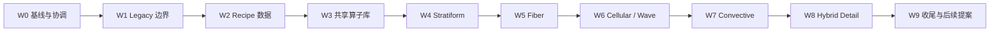

# Roadmap Refactor — 组合式云属密度 Recipe

本文把 `cloud-morphology-and-density-family-discussion.md` 的目标架构转换为可执行重构路线。规范性要求和完整任务清单位于 OpenSpec change：`refactor-cloud-density-recipes`。

> 状态：提案阶段。用户批准 OpenSpec change 前，不进入实现。
>
> 执行重点：Cached 与 Hybrid。Realtime 只验证正确性，不作为实时性能目标。

## 1. 重构目标

当前十属已经有独立 evaluator，但仍强制经过同一条 `evalCompatibilityGenus()` 团块密度链。本路线将其改造成：

```text
Placement Profile
  + Static Density Recipe
  + Optical Profile
```

Density Recipe 的内部顺序是：

```text
Domain Transform
→ Macro Support
→ Vertical Profile
→ Base Topology
→ Detail / Erosion
→ Attachment Fields
→ Finalize Density
```

最终效果：

- 层状云不再执行不必要的完整团块 Voronoi；
- 卷云纤维可以直接生成主体，不再被 Legacy 团块截断；
- Sc/Ac/Cc 共享 Cellular 算子，但拥有不同 cell 尺度、连通率和厚度；
- Cu/Cb 共享 Billow/Convective 算子，Cb 可组合 Tower、Anvil 和 Fiber Cap；
- 四云族保留为模板，不再是互斥运行时类型；
- 后续荚状、堡状、絮状、滚轴、碎片、乳状等通过有限 Modifier/Attachment 扩展。

## 2. 不变的下游契约

本路线不重写整套 renderer。以下契约全程保持：

- `cloudDensityTyped()` 统一合成每体密度；
- 多云体采用现有主密度 + 其余软饱和；
- 密度缓存继续使用 RGBA：密度、主云属、次云属、权重；
- Cached/Hybrid 继续使用 ping-pong 时间混合；
- 主 raymarch、light march、地面云影继续经统一密度入口；
- edge-style 继续发生在缓存采样后；
- 现有按属 Optical Profile 和特殊光效继续工作；
- `CloudBody` 与 scenario 在核心十属迁移阶段不改 schema。

## 3. 路线原则

### 3.1 小提交、单属纵向切片

每个提交只做一种事情：数据边界、一个算子、一个云属迁移、一次校准或一项检查。每个提交都应保持 typecheck/build 可用；每个波次都应可以回退到 Legacy。

### 3.2 LegacyPuffy 是稳定锚，不立即删除

当前兼容链改名为 `LegacyPuffy`，保留两级回退：

```text
全局 Legacy：十属全部走旧路径
全局 Recipe：已迁移属走新 Recipe，未迁移属仍走 LegacyPuffy
```

删除 Legacy 是最后一个独立 change，不是本路线中顺手完成的清理。

### 3.3 分发必须早于昂贵噪声

目标不是让每个 Recipe 执行全部算子，而是让静态 evaluator 只调用需要的函数。Stratiform 不执行完整 4D Voronoi，Fiber 不执行 Legacy 团块链，未启用 Modifier 在额外噪声前早退。

### 3.4 缓存主体，Hybrid 补微观

缓存保存宏观/中尺度拓扑；Hybrid 只补允许丢失的小细节。不能通过默认提高缓存分辨率解决所有问题，因为成本按立方增长。

## 4. 依赖与冲突处理

实施前必须处理：

| Active change | 处理方式 |
| --- | --- |
| `add-height-weather-shaping` | 完成或接受剩余视觉/性能风险；其结果保留在 LegacyPuffy/Billow，不重复实现 |
| `add-height-ambient-tint` | 独立收尾；冻结第一次密度校准使用的光照基线 |
| `add-stratocumulus-cumulus-breakup` | 当前为空 change；由 Cellular/Billow 与后续 fractus Modifier 吸收，不并行造另一套 breakup |

本路线细化并取代旧 `roadmap-v2` 阶段 13.1 的单体密度重建步骤，并吸收阶段 14 的形态扩展边界；不取代 13.2 光照和 13.3 大气。

## 5. 波次总览



| 波次 | 结果 | 有意改变观感 | 主要风险 |
| --- | --- | --- | --- |
| W0 | 冻结十属 Cached/Hybrid 基线 | 否 | 基线不完整导致后续无法判断回归 |
| W1 | LegacyPuffy、Context、Support、Finalize 边界 | 否 | 机械提取改变浮点顺序 |
| W2 | 独立 recipe buffer 和全局/属级回退 | 否 | CPU/WGSL 布局错位 |
| W3 | 可复用算子库，默认未启用 | 否 | shader 体积/编译成本 |
| W4 | St/Cs/As/Ns 使用 Stratiform | 是，仅四属 | 首轮密度重校准量大 |
| W5 | Ci 直接 Fiber 主体 | 是，仅 Ci | 缓存低通使细丝变粗或断裂 |
| W6 | Sc/Ac/Cc 使用 Cellular/Wave | 是，仅三属 | cell 尺度和排列过于规则 |
| W7 | Cu/Cb 使用 Billow/Convective | 是，仅两属 | Cb 组合最多、成本最高 |
| W8 | 按 Recipe 的 Hybrid 微观细节 | 是，微观 | 主次云属边界闪变 |
| W9 | 文档、最终矩阵、后续 change | 否 | 过早删除 Legacy 或扩 scope |

## 6. W0 — 协调、基线与测试门

### 工作

- 完成 active changes 的协调 gate；
- 固定 camera、scene time、每属 body/placement、96³ cache；
- 每属记录正常视图和 density debug；
- Cached、Hybrid 分别记录 cache/cloud pass 中位数；
- 扩展 genus 静态检查，为 Recipe 顺序和布局预留公开契约。

### 退出条件

- 十属基线齐全；
- 当前 Legacy 路径和 preset 参数有明确快照；
- `typecheck`、生产 build、genus dispatch 检查通过；
- 不要求 Realtime 性能，只记录当前正确性状态。

## 7. W1 — 机械拆出 LegacyPuffy

### 工作

1. 将兼容五阶段链命名为 LegacyPuffy；
2. 整理 Density Context；
3. 抽取无团块语义的 Macro Support；
4. 抽取 Finalize；
5. 更新 dispatcher/evaluator 检查，使 evaluator 可以直接消费 Context/Support。

### 退出条件

- 十属仍走完全相同的 Legacy 行为；
- 正常与 density debug 视觉等价；
- Cached/Hybrid 性能处于测量噪声范围；
- Cb 仍能在 footprint 采样前改变高层坐标。

## 8. W2 — Recipe 数据基础

### 数据职责

```text
Placement：沿用 genusProfile + CloudBody
Density：新增固定布局 DensityRecipeGPU
Optical：沿用现有 preset 光照字段
```

### 工作

- 定义最小 `DensityRecipe` 与 `RecipeMode`；
- 十属 Recipe 初始全部为 LegacyPuffy；
- 新增独立 recipe buffer 和具名打包；
- 增加 CPU/WGSL 布局静态检查；
- 增加全局 Legacy/Recipe 开关；
- Recipe 模式下允许未迁移属继续选择 LegacyPuffy。

### 退出条件

- 加入 recipe buffer 不改变画面；
- 全局两种模式当前等价；
- 十属顺序与 preset/dispatcher 一致；
- 旧 scenario 无需迁移。

## 9. W3 — 共享算子库

按一次一个提交增加，默认全部未启用：

| 类别 | 算子 |
| --- | --- |
| Vertical | Thin Sheet、Soft Layer、Flat-base Dome、Tower、Anvil、Roll/Lens |
| Topology | Stratiform、Billow、Cellular、Fiber、Wave/Lens、Convective Column |
| Detail | Worley erosion、fBm cutout、curl breakup、ripple |
| Composition | remap、smooth union、soft max、非负/有限 guard |

### 退出条件

- 新算子未启用时无视觉变化；
- octave、循环、attachment 数量均有静态上限；
- 不引入运行时 operator interpreter；
- 不因 CSV 描述新增固定 128³/32³ 噪声纹理。

## 10. W4 — Stratiform 纵向切片

迁移顺序：

1. Stratus：Thin Sheet + 低幅 Stratiform；
2. Cirrostratus：Ultra-thin、近均匀；halo 留在 Optical；
3. Altostratus：水平拉伸 Soft Layer；sun disc 留在 Optical；
4. Nimbostratus：厚 Stratiform，预留底部 Attachment，不实现降水场。

### 目标

- 四属不再运行 Legacy 的两套分形 4D Voronoi；
- St/Cs/As/Ns 分别呈现贴地薄层、高空薄幕、中层磨砂云幕、厚雨层；
- 其他六属保持 Legacy 基线。

### 退出条件

- 每属独立截图、密度调试和 GPU 中位数通过；
- Support 外无密度；
- 光学效果不因密度代码重复实现；
- 属级 Legacy 回退可用。

## 11. W5 — Fiber 纵向切片

### 工作

- Cirrus Fiber Field 直接从 Support 产生主体密度；
- 解耦 fiber length、width、curl、breakup、vertical thinness；
- 云体旋转控制长轴，物理风移动完整纤维；
- 缓存保存长丝骨架，微观分叉留给后续 Hybrid。

### 退出条件

- 长纤维不再被 Legacy 团块空洞随机截断；
- footprint 与实例高度外严格为零；
- Cached 主体连续，Hybrid/Legacy 回退可用。

## 12. W6 — Cellular 与 Wave

迁移顺序：

1. Stratocumulus：大 cell、高 connectivity、较厚；
2. Altocumulus：中 cell、中 connectivity；
3. Cirrocumulus：小 cell、薄 profile、高 ripple。

`tileScale` 先兼容映射到 cell scale。Wave/Lens/Roll hook 初始默认关闭，为 lenticularis/volutus 后续变体准备，不在这一波扩 scenario schema。

### 退出条件

- Sc/Ac/Cc cell 尺度和厚度肉眼可辨；
- 云粒不再被无关 Legacy 宏观团块截断；
- 未启用 Wave/Lens 零强度早退；
- 空的 breakup active change 目标已被明确吸收。

## 13. W7 — Convective

### Cumulus

- 先用 Billow + Flat-base Dome 匹配 Legacy 视觉锚；
- 再加入高度相关 cell scale 和有限 Convective Column；
- 高频 Worley/curl 成为明确 Detail，不再由一个 `detail` 同时控制宏观 octave。

### Cumulonimbus

```text
下部：高密度 Billow base
中部：Convective Column
中上部：更小的 cauliflower cells
顶部：Anvil Support + Fiber Cap
附属 hook：Mammatus / precipitation core，默认关闭
```

### 退出条件

- Cu 平底圆顶和 Cb 塔/砧/纤维顶部可分别关闭和辨认；
- 所有结构受 Support 限定；
- 十属都具备新主体 Recipe；
- Cb 迁移不得破坏 internal lightning 等 Optical 行为。

## 14. W8 — Recipe-aware Hybrid Detail

当前全局 4D Perlin 保留为 Legacy fallback。新 Recipe 根据缓存主、次云属选择：

| 主体 | Hybrid Detail |
| --- | --- |
| Stratiform | 无，或极弱 thickness noise |
| Billow/Convective | 高频 Worley/curl 翻卷 |
| Cellular | 粒边 breakup/ripple |
| Fiber | 高频分叉和断续 |

主、次云属交叠处使用现有 `w2` 混合。所有 detail 只在缓存非空区渐入。

### 退出条件

- Cached 主体稳定；
- Hybrid 的微观差异符合拓扑；
- 空区不凭空生云；
- 主 ray、light march、ground shadow 语义一致；
- 不出现云属边界硬切。

## 15. W9 — 收尾，而不是扩大范围

- 完成十属最终截图和 GPU timing 矩阵；
- 更新源码导读、参数说明和 roadmap；
- 严格 OpenSpec 验证；
- 分别建立后续提案：VariantModifier、precipitation field、Legacy cleanup；
- 未获新批准前不实施这些后续能力。

### Legacy 删除条件

只有同时满足以下条件才允许创建删除提案：

- 十属新 Recipe 全部默认启用；
- 十属均有 Cached/Hybrid 验收证据；
- 旧 scenario/preset 有明确迁移策略；
- 至少一个稳定版本周期内未依赖属级 Legacy 回退；
- 性能没有依赖 Legacy 才能达标的属。

## 16. 验证策略

### 自动检查

- TypeScript typecheck；
- production build；
- genus/recipe 顺序与完整性；
- CPU/WGSL recipe buffer 布局；
- 固定 record 和 octave 上限；
- dispatcher 路由和无效索引回退；
- 零强度昂贵路径的早退边界。

### 视觉检查

每个迁移属至少保留：

- Legacy 正常视图；
- Recipe 正常视图；
- Legacy density debug；
- Recipe density debug；
- Cached；
- Hybrid；
- 固定 camera/time/placement。

测试目标是公开行为：轮廓、拓扑、Support、缓存和最终成像。不要把 WGSL 私有函数的具体文本顺序当成行为测试。

### 性能检查

正式预算只看 Cached/Hybrid：

- cache pass 中位数；
- cloud pass 中位数；
- 活跃云体数；
- cacheResolution/updateRate；
- 正常视图与 density debug 分开记录。

Realtime 只要求编译、无 NaN/越界、基础 Recipe 语义一致。

## 17. 明确不在本路线内

- 任意 shader graph、用户自定义 WGSL；
- 十属所有云种/变种一次实现；
- precipitation curtain、virga、真实降水输运；
- 台风涡旋、风切变和流体模拟；
- 物理大气 LUT 和光照模型重写；
- Realtime 60fps；
- 未经迁移提案删除旧 preset 字段或 scenario 兼容；
- 用默认升高缓存分辨率掩盖密度算法问题。

## 18. OpenSpec 与执行入口

- Proposal：`openspec/changes/refactor-cloud-density-recipes/proposal.md`
- Design：`openspec/changes/refactor-cloud-density-recipes/design.md`
- Tiny commits：`openspec/changes/refactor-cloud-density-recipes/tasks.md`
- Spec deltas：`cloud-morphology`、`cloud-presets`、`cloud-rendering`、`cloud-params`
- 形态依据：`docs/cloud-morphology-and-density-family-discussion.md`
- 源数据：`docs/云属分类与数学建模技术手册 - Table 1.csv`

OpenSpec tasks 是进度事实来源；本文负责解释波次、依赖与退出条件。二者发生冲突时，应先更新设计和 spec，再同步路线图，不允许只改 checklist 掩盖架构变化。
